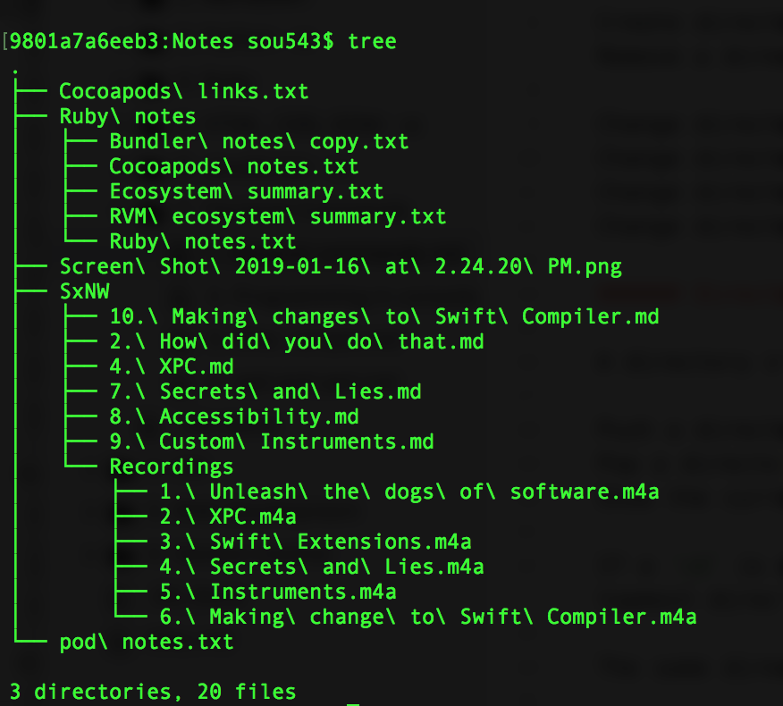

##### Directory related commands

Full path of current directory - `pwd` <br>
Open current directory in Finder - `open .` <br>

Create directory - `mkdir`<br>
Remove a directory - `rmdir`<br>

Change directory - `cd <path>`<br>
Change directory to parent of current directory -  `cd ..`, `cd ../`<br>
Change directory to home - `cd /`, `cd ~`<br>
Change directory to root - `su`<br>

###### Directory stack

A directory stack is maintained. The one at top is the current working directory.  <br>

Push a directory - `pushd Path`<br>
Pop a directory - `popd`<br>
Show the current director stack - `dirs`

If a `cd` is done the a pop is done and the passed directory pushed. With `pushd` however, the stack is not cleared. With `popd`, the topmost directory is popped from the stack. <br>

The same directory can be pushed on to the stack multiple times. <br>

Popping the stack when there is only one directory in it, only empties the stack. It does not change the current directory.

Push the second entry in current stack to top - `pushd +2` (This does not create a duplicate entry)

###### Seeing contents

See contents of directory - `ls` (`l` - attribute for showing size too, i.e. `ls -l`, `a` - attribute for showing hidden files too, `s` - for showing the no. of file system blocks too, whatever it may mean, `R` - For listing all files recursively, `1` - one entry per line).

`ls -sl /usr/local/bin/python*`  (Here s and l are actually two different options.)

`tree` - Shows a tree like structure of a folder's contents recursively. (Needs to be installed using brew install tree.) If hidden files should also be shown, -a argument needs to be used (tree list -a).



`find "$PWD" -type d` - List all folders in the present working directory recursively

###### Copy/move related commands

Copy directory/file - `cp <source> <destination>` <br>
Move directory/file - `mv <source> <destination>` <br>

Attribute for copying recursively - `r` <br>
Attribute to preserve all file attributes and symlinks while copying - `p` <br>
Attribute that includes `r` and `p` (and some more preservation options) - `a` <br>

Qualifier to copy hidden files too - `.`
`cp -a sourcePath. destPath`

##### File related commands

Create an empty file - `touch filename.extension`

View contents of an existing file - `cat Filename`

Create new file or erase any existing content of an existing file with same name - `cat > File.extension` <br>
Create new file or append to any existing content of an existing file with same name - `cat >> File.extension`

In both the above ways, the new content needs to be entered in the console. After entering content in console, hit enter and then exit (Ctrl + C). Ctrl + D saves it too (so you need not hit enter). So cat is a multipurpose command. It can be used to view/create/concatenate files.

Search for files by name - `find DirectoryToSearch -name "ExactFileName.txt` (search string has to be exact match, not a substring)

Navigate a file one window length at a time - `cat FilePath | less` (next window is shown by pressing Ctrl + F)

Make a file executable - `chmod +x filepath` <br>
Making a file executable means the file can be run just by its name and it does not need a separate command to run it. For this of course the file should have a shebang too. chmod stands for change mode. However even after doing a chmod to make a file executable for running the executable it needs to be prefixed with `./`.  `./ ExecutableFile` [Link](https://stackoverflow.com/a/6331085/1135417)

> Apparently files have several modes. One of the modes can can be changed to make the file an executable by itself.

Open a file - `open filepath` <br>
Open a file with a particular application - `open -a TextEdit filepath`

##### Help related commands

Get a list of all topics concerning the subject - `apropos Topic` <br>
Get documentation of passed command - `man Commands`  (`man grep`)

##### Misc. commands

Pipe operator can be used to make the input of one command the output of next command. <br>
`cat 1.txt 2.txt 3.txt | sort > sorted.txt` (Concatenate the contents of the 3 files and pass it to `sort` command)

If `&` is put after a command, the shell does not wait for the command to complete its work and instead shows the prompt immediately. <br>
`cat file1 file2 file3 | sort > destination &`

Running the same command on different inputs (using `xargs`) - `<input>| xargs <command>`

So `xargs` is a bit like loop. It takes each passed input and applies the passed command on it. If no command is passed, it uses `echo` (i.e. print).
`ls | xargs grep "searchstring"` (Runs the grep in each member of current working directory)

Computer's network name - `hostname`

Get I.P. address - <br>`ifconfig` (Gives a long set of data, the I.P. address is somewhere towards the top) <br>
`ifconfig | grep "inet " | grep -v 127.0.0.1 | awk '{print $2}'` (Gives a precise I.P. address)


Transferring data over the internet without any user interaction -
```
`curl` <br>
`\curl -sSL https://get.rvm.io | bash -s stable` (why that \ though)
```

Running all the commands in a local file -
```
`source` <br>
`source /Users/Anand/.rvm/scripts/rvm`
```
Reset I/O options - `stty` <br>
Called `set teletype`. This can apparently change and then also reset various I/O options. <br>
For example, `stty -echo` causes echo to be disabled. Now what this does is that nothing that you press will actually be shown on terminal. To enable it back, type `stty echo` (even though the characters will not be shown while typing) and hit enter. So this could be useful if characters should not be shown, say when a password needs to be entered.


###### Bash profile
In the `usr` folder a `.bash_profile` file can be created and whatever is entered there is made available across all the Terminal sessions. Typically functions can be put in it and then these functions simply invoked from command line.

```
cd ~/                        // Go to home folder
touch .bash_profile          // Create the .bash_profile file if none there
open -e .bash_profile        // Open the .bash_profile file to edit it
. .bash_profile              // Reload .bash_profile to update any functions that have been added
```

###### Links

[Cheat sheet](https://learncodethehardway.org//unix/bash_cheat_sheet.pdf) <br>
[Bash reference](http://www.gnu.org/software/bash/manual/bashref.html) <br>
[Redirect Terminal input and output on Mac](https://support.apple.com/guide/terminal/redirect-terminal-input-and-output-apd1dbe647b-7e11-49dc-aa76-89aa7e53ce36/mac) <br>
