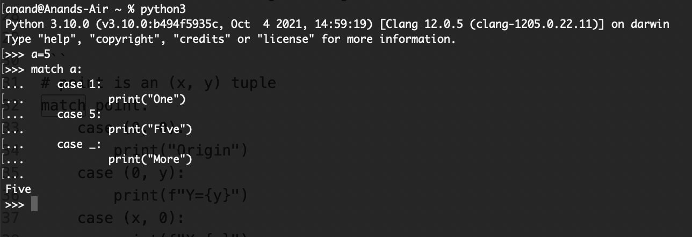

#### An interpreted language

Python is an interpreted language, meaning no compilation and linking is necessary.

#### Python is extensible

> Python is extensible: if you know how to program in C it is easy to add a new built-in function or module to the interpreter, either to perform critical operations at maximum speed, or to link Python programs to libraries that may only be available in binary form (such as a vendor-specific graphics library). Once you are really hooked, you can link the Python interpreter into an application written in C and use it as an extension or command language for that application.

What does this mean? That I can add a C function to Python interpreter, or that I can add a Python code to a C application. How would that be done?

#### Working with Python interpreter from command line

Bring up Python (system default version) console - `python`  
Bring up Python3 console (if installed, brings up latest installed minor version) - `python3`  
Exiting the interprter - `exit()`  

Even code compeltion is possible through `tab`. All this is apparently possible on any system that supports [GNU Readline library](https://tiswww.case.edu/php/chet/readline/rltop.html). Mac probably does.

[Keys](https://docs.python.org/3/tutorial/interactive.html#tut-interacting) supported in command line.

Running Python commands without bringing up a persistent console - `python -c command [arg] ...`
This however does not maintain a session across different invocations. Its also safer to quote command in its entirety with single quotes, so that any special character etc. in the command does not cause any confusion for the interpreter.

Python scripts can also be run using `python -m module [arg] ...`, which executes the source file for module. Its useful to be able to run the script and enter interactive mode afterwards. This can be done by passing -i before the script.

The script name and additional arguments thereafter are turned into a list of strings and assigned to the `argv` variable in the `sys` module. This list can be accessed by `import sys`. The length of the list is at least one; when no script and no arguments are given, sys.argv[0] is an empty string.

When commands are read from a tty, the interpreter is said to be in `interactive mode`. In this mode it prompts for the next command with the primary prompt, usually three greater-than signs (`>>>`); for continuation lines it prompts with the secondary prompt, by default three dots (`...`).

> The 3 dots mean the previous line is synatctically still continuing. Once the line is syntactically complete, it can be exited by entering Enter one more time.

By default, Python source files are treated as encoded in UTF-8.

To declare an encoding other than the default one, a special comment line should be added as the first line of the file. The syntax is
``# -*- coding: encoding -*-``, where encoding is one of the valid [codecs](https://docs.python.org/3/tutorial/interprdter.html) supported by Python.

In interactive mode, the last printed expression is assigned to the variable `_`.

#### Some syntax basics

Statement grouping is done using indentation.  
No variable or argument declaration is necessary.  
Multiple assignment of variables in a single line is possible. `a, b = 0, 1`  

#### Misc. - General outside things referred

GNU Readline library, Codec

Check later on -  
`__match_args__` in classes  

The definitive [style guide](https://www.python.org/dev/peps/pep-0008/) for Python coding.
