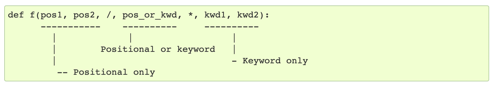

#### Defining a function

The function name is followed by a parenthesized list of formal parameters.

The first statement of the function body can optionally be a string literal; this string literal is the function’s documentation string, or `docstring`.

```
def fib(n):
    """Print a Fibonacci series up to n."""
    a, b = 0, 1
    while a < n:
        print(a, end=' ')
        a, b = b, a+b
    print()
```

Global variables and variables of enclosing functions can be referenced within a function but they cannot be directly assigned a value (unless, for global variables, named in a global statement, or, for variables of enclosing functions, named in a nonlocal statement {what does that mean?}).

```
def fib(n):
    """Print a Fibonacci series up to n."""
    a, b = 0, 1
    while a < n:
        print(a, end=' ')
        print(b, end=' ')
        a, b = b, a+b
    print()

    def test2():
        print(a)

    test2()
```

Arguments are passed using call by value (where the value is always an object reference, not the value of the object. What this jargon still means based on what I saw is that things behave as if they are passed by value (as in other languages).

Even functions without a `return` statement do return a value, the value is called `None`.

#### Default argument values

Its one way to define functions with a variable number of arguments.

```
def ask_ok(prompt, retries=4, reminder='Please try again!'):

ask_ok('OK to overwrite the file?', 2, 'Come on, only yes or no!')
```

The default value however is evaluated only once. This makes a difference when the default is a mutable object such as a list, dictionary, or instances of most classes. For example, the following function accumulates the arguments passed to it on subsequent calls.

```
def f(a, L=[]):
    L.append(a)
    return L

print(f(1))
print(f(2))
print(f(3))

# Prints - [1], [1, 2], [1, 2, 3]
```

In the above example if the default need not be shared between subsequent calls, `None` should be used instead.
```
def f(a, L=None):
    if L is None:
        L = []
    L.append(a)
    return L
```

#### Keyword arguments

While calling a function its possible to specify argument name too (termed as `keyword argument`), however all keyword arguments must follow `positional argument` (i.e. arguments where name is not given). All the keyword arguments passed must match one of the arguments accepted by the function, and their order is not important.

```
def parrot(voltage, state='a stiff', action='voom', type='Norwegian Blue'):

parrot(1000)  # Valid
parrot(voltage=1000)  # Valid
parrot(voltage=1000000, action='VOOOOOM')  # Valid
parrot(action='VOOOOOM', voltage=1000000)  # Valid
parrot(voltage=5.0, 'random') # Not valid
```

When a final formal parameter of the form `**name` is present, it receives a dictionary containing all keyword arguments passed during invocation except for those corresponding to a formal parameter. This may be combined with a formal parameter of the form `*name` which receives a tuple containing the positional arguments beyond the formal parameter list. (`*name` must occur before `**name`.)

```
def test3(a, *arguments, **keywords):
    print(a)   # Prints 5
    for arg in arguments:   // Prints 2, 4
        print(arg)  
    for keyword in keywords: // Prints 'greeting1 : Hi', 'greeting2 : There'
        print(keyword, ":", keywords[keyword])

test3(5, 2, 4, greeting1 = "Hi", greeting2 = "There")
```

So `**` and `*` can be one more way to pass variable number of arguments to a function.

#### Special parameters

Its possible to use `/` and `*` in a function definition to specify what parameters can be passed by position only, by keyword only, or by either.



If `/` and `*` are not present in the function definition, arguments may be passed to a function by position or by keyword.

#### Arbitrary Argument Lists

Looks like the same thing as the fact that if an argument has `*`, then it indicates a variable number of arguments can be passed to it which will be available as a tuple in the function.

```
def concat(*args, sep="/"):
    return sep.join(args)

print(concat("earth", "mars", "venus"))
```

#### Unpacking Argument Lists

If a list or tuple is prefixed with a `*` in an argument of a function call, then automatically get unpacked (expanded) while the function is called and become available to the function as positional arguments.

```
def parrot(voltage, state='a stiff', action='voom'):

d = {"voltage": "four million", "state": "bleedin' demised", "action": "VOOM"}
parrot(**d)
```

#### Lambda Expressions

Lambdas are short functions expressed in a single expression. They are just a syntactic convenience.

Here the make_incrementor function returns a function (craeted using lambda) itself.
```
def make_incrementor(n):
    return lambda x: x + n
```

#### Function Annotations

Annotations are metadata for a user-defined function's types that is automatically available for various functions.

```
def test2(n: int):

print(test2.__annotations__) # Prints {'n': <class 'int'>}
```
