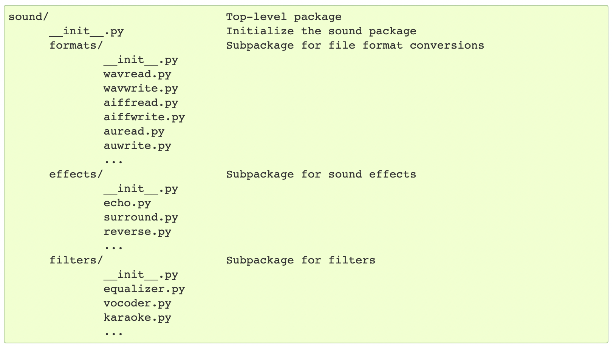

A module is a file containing Python definitions and statements (i.e. just a `.py` file).

Accessing it from other places thereafter. (Assuming module name is fibo and it has a function named fib)
```
import fibo

fibo.fib(1000)
f = fibo.fib  # A function can even be assigned to a variable for easier access
```

#### Various ways of importing modules

There is a variant of the import statement that imports names from a module directly into the importing module’s symbol table.
```
from fibo import fib, fib2
```

There is another variant to import all names that a module defines. (But isn't this practically the same as simply `import fibo`.) This imports all names except those beginning with an underscore `_.`
```
from fibo import *
```

If the module name is followed by `as`, then the name following `as` is bound directly to the imported module.
```
import fibo as fib
from fibo import fib as fibonacci
```

##### Running a Python module as a script

When a Python module is run with `python fibo.py <arguments>`,  `__name__` argument is set to `"__main__"`.

Hence, if the module has a function like this, the file is usable as a script as well as an importable module, because the code that parses the command line only runs if the module is executed as the main file.
```
if __name__ == "__main__":
    import sys
    fib(int(sys.argv[1]))
```

#### Module Search Path

When a module named xyz is imported, the interpreter first searches for a built-in module with that name.

> What is a built-in module?

If not found, it then searches for a file named xyz.py in a list of directories given by the variable `sys.path`.

> How `sys.path` is initialized. ([Link](https://docs.python.org/3/tutorial/modules.html#the-module-search-path))

> Also read about [Compilation and caching of modules](https://docs.python.org/3/tutorial/modules.html#compiled-python-files).

#### Standard modules

There are some standard modules that come with Python. They are built into the interpreter and provide access to operations that are not part of the core of the language but are nevertheless built in, either for efficiency or to provide access to operating system primitives such as system calls.

The `sys` module for example provides things like `sys.ps1` and `sys.ps2` (which define the strings used as primary and secondary prompts, they are available only when the interpreter is in interactive mode). `sys.path` is a list of strings that determines the interpreter’s search path for modules.

#### `dir` and `builtins`

The built-in function `dir()` is used to find out which names a module defines.

Without arguments, `dir()` lists the names defined in current scope. iit lists all types of names - variables, modules, functions, etc.

`dir()` does not list the names of built-in functions and variables. If you want a list of those, they are defined in the standard module `builtins`.

#### Packages

Very simply speaking, a package is a collection of modules. It allows accessing modules through dotted notation and allows better management of variable names, etc. across different modules.

Here is a possible file system structure of a package.


The `__init__.py` files are what indicate that the directory containing the file is a package. It can even be empty.

##### Importing packages

And then it can be imported in different ways.
```
import sound.effects.echo # imports an individual module from package

sound.effects.echo.echofilter(input, output, delay=0.7, atten=4) # Must then be referenced in full

from sound.effects import echo # Another way of importing a module or name (i.e. function, class, etc.) from a package
```

However, when using syntax like import `item.subitem.subsubitem`, each item except for the last must be a package; the last item can be a module or a package but can’t be a class or function.

if a package’s `__init__.py` code defines a list named `__all__`, the list of module names mentioned there are the ones imported when `from package import *` is encountered for that package.
```
__all__ = ["echo", "surround", "reverse"]
```

[Link](https://docs.python.org/3/tutorial/modules.html#importing-from-a-package)

##### Intra-package references

When a package is structured into subpackages, and a subpackage needs to refer something from another subpackage it can use absolute imports as well as relative imports.

```
from . import echo
from .. import formats
from ..filters import equalizer
```

##### Packages in Multiple Directories

There is another special attribute, `__path__` which is  initialized to be a list containing the name of the directory holding the package’s `__init__.py` before the code in that file is executed.
