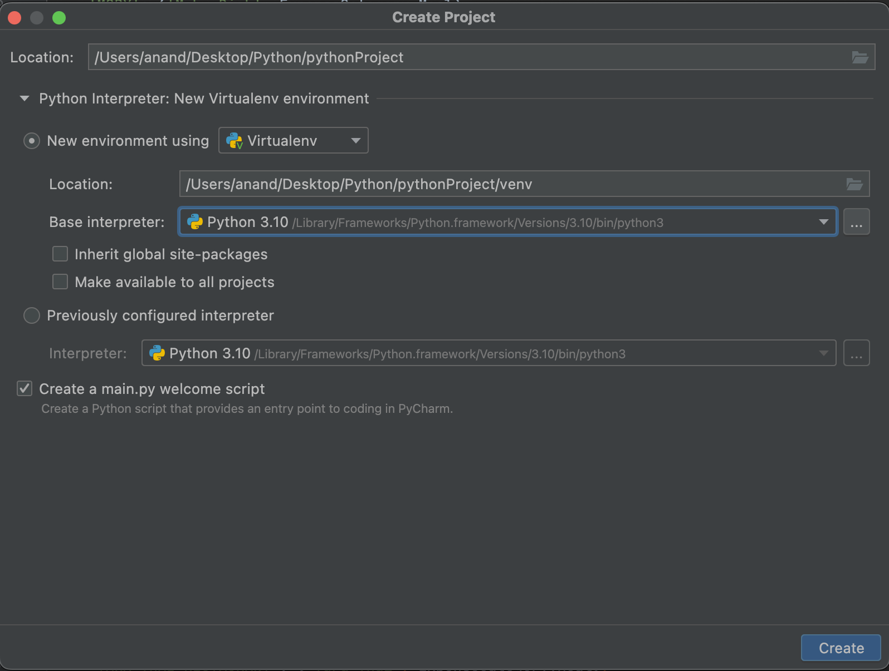
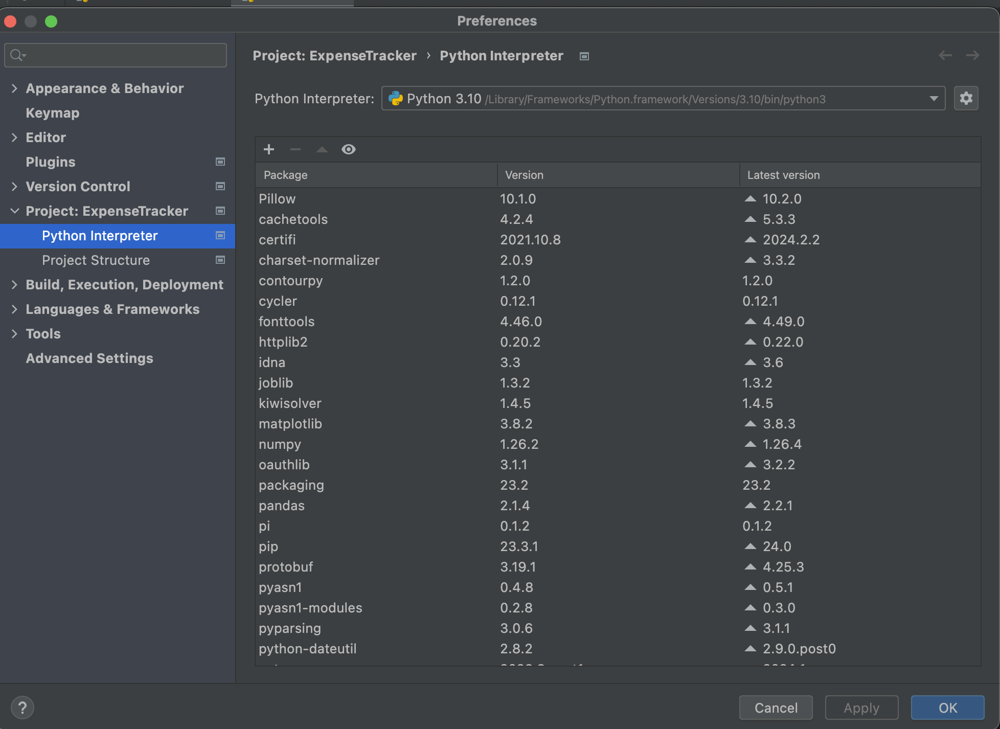
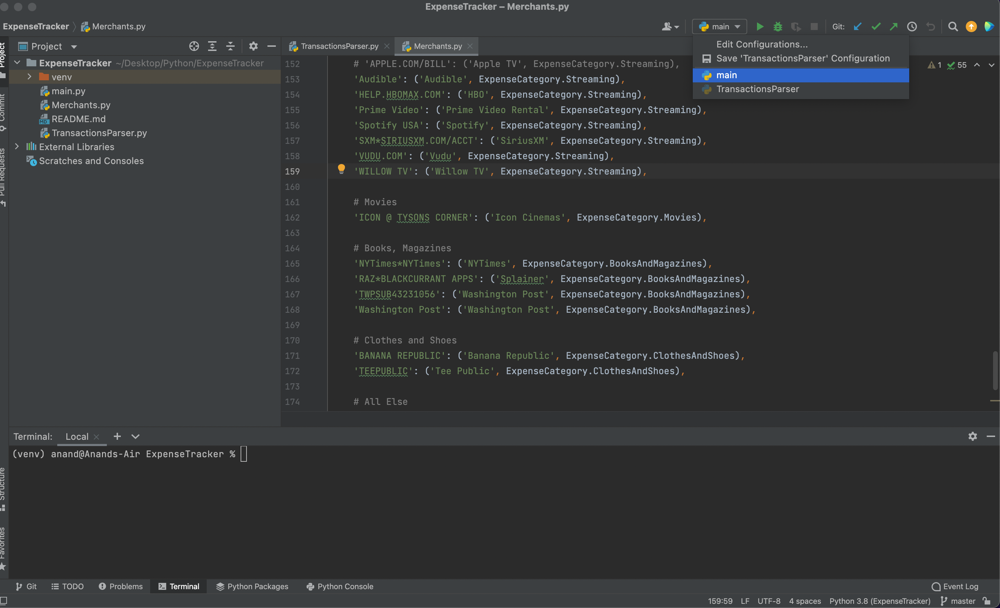

Run - `Ctrl R` <br>
Toggle run console display - `Cmd 4` <br>
Hide bottom console - `Shift Escape` <br>

> There are several view modes for every type of console (can be accessed by doing a context tap on the console in bottom toolbar). `Run Console > View Mode > Window` for instance puts Run Console in a new window of its own.

Go to beginning/end of file - `Fn Cmd Left/Right` <br>
Code expand/collapse - `Cmd Shift +`, `Cmd -` <br>
Refactor - `Shift + Fn + F6` <br>
Toggle Case - `Cmd + Shift + U` <br>

Check short documentation - `Press Cmd and hover cursor over the symbol` <br>
Check longer documentation - `Option Space` (even shows function definition) <br>

##### How to setup and run a basic Python project in PyCharm

Create a new project in PyCharm and select a Python version. If the Python version is not available, it can be downloaded from Settings > Project: .... > Python Interpreter. If nothing is already available, there will be a download button to download it. 

| Select a Virtual Environment and Python version              | Settings > Python Interpreter                                |
| ------------------------------------------------------------ | ------------------------------------------------------------ |
|  |  |

> If its an office laptop, enter proxy settings in Settings > Appearance & Behavior > System Settings > HTTP Proxy

Once set, a python code can also be simply run from command line.

```
python3 main.py
```

##### Some of the gotchas

If debugging the code is not working or code does not seem to be running, check the configuration. It should be `main`.


