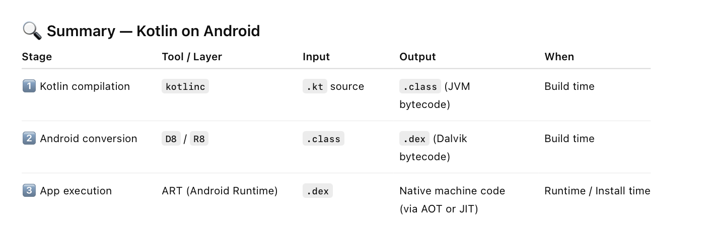

Ultimately everything that actually runs on hardware must be in **machine code** (binary instructions that CPU understands). It is how and when a high level language code is converted into machine language is where the difference is.

There are 3 main mechanisms - Compiled languages, Hybrid model (Intermediate Representation), Interpreted languages

|                                         | Compiled languages                                           | Hybrid model languages                                       | Intepreted languages                                         |
| --------------------------------------- | ------------------------------------------------------------ | ------------------------------------------------------------ | ------------------------------------------------------------ |
| 'Gist'                                  | Ahead of Time compilation                                    | Just In Time compilation/interpretation                      | Runtime conversion                                           |
| Examples                                | C, C++, Swift, Rust                                          | Java, C#, Kotlin, Hermes for ReactNative, Languages that support WASM | Python, JavaScript, TypeScript, Ruby                         |
| When is conversion to machine code done | At build time. Compiler converts everything to an .exe, .app, etc. which already has entire source code in machine code | Everything is converted to bytecode, or Intermediate Representation before runtime.  This then gets converted to machine code chunk by chunk at runtime as needed by a virtual machine (Just In Time compilation). | Line by line conversion to machine code done at runtime as needed |
| Cacheable                               | N/A, as everything is already in machine code nothing has to be even made cacheable at runtime | Yes                                                          | No. Every line gets reconverted to machine code even if it was just done earlier in the flow |
| Speed at runtime                        | High                                                         | Medium                                                       | Low                                                          |
| Memory efficiency                       | Low (large footprint)                                        | Medium                                                       | High (low footprint, only compiles what's needed)            |

#### Languages Specifics

##### Kotlin in Android apps

Overall it largely follows a hybrid model like Java, but the formats can change based on build tools.

When a .kt file is built it produces a .class file (which is JVM bytecode). Depending on the build tool (gradle/kotlinc) used, while shipping/packaging this can get converted into .dex (optimized bytecode) before getting embedded into the .apk/.aab. And then when it gets to device, it could get AOT compiled into dex bytecode during installation or JIT compiled during launch/runtime.

##### WASM

**WebAssembly (WASM)** is another Intermediate Representation like Java bytecode, and is primarily relevant in web development. Web browsers provide a virtual machine/runtime that can run WASM and its very fast (compared to interpreted JS, etc.). With time more and more languages are adding WASM support, thereby making web development possible in those languages too. The WASM bytecode format is `.wasm`. 

All major web browsers' JS runtime environments (V8, JavaScriptCore, SpiderMonkey, etc.) now also provide a WASM VM, thereby making WASM a possibility in all of them.

Languages that typically offer WASM support now are C, C++, Rust, Swift, and  AssemblyScript.

>**AssemblyScript** is a TypeScript-like programming language that compiles to WebAssembly (WASM). It looks and feels almost like TypeScript. It was created specifically to make use of WASM, the traditional WASM languages (C, C++, Rust) are low-level and systems-oriented and not very web-developer-friendly.

The reason WASM was created was to give web browsers a way to run high performance code written in languages like C, C++, and Rust safely alongside JS. JS was never meant for high performance tasks such as 3D graphics, audio/video, etc. and those languages were better suited for them.

#### Resources

ChatGPT [link](https://chatgpt.com/g/g-p-68d848671ccc819190a215c58c55d1a2-react-native/c/68e52b4b-ac24-8322-bb2c-bbf927637a36)