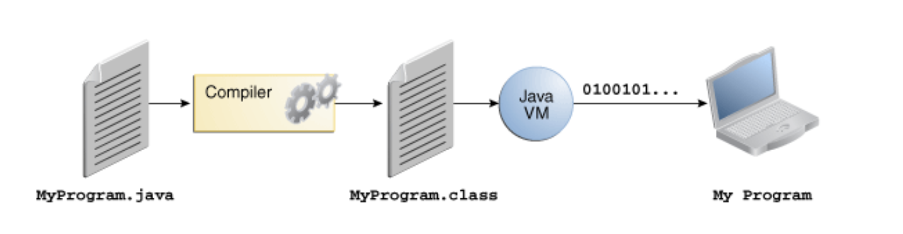
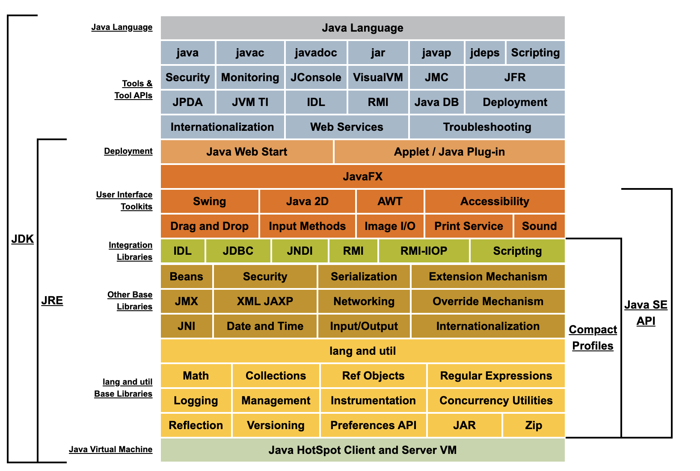

###### Some of the attributes of Java

`Statically-typed`. It means that all variables must first be declared before they can be used.

Java does support `Multithreaded execution`.

It also does `automatic garbage collection`. The runtime environment has a garbage collector that periodically frees the memory used by objects that are no longer referenced.

Java code is compiled by `javac` (i.e. Java compiler) into bytecode which is actually understood by `Java virtual Machine (JVM)`, and not quite by the system processor per se. The `Java launcher` then launches the app with an instance of JVM. JVM is available for Microsoft Windows, Solaris OS, Linux, and macOS. Since Java code can be executed by multiple platforms (that JVM supports), Java is also loosely referred to as a `Dynamic` (its not a dynamically-typed language though).

Some virtual machines, such as the Java SE HotSpot at a Glance, perform additional steps at runtime to give the application a performance boost.

The main tools that get used in everydaya development are the `javac` compiler, the `Java launcher`, and the `javadoc` documentation tool.

JDK software uses standard mechanisms such as the `Java Web Start software` and `Java Plug-In` software for deploying applications to end users.

###### Javadoc

Various things documented in [Javadoc](https://docs.oracle.com/javase/8/docs/index.html).

###### Misc.

`JavaFX`, `Swing`, and `Java2D` toolkits for GUI.
