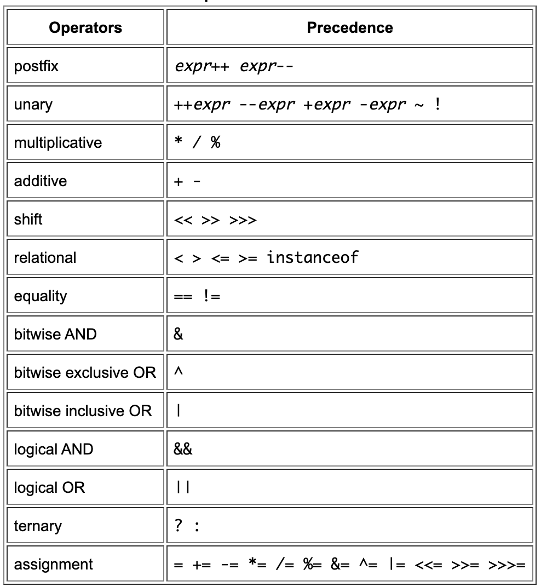

###### Primitive data types

There are 8 primitive data types

Data type | Description | Default values
--- | --- | ---
`byte` | 8-bit signed integer. -128 to 127. Useful in saving memory in large arrays. | 0
`short` | 16- bit signed integer | 0
`int` | 32-bit  signed integer | 0
`long` | 64-bit signed integer | 0L
`float` | Single precision 32-bit floating point. Useful in saving memory in large arrays, but should never be used for precise values such as currency. | 0.0.f
`double` | Double precision 64-bit floating point. The usual type for decimal values. | 0.0d
`boolean` | Just a boolean, `true`/`false` | false
`char` | Single 16-bit Unicode character. `\u0000` to `\uffff`. | '\u0000'

Not technically a primitive data type, but special support is also provided for character strings via `java.lang.String` class. `String` objects are immutable. Its default value is `null`.

The compiler never assigns a default value to a local variable, but does assign it to an instance or class variable.

###### Literals

Literal type | How to denote
--- | ---
Integer literals | `long` if it ends with the letter `L` or `l`. Else `int`. <br><br> By default decimal number system is used. For hexadecimal or binary, it should be prefixed with `0x` or `0b`.
Floating point literals | `float` if it ends with the letter `F` or `f`. Else `double` (can actually even be denoted using `D` or `d`). <br><br> Can also be expressed using `E` or `e` for scientific notation.
Character and string literals | Can have any UTF-16 character. If the editor does not allows it, use like this `\u0108`. Some characters though need to be escaped (\b for backspace, \t for tab, etc.).

```
double d1 = 123.4;
// same value as d1, but in scientific notation
double d2 = 1.234e2;
float f1  = 123.4f;
```

In case of numeric literals, underscores too can be used as many times as needed. It's used for grouping.
> Is the value of 2 numeric literals same if just their underscore positions are different?

###### Precedence of operators

closer to the top of the table an operator appears, the higher its precedence. Operators on the same line have equal precedence. All binary operators except for the assignment operators are evaluated from left to right; assignment operators are evaluated right to left.



`%` is the remainder operator.

`instanceof` operator compares an object to a specified type.
```
if (array1 instanceof int[]) {
    System.out.println("Matches");
}
