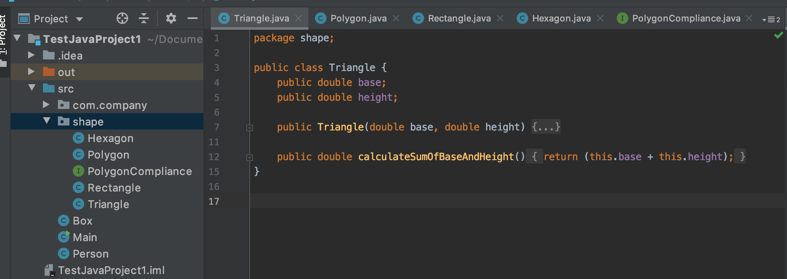
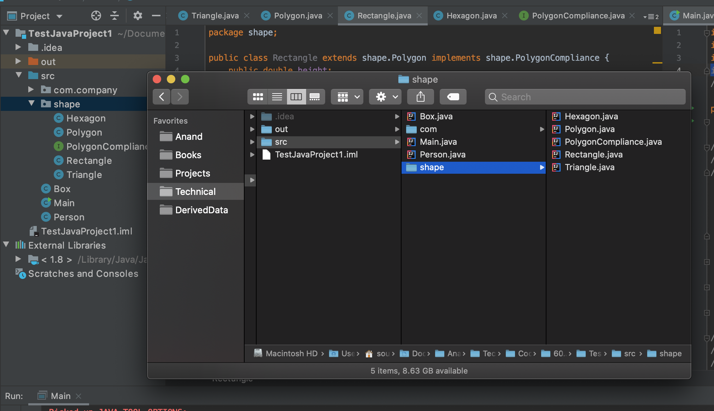
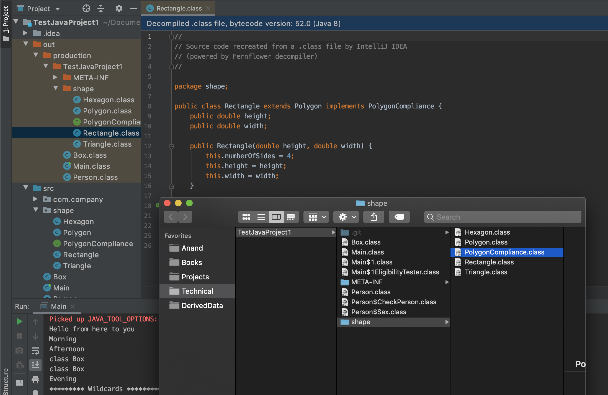

###### What is a Package

A `package` is a grouping of related types providing access protection and name space management. Note that types refers to classes, interfaces, enumerations, and annotation types.

If a package is not explicitly specified, the type ends up in an unnamed package.

###### Creating a package

To create a package, at the top of every source file that contains the types the following should be specified.

```
package shape;
```



If multiple types are put in a single source file, only one can be public, and it must have the same name as the source file.

###### Accessing a package

The types that comprise a package are known as the package members.

A public package member can be accessed from outside the package in any of the following ways.

1. Refer to the member by its fully qualified name. Nothing needs to be imported as such.
```
shape.Triangle triangle1 = new shape.Triangle(5.0,15.0);
System.out.println(triangle1.height);
```

2. Import the package member
```
import shape.Triangle;
```

3. Import the member's entire package
```
import shape.*;
```

###### Packages are not necessarily hierarchical

Packages may appear to be hierarchical, but they are not.

For example, the Java API includes a `java.awt` package, a `java.awt.color` package, a `java.awt.font` package, and many others that begin with `java.awt`. However, the `java.awt.color` package, the `java.awt.font` package, and other `java.awt.xxxx` packages are not included in the `java.awt` package.

Importing `java.awt.*` imports all of the types in the `java.awt` package, but it does not import `java.awt.color`, `java.awt.font`, or any other `java.awt.xxxx` package

> But can oner package already have other packages created in it?

###### static import

`static import` provides a way to import the constants and static methods from a package without having to fully qualify them.

If imported this way.
```
import static java.lang.Math.PI;
```

Then instead of `Math.PI`, just `PI` can be used.

###### Where are files physically placed with regards to their package

Even though it's not required by Java, it is customary to put the source file in a directory whose name reflects the name of their package. In fact, IntelliJ seems to be doing this by default.



###### Naming a package

By convention, a company uses reversed Internet domain name for the package names.
The Example company, whose Internet domain name is example.com, would precede all its package names with com.example. Each component of the package name corresponds to a subdirectory. So, if the Example company had a com.example.graphics package that contained a Rectangle.java source file, it would be contained in a series of subdirectories like this.

```
....\com\example\graphics\Rectangle.java
```

###### Compiling the files of a package

When a source file is compiled, the compiler creates a different output file for each type defined in it. The base name of the output file is the name of the type, and its extension is `.class`.

Like the `.java` source files, the compiled `.class` files should be in a series of directories that reflect the package name.



###### CLASSPATH variable

`CLASSPATH` is a parameter in the Java Virtual Machine or the Java compiler that specifies the location of user-defined classes and packages. By default it probably uses the root location of the project. ([Link](https://docs.oracle.com/javase/8/docs/technotes/tools/windows/classpath.html))

To display the current `CLASSPATH` variable.
```
echo $CLASSPATH
```

To delete the current contents of the `CLASSPATH` variable.
```
unset CLASSPATH; export CLASSPATH
```

To set the `CLASSPATH` variable.
```
CLASSPATH=/home/username/java/classes; export CLASSPATH
```
