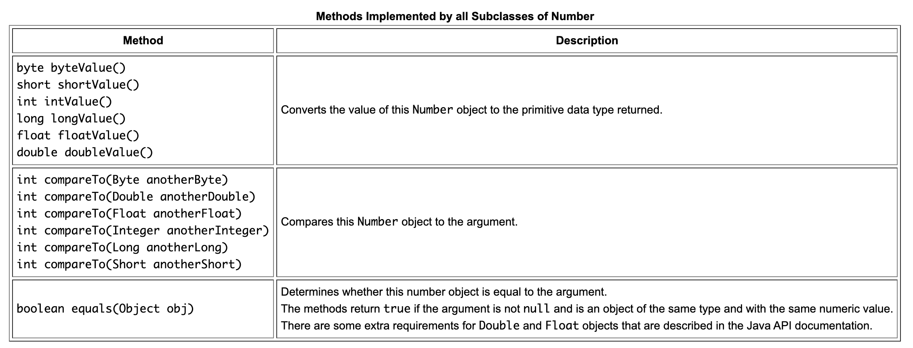
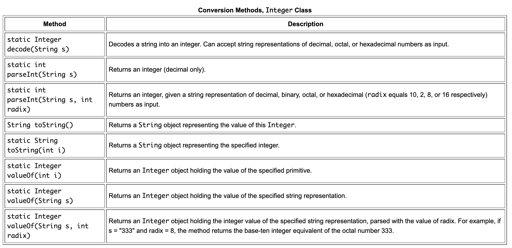

#### Number class

`Number` class is a part of the java.lang package.

###### When does Number need to be used instead of primitive data types.

1. As an argument of a method that expects an object (often used when manipulating collections of numbers).

2. To use constants defined by the class, such as `MIN_VALUE` and `MAX_VALUE`, that provide the upper and lower bounds of the data type. (Why?)

3. To use class methods for converting values to and from other primitive types, for converting to and from strings, and for converting between number systems (decimal, octal, hexadecimal, binary).

###### Wrapper classes

Java platform provides `wrapper classes` for each of the primitive data types. These classes "wrap" the primitive in an object. if you use a primitive where an object is expected, the compiler boxes the primitive in its wrapper class for you. Similarly, if you use a number object when a primitive is expected, the compiler unboxes the object for you.

> Read [Autoboxing and Unboxing](https://docs.oracle.com/javase/tutorial/java/data/autoboxing.html).

###### Number's subclasses

All of the numeric wrapper classes are subclasses of the abstract class `Number`.

Following are all its subclasses.

`Byte`, `Integer`, `Double`, `Float`, `Short`, `Long`, `BigDecimal`, `BigInteger`, `AtomicInteger`, `AtomicLong`.

###### Various Methods

###### Advanced mathematical computation

`Math` class in the java.lang package provides methods and constants for doing more advanced mathematical computation.

[Link](https://docs.oracle.com/javase/tutorial/java/data/beyondmath.html)

###### Misc.

`java.text.DecimalFormat` class can be used to control the display of leading and trailing zeros, prefixes and suffixes, grouping (thousands) separators, and the decimal separator.

`random()` method returns a pseudo-randomly selected number between 0.0 and 1.0. The range includes 0.0 but not 1.0, i.e. `0.0 <= Math.random() < 1.0`.  
Using Math.random works well when a single random number needs to be generated. If a series of random numbers need to be generated, `java.util.Random` needs to be used.
