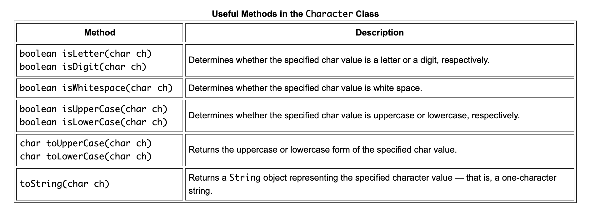
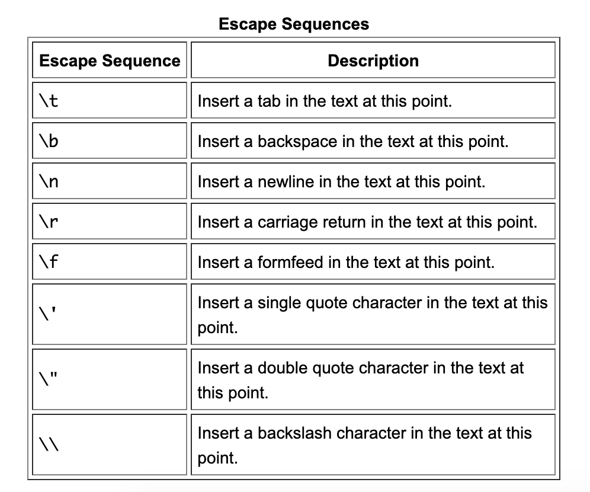
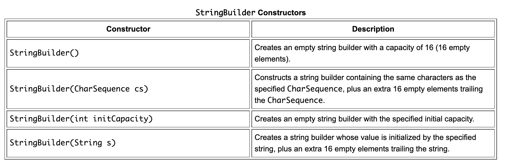

#### Character

`Character` is the wrapper class for primitive data type `char`.

`Character` class is immutable, so that once it is created, a Character object cannot be changed.





#### String

```
String greeting = "Hello world!";
```

###### Methods
length(), concat(), `+`, `floatValue()`, `substring`, `split`, `subSequence`, `trim()`, `indexOf()`, `contains()`, `replace()`, `startsWith()`, `matches()`

###### Formatting a String
```
System.out.printf("The value of the float " +
                  "variable is %f, while " +
                  "the value of the " +
                  "integer variable is %d",
                  floatVar, intVar);
```

```
String fs;
fs = String.format("The value of the float " +
                   "variable is %f, while " +
                   "the value of the " +
                   "integer variable is %d,
                   floatVar, intVar);
System.out.println(fs);
```

###### StringBuilder

`StringBuilder` objects are like String objects, except that they can be modified.

Its constructors -


Some of its methods - `append()`, `insert()`

> [Link](https://docs.oracle.com/javase/tutorial/java/data/buffers.html)
