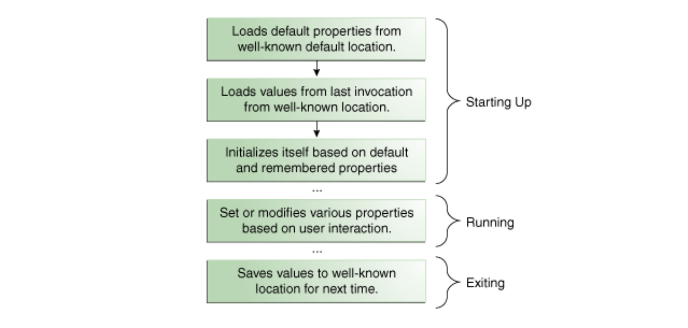

`Platform environment` is aterm that seems to indicate the overall environment in which the application is being run. It is defined by the OS, the JVM, class libraries, and the various configuration data supplied (such as command line arguments) when the application is launched.

These details are made accessible using several different classes and mechanisms.

#### Configuration Utilities

##### Properties

`Properties` are configuration values managed as key-value pairs. These values come from a `stream`, and can also be written back to a `stream`. It is done using `java.util.Properties` class. Properties extends `java.util.Hashtable` and can hence be used like hash tables too.

Access to properties however is subject to approval by the `security manager` (whatever it may mean). The same code in an applet may not work depending on the browser in which it is running.

> So it seems as if Properties are like iOS user defaults. Simple persistent plist values. Where are they persisted though.

 Properties during an application life cycle |
 --- |
 |

(Properties documentation - [link](https://docs.oracle.com/javase/tutorial/essential/environment/properties.html))

##### Command Line Arguments

Command line arguments can be accessed using the `args[]` argument of main`()`.

```
public static void main (String[] args) {
```

##### Environment Variables

Environment variables is how OS passes OS related configuration information to applications. They can be accessed using `System.getenv`.

When a Java application uses a `ProcessBuilder` object to create a new process, the default set of environment variables passed to the new process is the same set provided to the application's virtual machine process. The application can change this set using `ProcessBuilder.environment`.

> There are many subtle differences between the way environment variables are implemented on different systems. For example, Windows ignores case in environment variable names, while UNIX does not.

##### Misc.

There are several more configuration utilities.

`Preferences API` allows applications to store and retrieve configuration data in an implementation-dependent backing store. Asynchronous updates are supported, and the same set of preferences can be safely updated by multiple threads and even multiple applications.

An application deployed in a `JAR archive` uses a manifest to describe the contents of the archive.

The configuration of a `Java Plug-in applet` is partially determined by the HTML tags used to embed the applet in the web page.

The class `java.util.ServiceLoader` provides a simple service provider facility. A `Service Provider` is an implementation of a service, a well known set of interfaces and (usually abstract) classes. The classes in a service provider typically implement the interfaces and subclass the classes defined in the service. Service providers can be installed as `Extensions`.

#### System Utilities

[System](https://docs.oracle.com/javase/8/docs/api/java/lang/System.html) class provides a number of utilities.

##### Command-Line I/O Objects

There are several predefined `Command Line I/O objects` that are useful in a Java application that is meant to be launched from the command line. ([link](https://docs.oracle.com/javase/tutorial/essential/io/cl.html))

##### System Properties

The System class maintains a `Properties` object that describes the configuration of the current working environment.

##### Security Manager

A `Security Manager` is an object that defines a security policy for an application ([link](https://docs.oracle.com/javase/8/docs/api/java/lang/SecurityManager.html)).

This policy specifies actions that are unsafe or sensitive. Any actions not allowed by the security policy cause a `SecurityException` to be thrown. An application can also query its security manager to discover which actions are allowed.

Typically, a web applet runs with a security manager provided by the browser or Java Web Start plugin. Other kinds of applications normally run without a security manager, unless the application itself defines one.

Many actions that are routine without a security manager can throw a SecurityException when run with a security manager. This is true even when invoking a method that isn't documented as throwing SecurityException. For example, consider the following code used to read a file:

```
reader = new FileReader("xanadu.txt");
```

##### Accessing PATH and CLASSPATH in Windows, Solaris and Linux

PATH and CLASSPATH environment variables on Microsoft Windows, Solaris, and Linux can also be accessed.

##### Misc.

`currentTimeMillis` and `nanoTime` methods are useful for measuring time intervals during execution of an application.

The `exit` method causes the Java virtual machine to shut down, with an integer exit status specified by the argument.
