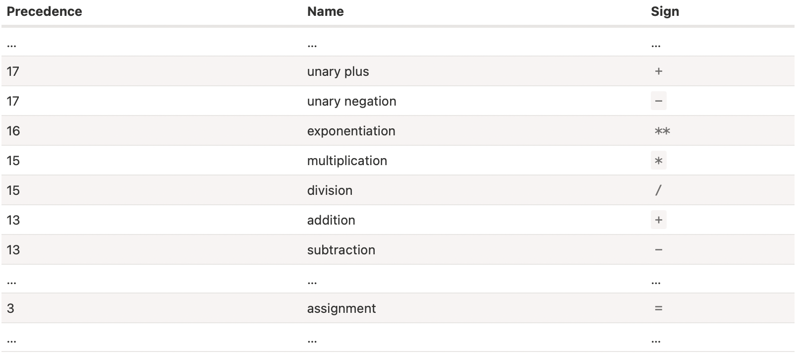

##### Some basic operators

`+`, `-`, `*`, `/`, `%` (remainder), `**` (exponentian).

String concatenation is also possible with `+`. If any of the operands is a string, then the other one is converted to a string too.

The unary plus or, in other words, the plus operator `+` applied to a single value, doesn’t do anything to numbers. But if the operand is not a number, the unary plus converts it into a number.
```
// Converts non-numbers
alert( +true ); // 1
alert( +"" );   // 0
```

`Modify-and-assign operators` (like `+=`, `-=`, `*=`, `/=`) too exist for all arithmetical and bitwise operators.

`++`, `--` exist too and can be placed either before (prefix form) or after (postfix form) a variable. Increment/decrement can only be applied to variables. Trying to use it on a value like 5++ gives an error. The prefix form returns the new value while the postfix form returns the old value (prior to increment/decrement).

##### Operator precedence

There are many operators in JavaScript. Every operator has a corresponding precedence number. The one with the larger number executes first. If the precedence is the same, the execution order is from left to right.



An assignment, i.e. `=` is also an operator. It writes the value into the variable and then returns it too (the obvious thing actually).
```
let a = 1;
let b = 2;
let c = 3 - (a = b + 1);
alert( a ); // 3
```

Assignments can in fact even be chained. Chained assignments evaluate from right to left.
```
let a, b, c;
a = b = c = 2 + 2;
```

The operators `++`/`--` can be used inside expressions as well. Their precedence is higher than most other arithmetical operations.
```
let counter = 1;
alert( 2 * ++counter ); // 4
```

##### Bitwise operators

They treat arguments as 32-bit integer numbers and work on the level of their binary representation. These operators are seldom needed though.

```
AND ( & )
OR ( | )
XOR ( ^ )
NOT ( ~ )
LEFT SHIFT ( << )
RIGHT SHIFT ( >> )
ZERO-FILL RIGHT SHIFT ( >>> )
```

##### Comma operator

`Comma operator` allows to evaluate several expressions, dividing them with a comma `,`. Each of them is evaluated but only the result of the last one is returned. It however has a very low precedence.

```
let a = (1 + 2, 3 + 4);
alert(a); // 7
```

##### Comparisons

Strings too can be compared to see if one is 'greater' than the other. The comparison is done using lexographical (i.e. dictionary based) order. This order is actually the unicode order, and hence A is greater than a.
```
alert( 'Z' > 'A' ); // true
alert( 'Bee' > 'Be' ); // true
```

Also, (if it wraps a number) string can be compared with numbers too.
```
alert( '2' > 1 ); // true
alert( '02' == 2 ); // true
```

The `regular equality check` (`==`) however cannot distinguish between `0` and `false`.
```
alert( 0 == false ); // true
```

A `strict equality check` (`===`) however even checks for the type.
```
alert( 0 === false ); // false
```

When `null` or `undefined` are compared to other values, the results are strange. In fact `undefined` shouldn’t be compared to other values. Any comparison with `undefined`/`null` except the strict equality `===` should be done with a lot of care.
