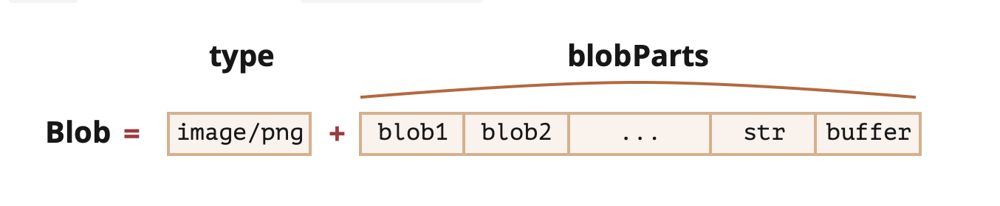

> This is possibly a web development topic but deals with JavaScript types, etc. to the extent I think of this more as a JavaScript topic.

[toc]

#### ArrayBuffer, Binary Arrays

In web development binary data is what is used while dealing with files (create, upload, download). JavaScript has certain types for it and they are highly performant.

`ArrayBuffer` is the basic binary object. It is a fixed-length contiguous memory area that is pre-filled with zeroes.

```
let buffer = new ArrayBuffer(16); // create a buffer of length 16
alert(buffer.byteLength); // 16
```

To access individual bytes, another 'view' object is needed, not 'buffer[index]'. A 'view' object does not store anything on its own. It’s the 'eyeglasses' that give an interpretation of the bytes stored in the `ArrayBuffer`.

`Uint8Array` – Treats each byte in ArrayBuffer as a separate number, with possible values from 0 to 255.
`Uint16Array` – Treats every 2 bytes as an integer, with possible values from 0 to 65535.
`Uint32Array` – Treats every 4 bytes as an integer, with possible values from 0 to 4294967295.
`Float64Array` – Treats every 8 bytes as a floating point number with possible values from 5.0x10-324 to 1.8x10308.

```
let buffer = new ArrayBuffer(16); // create a buffer of length 16

let view = new Uint32Array(buffer); // treat buffer as a sequence of 32-bit integers

alert(Uint32Array.BYTES_PER_ELEMENT); // 4 bytes per integer

alert(view.length); // 4, it stores that many integers
alert(view.byteLength); // 16, the size in bytes

// let's write a value
view[0] = 123456;
```

#### TypedArray

`TypedArray` has several regular Array methods like `map`, `slice`, `find`, `reduce` but does not have a few things like `splice` and `concat`.

It has two additional methods - `set` and `subarray`.

#### DataView

A special super-flexible “untyped” view over ArrayBuffer. It allows to access the data on any offset in any format.

#### TextDecoder, TextEncoder

Well, the received binary data can actually be a string. 

 `TextDecoder` allows to automatically read the value into an actual JavaScript string, given the buffer and the encoding. `label` is the encoding, utf-8 by default.

```
let decoder = new TextDecoder([label], [options]);
```

And then decode it to a JavaScript string. `input` is the BufferSource to decode.

```
let str = decoder.decode([input], [options]);
```

```
let uint8Array = new Uint8Array([72, 101, 108, 108, 111]);
alert( new TextDecoder().decode(uint8Array) ); // Hello
```

`TextEncoder` does the reverse thing, i.e. converts a string into bytes.

```
let encoder = new TextEncoder();

let uint8Array = encoder.encode("Hello");
alert(uint8Array); // 72,101,108,108,111
```

#### Blob

`ArrayBuffer` and views are a part of ECMA standard, i.e. a part of JavaScript.

The browser has additional higher-level objects (specified in the [File API](https://www.w3.org/TR/FileAPI/)), and `Blob` is one of them. `Blob` consists of an optional string type (a MIME-type usually), plus blobParts – a sequence of other Blob objects, strings and BufferSource.

> So `Blob` is a type to work with files in browser environments? 



```
// create Blob from a string
let blob = new Blob(["<html>…</html>"], {type: 'text/html'});

// create Blob from a typed array and strings
let hello = new Uint8Array([72, 101, 108, 108, 111]); // "Hello" in binary form
let blob = new Blob([hello, ' ', 'world'], {type: 'text/plain'})
```

We can’t change data directly in a `Blob`, but we can slice parts of a Blob, create new Blob objects from them, mix them into a new Blob and so on.

This behavior is similar to JavaScript strings: we can’t change a character in a string, but we can make a new corrected string.

Essentially, a `Blob` represents 'binary data with type'. That makes them convenient for upload/download operations, that are so common in the browser. Methods that perform web-requests, such as XMLHttpRequest, fetch and so on, can work with Blob natively, as well as with other binary types.

#### File, FileReader

A `File` object inherits from `Blob` and is extended with filesystem-related capabilities.

```
new File(fileParts, fileName, [options])
```

Also, more often we get a file from `<input type="file">` or drag'n'drop or other browser interfaces. 

```
<input type="file" onchange="showFile(this)">

<script>
function showFile(input) {
  let file = input.files[0];

  alert(`File name: ${file.name}`); // e.g my.png
  alert(`Last modified: ${file.lastModified}`); // e.g 1552830408824
}
</script>
```

`FileReader` is an object with the sole purpose of reading data from `Blob` (and hence `File` too) objects. It delivers the data using events, as reading from disk may take time.

```
let reader = new FileReader(); // no arguments
```

It can read data in one of three formats - String, ArrayBuffer, Data url, base-64 encoded.