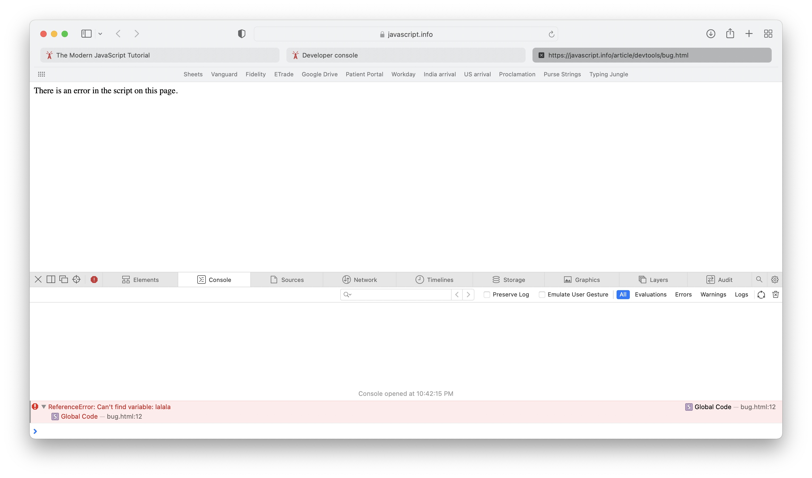

#### Safari

`Console` shows and messages that get logged when JavaScript scripts are run. So if there is any error, it will get shown there (in fact even with the line number in the html where the error occurs).

There is also a `command line` section with blue arrow just there, which can apparently even run JavaScript commands (need to try this, don't think it changes the attahed script though).

