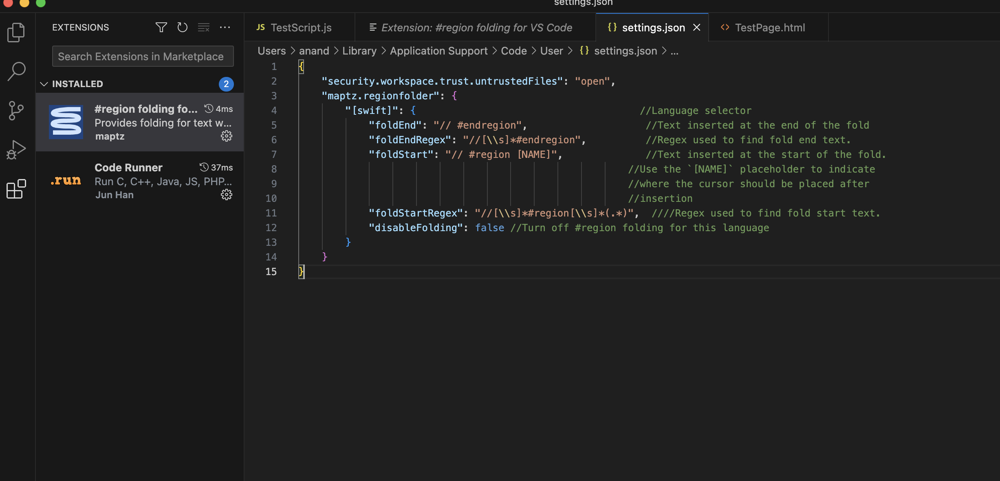
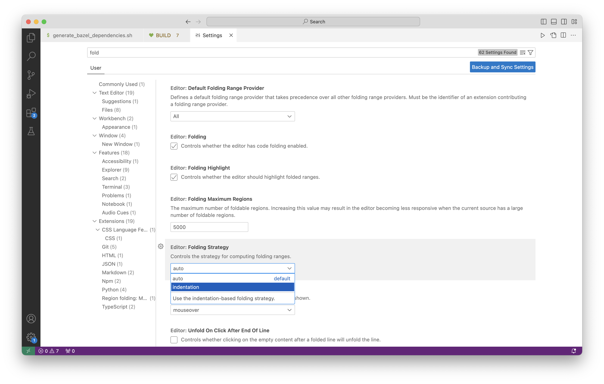
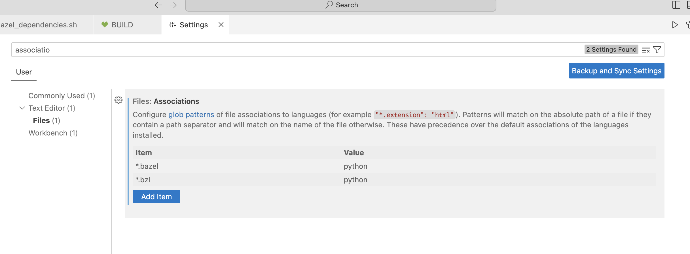
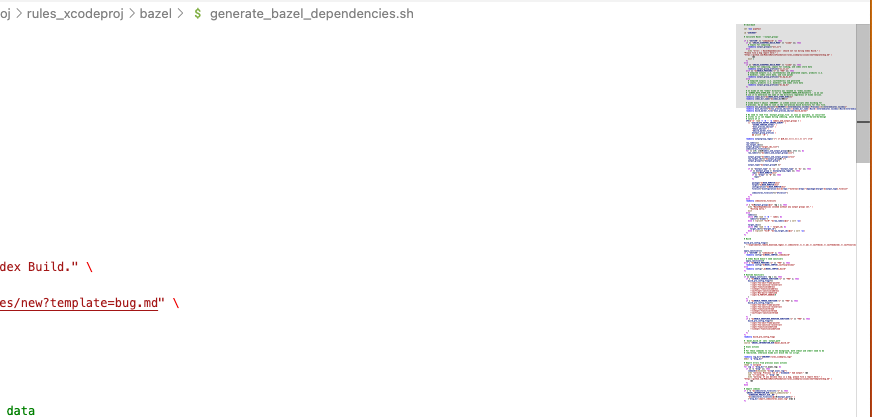
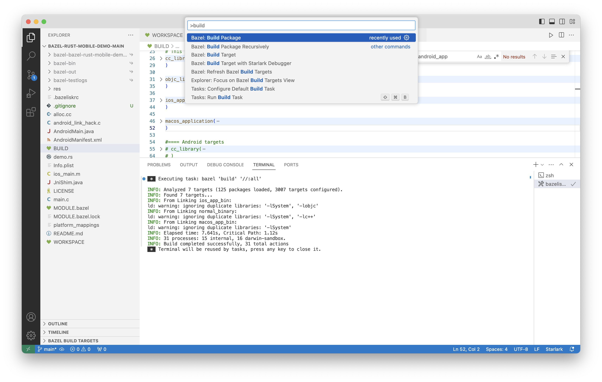
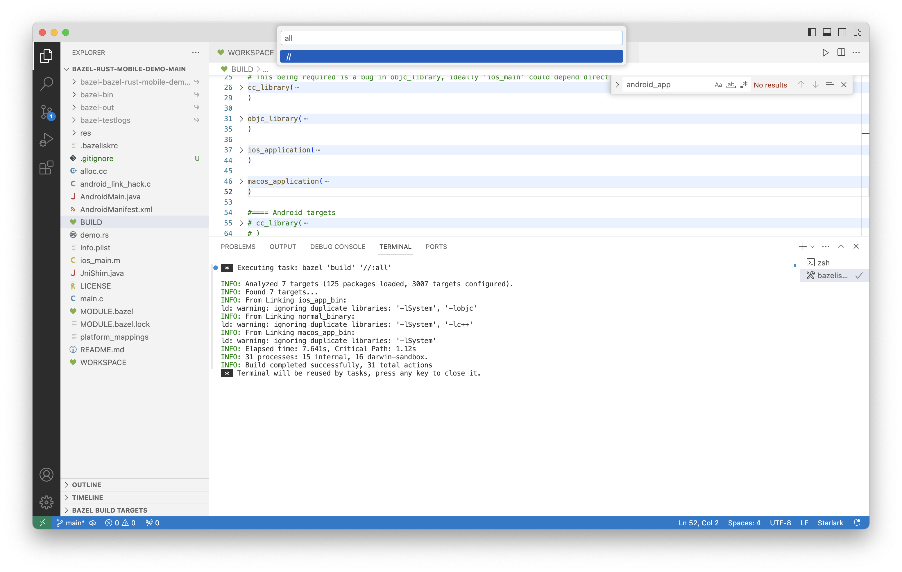

Running the JS file - Install NodeJS, then `Ctrl + Option + N`  

##### Region folding

A third party extension (from [maptz](https://marketplace.visualstudio.com/items?itemName=maptz.regionfolder)) can be used for it. With it code folding can be done across any custom region using the syntax `// #region REGION_NAME` and `//endregion`. This patten in fact is same across all languages, just that the initial characters should be the standard comments syntax for that language.

In Visual Studio's settings.json (accessible using the gear icon for the extension), an entry must be created appropriately for the applicable language (it is not present by default) and it must be ensured that it has the right characters for the comment syntax.

The keyboard shortcut to wrap any bunch of code in a region is to select the lines, and then type `Ctl M Ctl R`.

##### Default folding strategy

Its possible to set a defualt folding strategy when unknown, for example indent based on indentation.

##### Associations

It can be specified that certain file extensions be treated as belonging to a particular language's.

##### Show/Hide Editor Minimap

| Minimap                                                        | Setting to show/hide it                                        |
| ---------------------------------------------------------------- | ---------------------------------------------------------------- |
|  |  |

##### Command Palette

Its something like an easy way to access the full menu for a given extension. An extension can support plenty of things, but the number of possible key bindings are limited so this offers a way to access them all. It brings up a popover where the particular command can be typed and then run. The keyboard shortcut to bring it up is `Cmd Shift P`.

In the below example, Bazel extension's 'Build Package' command is shown. If selected, it runs the command (if needed, will ask for further arguments in another subsequent popover). 

| Command Palette                                              | Subsequent popover for arguments                             |
| ------------------------------------------------------------ | ------------------------------------------------------------ |
|  |  |

##### Keyboard Shortcuts

(Reference [Link](https://code.visualstudio.com/shortcuts/keyboard-shortcuts-macos.pdf))

File Explorer - `Cmd Shift E`  Extensions - `Cmd Shift K`  Command Palette - `Cmd Shift P`  

Go to File - `Cmd P`  Open Terminal - ``Ctrl ` ``  Open in new tab - Double click  

Fold All - `Cmd K Cmd 0`  Unfold All - `Cmd K Cmd J`  

Show Preview (Markdown Editor extension) - `Cmd Option Shift M`  
