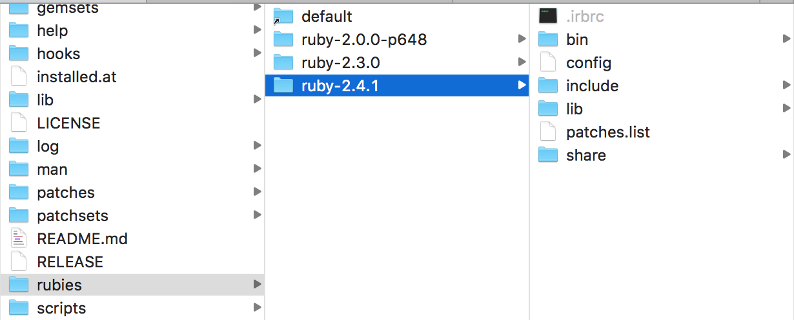
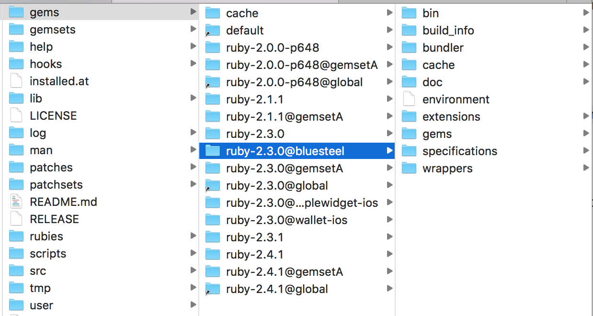
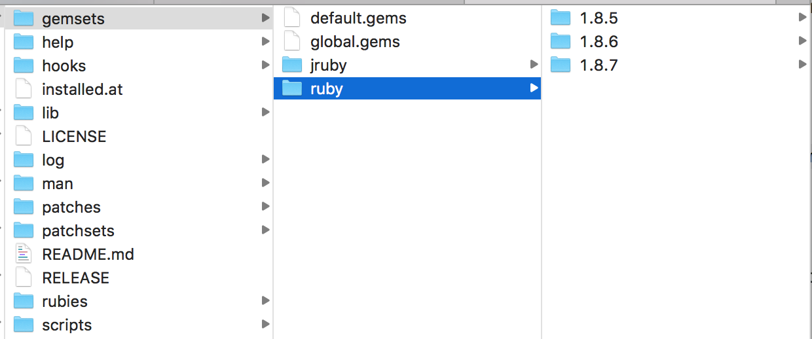

##### What is RVM

RVM allows you to have multiple version of Ruby installed in your system, have different set of gems installed for each version and in fact even have different set of gems for different projects even though every project is using the same Ruby version.

> Without RVM, Ruby just gets installed in system folder. So at a time only one Ruby version can be available and every gem that it has installed becomes available to all projects. Even though different projects would rather have different versions of a given gem. (I think that is how it happens without RVM.)

##### Installing RVM
```
curl -L get.rvm.io | bash -s stable  
```

RVM should also be loaded in Shell. Its usually best to just add it in `bash_profile`.
```
[[ -s "$HOME/.rvm/scripts/rvm" ]] && source "$HOME/.rvm/scripts/rvm"
```

##### Folders in .rvm

Physically RVM gets stored in `/Users/sou543/.rvm`. It has several folders in it. Two or three of them are of particular interest.

`rubies` has all the installed Ruby versions. <br><br>
`gems` has all the installed gemsets. Gemsets are arranged as `RubyVersion@GemsetName` and these gemsets internally have the precise gems they need to have. <br><br> `gemsets` is another folder called but it seems to be less relevant. It seems to be having one folder each for all the Ruby implementations (i.e. `ruby`, `jruby`, etc.) and each of these folders have their respective installed versions and they in turn something called `global.gems` file. <br><br>

| `rubies`  | `gems` | `gemsets`
| ------------- | ------------- | -------------
|   |  | 

##### Common rvm commands

###### Installing gems

```
gem install GemName (Installs the gem in the current Rubyset)
gem install GemName -v 1.0.5 (Install a specific version in the current Rubyset)

rvm @global do gem install GemName (Install the gem across all gemsets of currently active Ruby version)

gem list (Gives a list of all installed gems. Across all versions even including system gems?)
```

> If you use install gems without having RVM then everything gets installed in the system folder, i.e. `/usr/local/lib/ruby`

> While installing a gem using rvm, never use sudo as it then places the gem outside the .rvm folder

> To automatically install some gems in every new Ruby version that you install using RVM. Make entries for those gems (one gem per line) in `~/.rvm/gemsets/global.gems`

###### Switching/installing Ruby versions

```
rvm use 2.3.0 (Changes Ruby version for currently active Shell session. Even installs it, if unavailable.)
rvm use 2.4.1@gemsetA (Can even specify gemset while switching)

rvm use 1.9.3 --default (Makes the specified Ruby the default for new sessions)
rvm use 2.4.1@gemsetA --default (Makes the specified gemset the default for new sessions)
rvm alias show default (Shows the Ruby version set as default)

ruby use system (Switches to system Ruby)
rvm use default (Switches back to RVM Ruby)

rvm list (Gives all Ruby versions installed via RVM)
rvm current (Gives currently active version of Ruby)

rvm 2.4.1@gemsetA (Same as `rvm use`)
rvm install 2.4.1 (Installs the Ruby version. Don't think it also activates it for current Shell session)

```

> Keep in mind that by default a new terminal session uses the 'default gemset', not the gemset that was previously used for that folder.

###### Managing Gemsets

```
rvm gemset create gemsetA (Creates a new gemset)
rvm gemset delete ruby-2.4.1@gemsetB (Deletes a gemset)

rvm gemset (Shows the gemset currently being used)
rvm gemset list (Shows gemsets for current Ruby version)
rvm gemset list_all (Shows gemsets across all Ruby versions)
```
> When a new gemset is created, a new folder in  `.rvm/gems/ruby-RubyVersion@GemsetName` gets created. Inside that there is a folder called `gems` where you can see all the installed gems in that gemset.


###### Misc.

```
ruby -v (Ruby version being used in current Shell session)
which ruby (Gives where currently active Ruby version is located)
```

> While opening a folder (which had a `gemfile`) in Shell for the first time, the below happened. Need to understand this better.

```
RVM used your Gemfile for selecting Ruby, it is all fine - Heroku does that too,
you can ignore these warnings with 'rvm rvmrc warning ignore /Users/sou543/Documents/Anand/Projects/8.VirtualCardManager/Codebase/virtualcardmanager/Gemfile'.
To ignore the warning for all files run 'rvm rvmrc warning ignore allGemfiles'.
ruby-2.3.0 - #gemset created /Users/sou543/.rvm/gems/ruby-2.3.0@virtualcardmanager-ios
ruby-2.3.0 - #generating virtualcardmanager-ios wrappers.........

```

[Link1](http://robdodson.me/how-to-use-rvm-for-rails3/) <br>
[Link2](https://medium.com/the-andela-way/ruby-versioning-with-ruby-version-manager-rvm-6a3198b263df)
