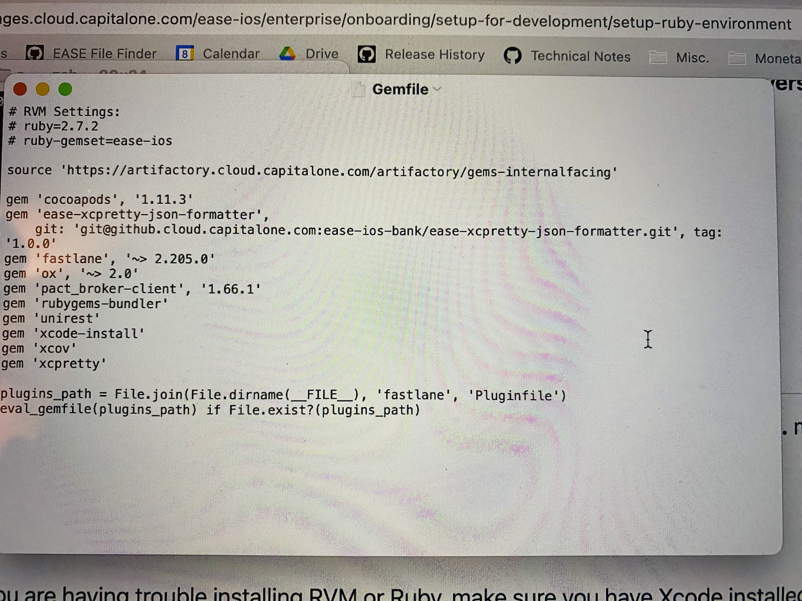

[toc]

There are some packages that EASE needs for itself to operate, i.e. things like Cocoapods, XcodeGen, Fastlane, etc. The things that these packages do, its cumbersome to do those things without them. Now, these packages are invariably written in Ruby. In other words, these packages are available as Ruby libraries (i.e. gems). And to install these gems, you need to work with the Ruby ecosystem. 

##### 1. Install RVM

Now the typical way to install a gem is through RubyGems which gets installed automatically with Ruby. But then you would also want to ensure that the gems get installed using the specific Ruby version you want so that everyone in the team is working with the same gem versions. Now for all the gems to have the same version, the first step is to have a single Ruby version to be used by all the devs. This is done using a RVM (i.e. Ruby Version Manager).

So that is done using this command.

```
curl -sSL get.rvm.io | bash -s stable --ruby 
```

RVM should also be loaded in Shell. Its usually best to just add it in `bash_profile` / `.zlogin`.

```
[[ -s "$HOME/.rvm/scripts/rvm" ]] && source "$HOME/.rvm/scripts/rvm"
```

##### 2. Install Ruby

After installing RVM, its used to install the same Ruby version in ease-ios root directory for all the devs. There is a `.ruby-version` file placed in ease-ios root that has the Ruby version to be used.

```
rvm install $(head -n 1 .ruby-version)
```

##### 3. Install Bundler

So this makes sure that all developers are working with the same Ruby version. The next task is to ensure everyone is indeed using the same gem versions too. The way to do it is by using Bundler, which is in fact a gem itself. To install the desired Bundler version, RubyGems (which gets automatically installed along with Ruby) is used. Gemfile.lock file in ease-ios root has the bundler version mentioned in its last line.

```
gem install bundler -v "$(grep -A 1 "BUNDLED WITH" Gemfile.lock | tail -n 1)"
```

##### 4. Install all the gems

Now Bundler can be used to install the precise versions of all the required gems. The required gem versions are mentioned in the `gemfile`, also the `gemfile.lock` file spcifies which precise version to use for a given gem if multiple versions satisy `gemfile` specs.

```
bundle install
```



##### 5. Download and link all Cocoapods pods

Next step is to install the required pods (i.e. Cocoapods pods) using the Cocoapods version specified for ease-ios in its gemfile. That is done using 'bundle exec'.

```
bundle exec pod install --repo-update
```

##### 6. Run XcodeGen

Thereafter, simply run xcodegen.

```
swift run ease xcodegen
```

> What is really happening here. Is it a script, inspect its code.

##### 7. Generate MiniTestHarness

And then generate MiniTestHarness workspace.

```
swift run toolbox make-workspace
```

> Inspect the code that runs when above is used.
