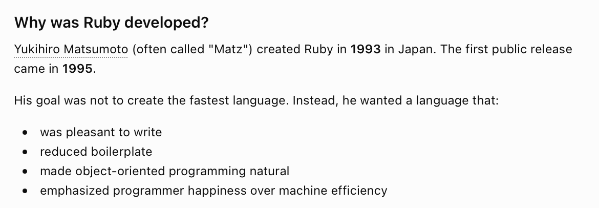
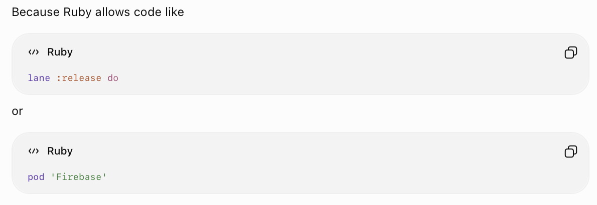
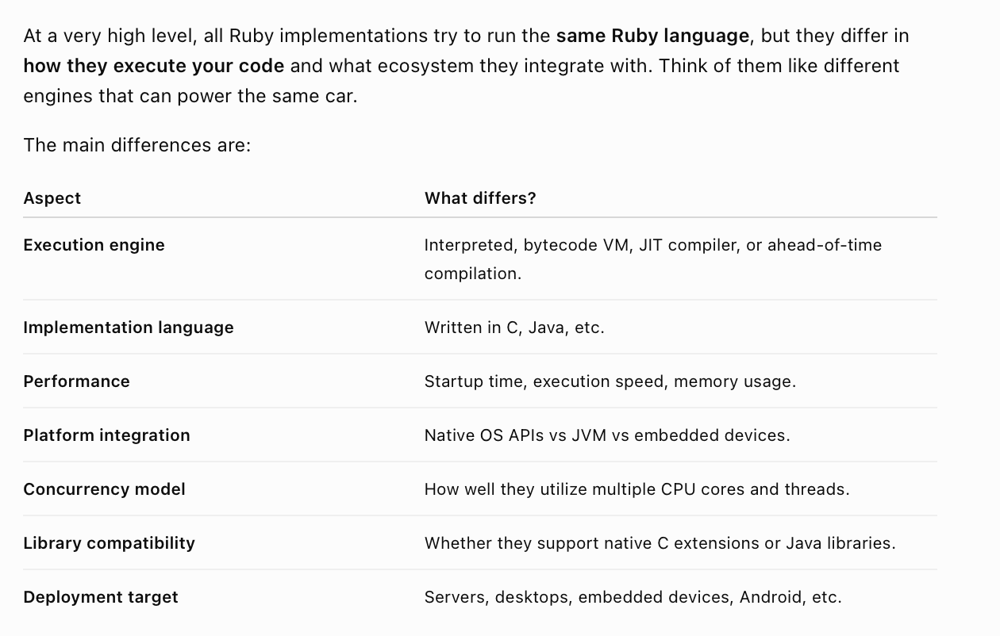
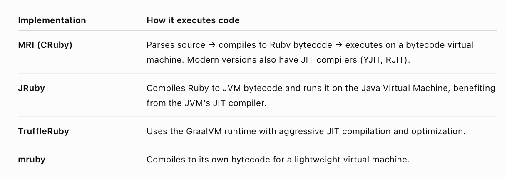

[toc]

##### When was created and why

It was developed in 1993 with the main motive being a language pleasant to write, and not performance or such. 

Around 2004, Ruby on Rails was developed which really made it a very popular web dev language. Gradually though it started being used in tooling automation and build systems more. A big reason for its popularity in tooling is that it is expressive and easy to extend with domain-specific languages (DSLs).

##### Ruby implementations

There are multiple implementations. MRI (CRuby), JRuby, Rubinius, etc. How differ among each other is not really in syntax, but instead in their compilation/interpretation mechanism, intended platforms and hence the available platform APIs, concurrency support, etc.

MRI (CRuby) is pretty much the original Ruby implementation.

##### Ruby is not an interpreted language anymore

Like most modern 'interpreted' languages, no Ruby implementation is strictly line-by-line interpreted anymore. They all use some variation of Just in time compilation.

##### Resources

Ruby evolution ([ChatGPT link](https://chatgpt.com/g/g-p-6a66554e47d08191981983576e2253f0-enterprise-apps-tooling/c/6a66557b-33a4-83ea-b340-9a4418b99872))

