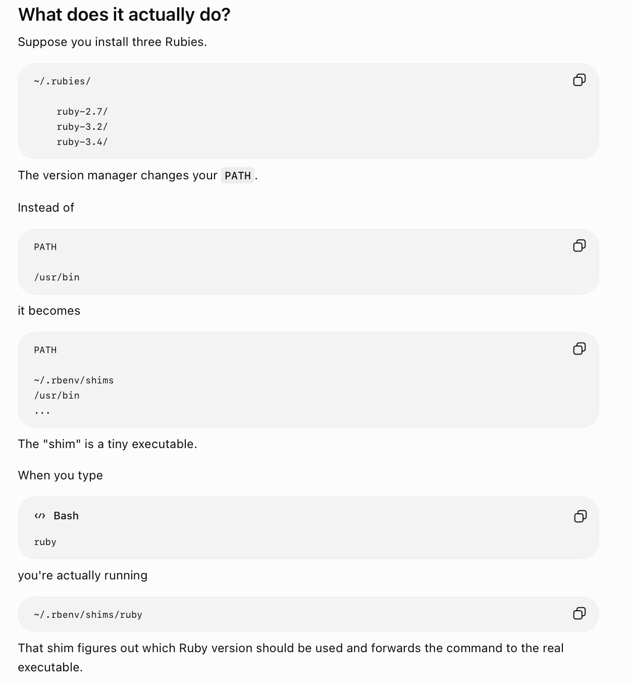
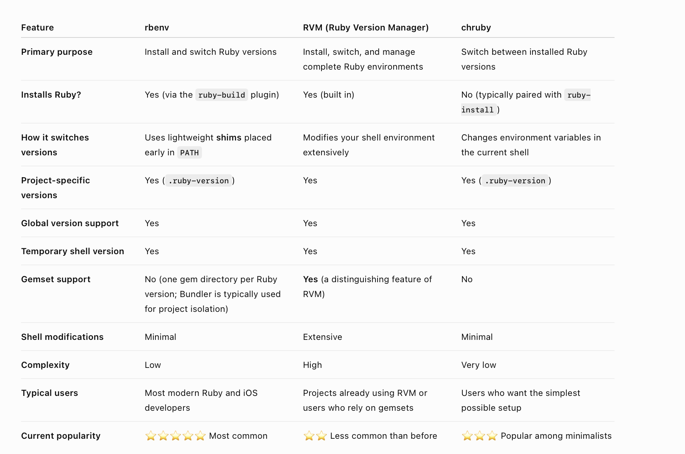
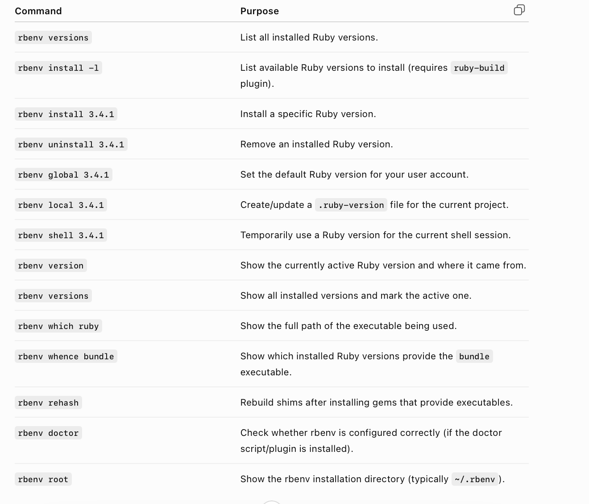
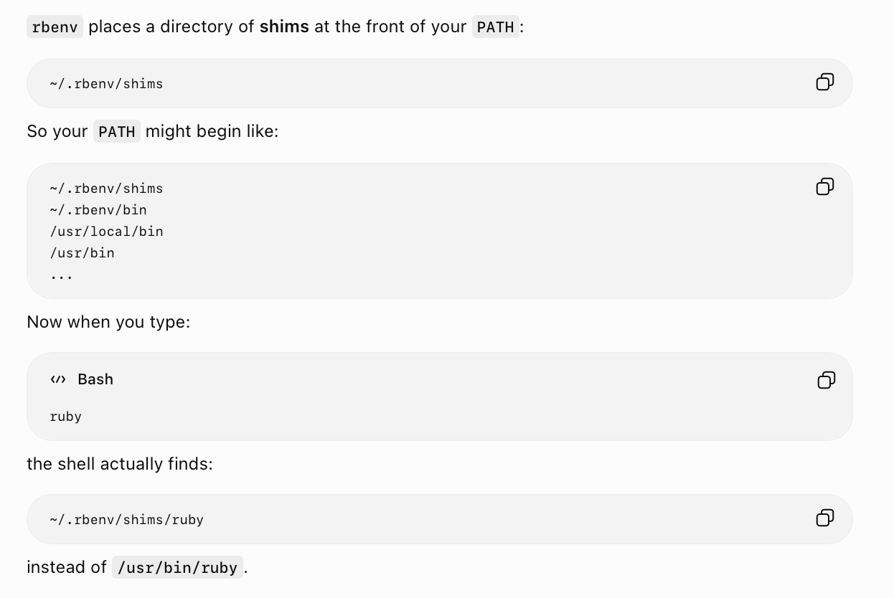
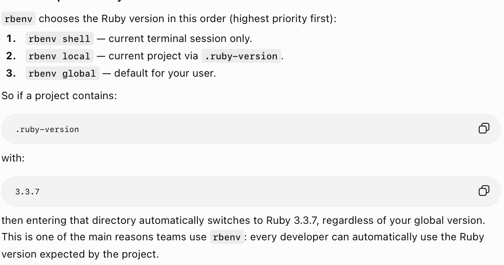

[toc]

#### System Ruby

macOS ships with a pre-installed Ruby, i.e. **MRI (CRuby)**, the standard C implementation of Ruby. Its invariably ruby **2.6.10**p210 across macOS versions and doesn't changhe inspite of being an old version to maintain system compatibility. 

This system Ruby is at **/usr/bin/ruby** and developers are really not supposed to use it themselves, instead they should use their own latest Ruby version through a Ruby version manager of their choice.

#### Ruby Version Managers

The basic idea is to have multiple Ruby versions installed in the system and pick and choose different versions for different projects.

Common version managers are **rbenv**, **RVM**, **chruby**.

Some newer version managers like **asdf** or **mise** let you manage runtimes for multiple languages (like Swift, Python, Node.js, Java) too.

#### rbenv

##### Basic commands

**rbenv versions** - List all Ruby versions  **rbenv install 3.4.1** - Install a specific Ruby version  **rbenv install -s 3.4.1** - Install a specific Ruby version only if not already installed  **rbenv which ruby** - Show the full path of the Ruby executable being used.

##### shims

Its basically a tiny executable that gets sourced in PATH, that makes sure to pick the right Ruby version for a given project.

##### How it picks which Ruby version to use

Its basically, 'current shell setting > project setting > global setting'

#### Resources

Ruby version managers ([ChatGPT link](https://chatgpt.com/g/g-p-6a66554e47d08191981983576e2253f0-enterprise-apps-tooling/c/6a66557b-33a4-83ea-b340-9a4418b99872))  rbenv basics ([ChatGPT link](https://chatgpt.com/g/g-p-6a66554e47d08191981983576e2253f0-enterprise-apps-tooling/c/6a67ea60-5dd0-83ea-b7a2-972ad26d0430))