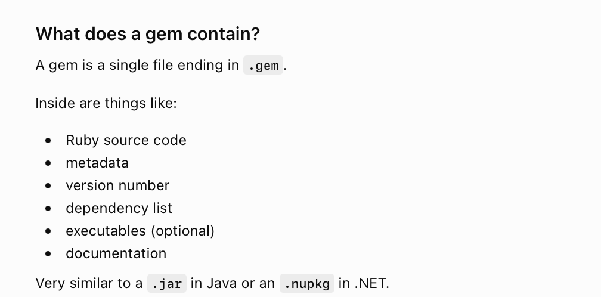
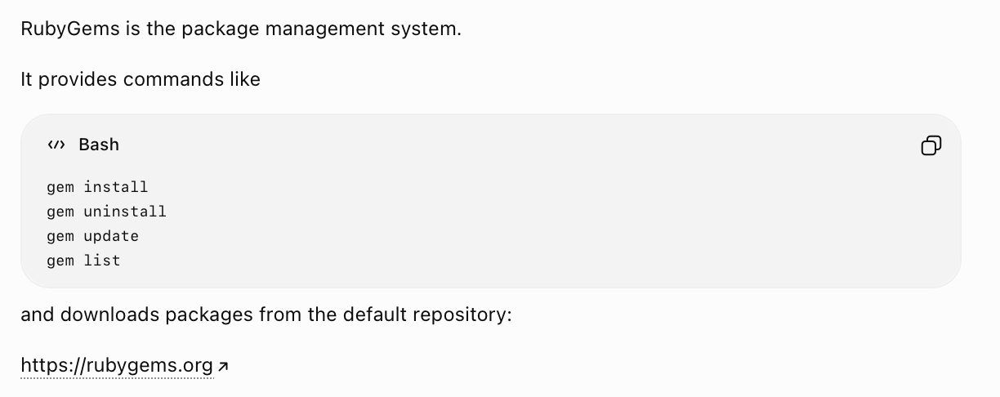
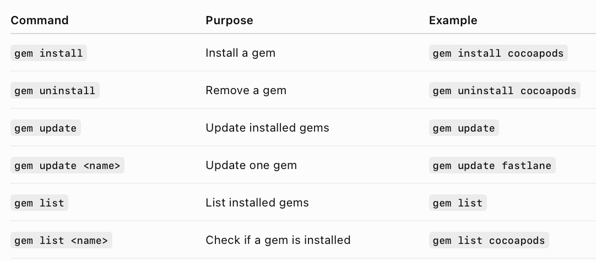
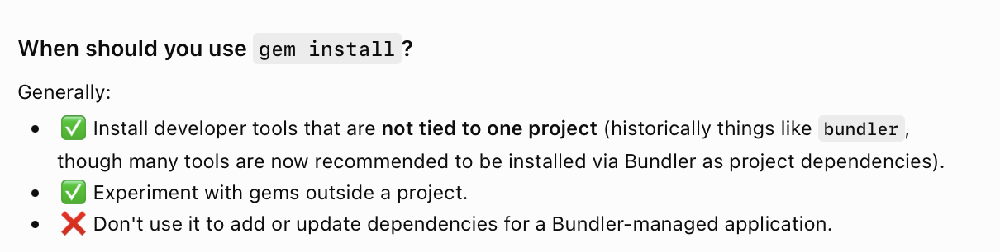
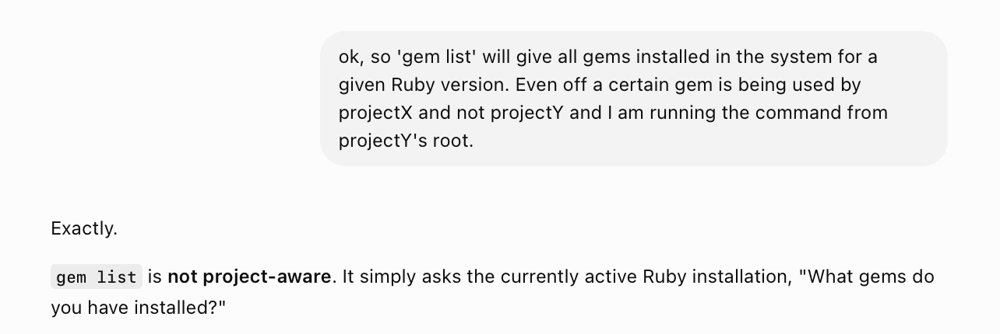
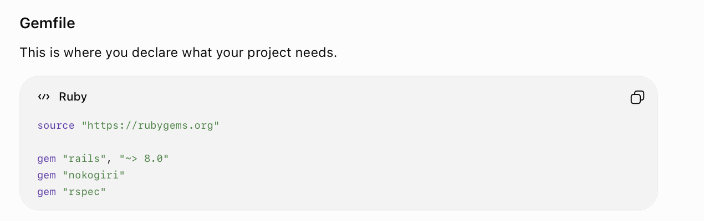
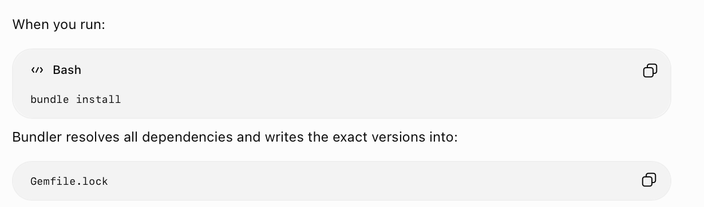
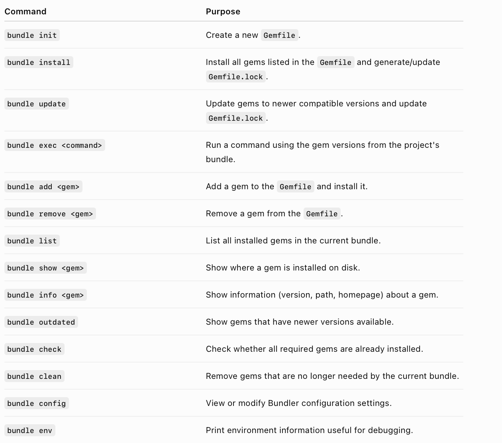

[toc]

#### RubyGems

##### What is it

Simply put a **gem** is a Ruby library and RubyGems is a package management systrem (just like SPM or Cocoapods). All Ruby implementations now install RubyGems too.

##### Basic commands

RubyGems has its own commands to install gems, but you should not use that inside a project which is otherwise being managed using Bundler as doing so will simply install latest version of that gem regardless of any constraints in gemfile and will also not update gemfile.lock. FWIW, some of these commands are below still. 

👉 If bundler is being used, use gem install only for non-project specific gems,

👉 Note that gem list and bundle list are not literally the same things. gem list is not project-aware and gives a list of all the gems installed in the system for a given Ruby version, even if that gem is not being used in a given project (i.e. is not in its Gemfile).

#### Bundler

##### What is it

**Bundler** is dependecy management system. So while installing a gem is the job of RubyGems figuring out what other gems a gem needs is the job of Bundler. The list of gems that a project directly needs is specified in **Gemfile**.

##### Basic commands

**bundle install** installs the gems listed in gemfile  **bundle exec <command>** runs the passed command using the gem versions from project's bundle  **bundle list** lists the gems currently installed in project bundle

#### Resources

RubyGems ([ChatGPT link](https://chatgpt.com/g/g-p-6a66554e47d08191981983576e2253f0-enterprise-apps-tooling/c/6a669882-5400-83ea-896f-fda0df5e4299))  Bundler ([ChatGPT link](https://chatgpt.com/g/g-p-6a66554e47d08191981983576e2253f0-enterprise-apps-tooling/c/6a669b7d-7fbc-83ea-9626-7a56c37efd1d))