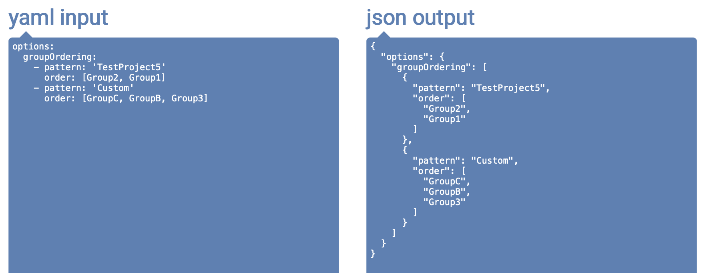

`YAML` is another data-serialization language like `XML` and `JSON`. It uses indentation to indicate nesting and is more compact than XML and JSON.

Every valid JSON is also a valid YAML. It also allows comments to be inserted.

[Syntax - Wiki](https://en.wikipedia.org/wiki/YAML#Syntax)<br>
[Syntax - Official reference](https://yaml.org/refcard.html)<br>

##### Basic Syntax

Whitespace indentation is used (tab characters are not allowed). <br>

Comments begin with `#` and can start anywhere on a line. <br>

List members are denoted by a `-` with one member per line or by `[...]` with each entry separated by a `,`. <br>

Dictionary is represented by `:` in the form `key: value` with one entry per line. Or by `{...}`, with keys separated from values by colon and the entries separated by commas. A `?` can be used in front of a key, in the form `?key: value` to allow the key to contain leading dashes, square brackets, etc., without quotes. <br>

Strings are ordinarily unquoted, but may be enclosed in `''` or `""`. <br>

```
default_attributes:
  openstack.attribute_test.string           : "test"
  openstack.attribute_test.string_no_quotes : test
  openstack.attribute_test.integer          : 14
  openstack.attribute_test.boolean          : true
  openstack.attribute_test.nothing          :

  # This is one string and not an array of strings
  openstack.attribute_test.array_strings    : zero, one, two

  # Arrays of strings
  openstack.attribute_test.array_strings_1  : ["zero", "one", "two"]
  openstack.attribute_test.array_strings_2  : [zero, one, two]
  openstack.attribute_test.array_strings_3  :
    - zero
    - one
    - two
```

In the below example, groupOrdering is a list and every element of that list is a dictionary.



##### Advanced Syntax

Multiple documents within a single stream are separated by `---`.

Repeated nodes are initially denoted by `&` and thereafter referenced with an `*`.
```
# Here the value of `current` is same as that in `def`.

pagination:
    limit:
        default: &def 10
        min: 0
        max: 50
        current: *def
```

Nodes may be labeled with a type or tag using `!!` followed by a string. YAML autodetects datatype of entities, but this can be used to explicitly specify the type. <br>
```
---
d: !!float 123

---
picture: !!binary |
  R0lGODdhDQAIAIAAAAAAANn
  Z2SwAAAAADQAIAAACF4SDGQ
  ar3xxbJ9p0qa7R0YxwzaFME
  1IAADs=
```
