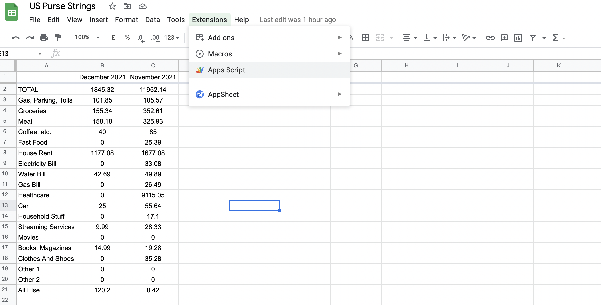
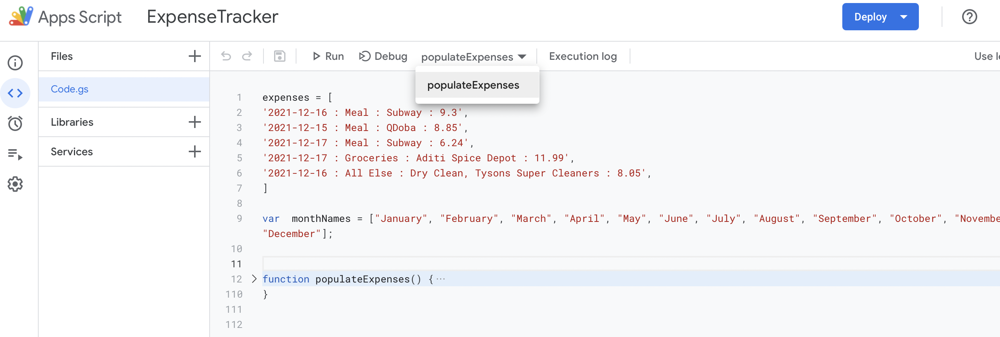
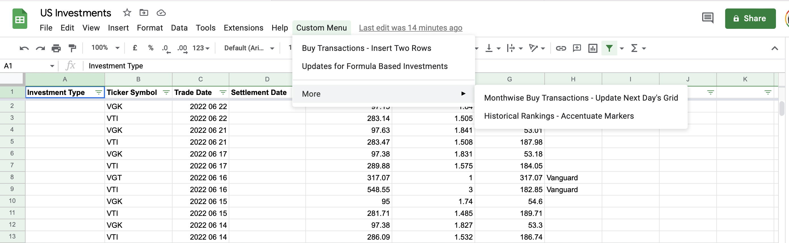
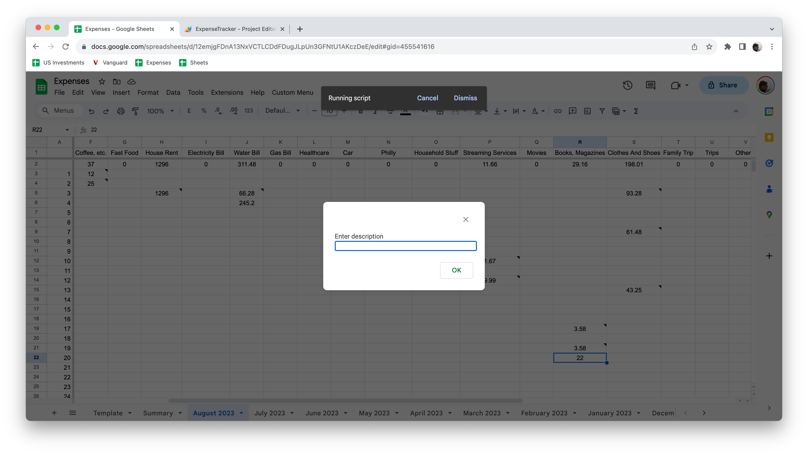

[toc]

Google Apps Script is an online scripting language used for automating tasks on Google Workspace apps. Its based on JavaScript and while is not usually having the latest JavaScript like API, does have the API from a couple of versions before.

##### How to launch the editor, run the script

The editor can be launched via the menu option `Extensions > App Scripts`.



Once the code is written, each of the functions show up in the top toolbar and (I think) the functions can be run individually (there is a `Run` button in the toolbar).



`Execution Log` shows the console logs from the previous run. it also shows up automatically when the script is run afresh.

##### How to attach scripts to custom menu options

This can be done by implementing `onOpen` function in Apps Script. Existing custom functions can be tied to custom menu options, and when google sheets UI is reloaded, the custom menu options show up.

```
function onOpen() {
  var ui = SpreadsheetApp.getUi();
  ui.createMenu('Custom Menu')
      .addItem('Buy Transactions - Insert Two Rows', 'insertTwoRowsInBuyTransactionsSheet')
      .addItem('Updates for Formula Based Investments', 'usualStepsForFormulaBasedInvestments')
      .addSeparator()
      .addSubMenu(ui.createMenu('More')
        .addItem('Monthwise Buy Transactions - Update Next Day\'s Grid', 'updateNextDayGrid')
        .addItem('Historical Rankings - Accentuate Markers', 'accentuateMarkersInHistoricalRankings')
      )
      .addToUi();
}
```



#### Basic GoogleSheets API

##### Accessing a sheet

Getting the active spreadsheet (i.e. workbook). Returns an array of sheets.
```
var activeSpreadsheet = SpreadsheetApp.getActiveSpreadsheet();
```

Get sheet by name.
```
var templateSheet = activeSpreadsheet.getSheetByName('Template');
```

##### Duplicating a sheet

Duplicate existing sheet and give it a new name.
```
var templateSheet = activeSpreadsheet.getSheetByName('Template');
templateSheet.copyTo(activeSpreadsheet).setName("New name");
```

##### Accessing a range

Various ways of referring a range.
```
const range1 = activeSpreadsheet.getSheetByName("Summary").getRange(1,3,1,20); // (row, column, numRows, numColumns)
const range2 = activeSpreadsheet.getRange("Summary!A1:Z1");
```

Getting the active (i.e. selected) range.
```
const selectedRange = activeSpreadsheet.getActiveRange();
```

Get the first row and column index of a range.
```
const firstRowIndex = range.getRowIndex();
const firstColumnIndex = range.getColumn();
```

##### Getting and setting values

Get or set values in a range of cells. Here the values in all the cells in the range beginning from Row 1,3 to Row 1,20 are stored in a two-dimensional array.
```
const row1RangeValues = activeSpreadsheet.getSheetByName("ABC").getRange(1,3,1,20).getValues();

summarySheet.getRange(innerLoopIndex, columnIndexInSummarySheet).setValue(totalForCurrentCategoryAndMonth)
```

Here the values in a range with multiple cells are updated in a single update.
```
buyTransactionsSheet.getRange("B2:C3").setValues([["VGK", currentDateVerbiage], ["VTI", currentDateVerbiage]]);
```

Iterating though all the cells of a range.
```
const firstRowIndex = selectedRange.getRowIndex();
const firstColumnIndex = selectedRange.getColumn();

selectedRangeValues.forEach(function(rowArray, outerArrayIndex) {
  rowArray.forEach(function(cell, innerArrayIndex) {
    const currentRowIndex = firstRowIndex + outerArrayIndex;
    const currentColumnIndex = firstColumnIndex + innerArrayIndex;
    const currentCellRow0Value = monthCells[0][currentColumnIndex-1];
    const currentCellColumn0Value = categoryCells[currentRowIndex-1];    
  });
});
```

##### Getting and setting notes

Get or set notes in a range of cells. Here the note of the specified cell is returned.
```
const currentNote = correspondingSheet.getRange(rowNumberInSheet,columnNumberInSheet).getNote();

correspondingSheet.getRange(rowNumberInSheet,columnNumberInSheet).setNote(newNote)
```
> I think what is returned by any `getRange().getXYZ()` function depends on what range was passed. If the range is just one cell, it returns a single value. If the range is one row/one column it probably returns an array. If the range is a two dimensional array it returns a two-dimensional array.

##### Inserting/deleting rows

Insert a row, and copy cells from another row.
```
const chartsTopRowRange = chartsSheet.getRange("A22:AF22");
chartsSheet.insertRowsAfter(22, 1);
chartsTopRowRange.copyTo(chartsSheet.getRange(23, 1, 1, 28), {contentsOnly:false})
```

##### Logging messages in console

Log a message in the console.
```
Logger.log("INSERTED NEW SHEET - " + expectedSheetNames[outerLoopIndex]);
```

##### Showing an alert message

```
SpreadsheetApp.getUi().alert("Sample message");
OR
Browser.msgBox("Sample message")
```

##### Showing an inut box

```
let description = Browser.inputBox("Enter description")
```



##### Get last row

Get the index last row in the sheet that is not empty.
```
currentSheet.getLastRow();
```

##### Changing cell background color and font color

```
activeSheet.getRange(1, 1, 5, 5).setBackgroundRGB(120, 180, 190);
activeSheet.getRange(1, 1, 1, 5).setFontColor(fontColor);
```

##### Making cells bold/unbold

```swift
SpreadsheetApp.getActiveSpreadsheet().getActiveSheet().getRange(1,1,numRows,numColumns).setFontWeight("bold"); SpreadsheetApp.getActiveSpreadsheet().getActiveSheet().getRange((1,1,numRows,numColumns).setFontWeight("bold");
```

##### Setting horizontal alignment of a range

```swift
SpreadsheetApp.getActiveSpreadsheet().getActiveSheet().getRange(1,1,numRows,numColumns).setHorizontalAlignment("left");
```

##### Deleting all cells in a range

```swift
SpreadsheetApp.getActiveSpreadsheet().getActiveSheet().getRange(1,1,numRows,numColumns).deleteCells(SpreadsheetApp.Dimension.ROWS);
```

#### Basic GoogleSheets functions

`SORT` - Sorts the specified range, using the column specified in 2nd argument, in asecending/descring order as per 3rd argument. And then prints the sorted range from the cell in which function is given.

```
=SORT({A3:A21, B3:B21}, 2, FALSE)
```

`INDEX` - Takes a range, and prints only the selected row (2nd argument), or the selected column (3rd argument).
```
=INDEX(A3:C21),,1)

=INDEX(SORT({A3:A21, B3:B21}, 2, FALSE),,1)
```
