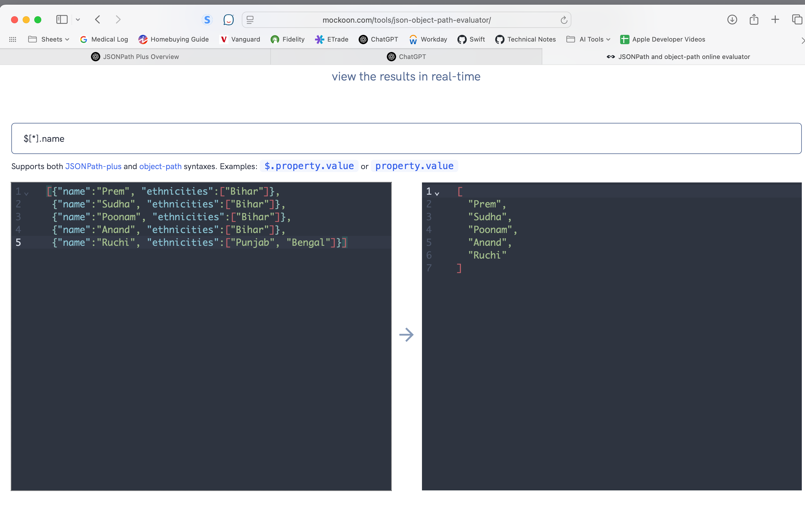
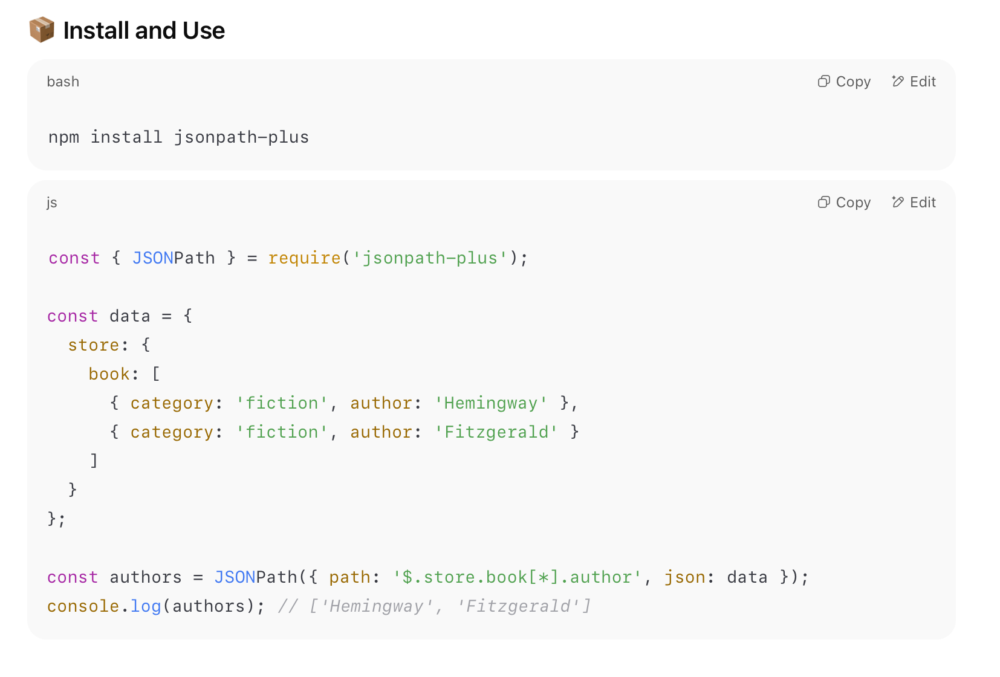

[toc]

##### What are they

Query languages basically enable to quickly query the data from a JSON.

For example, given a JSON such as this

```swift
{
  "person": {
    "name": "Alice",
    "pets": [
      { "type": "dog", "name": "Rex" },
      { "type": "cat", "name": "Mittens" }
    ]
  }
}
```

These are what various paths (in JSONPath format here) will generate

```swift
$.person.pets[*].type                    ----> ["dog", "cat"]
$.person.pets[?(@.type=="cat")].name     ----> ["Mittens"]
```

##### Online tools to test them

[Mockoon's](https://mockoon.com/tools/json-object-path-evaluator/) JSON Object Path evaluator is pretty good.



##### Support in various programming languages

The JavaScript world esepcially has libraries that can allow these JSON query languages to be used.

For example, JSONPath Plus support is available using the node package **jsonpath-plus**


