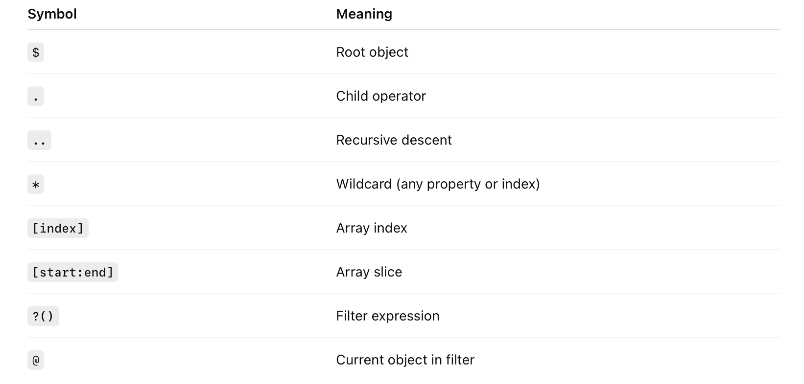
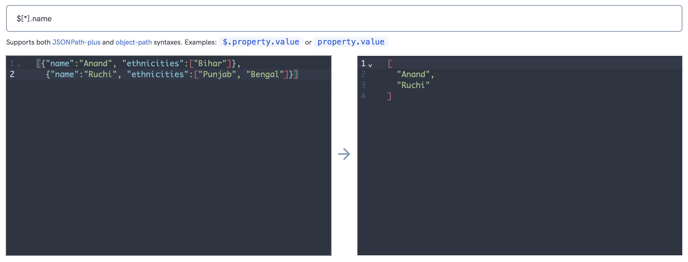
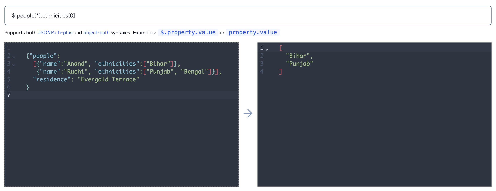
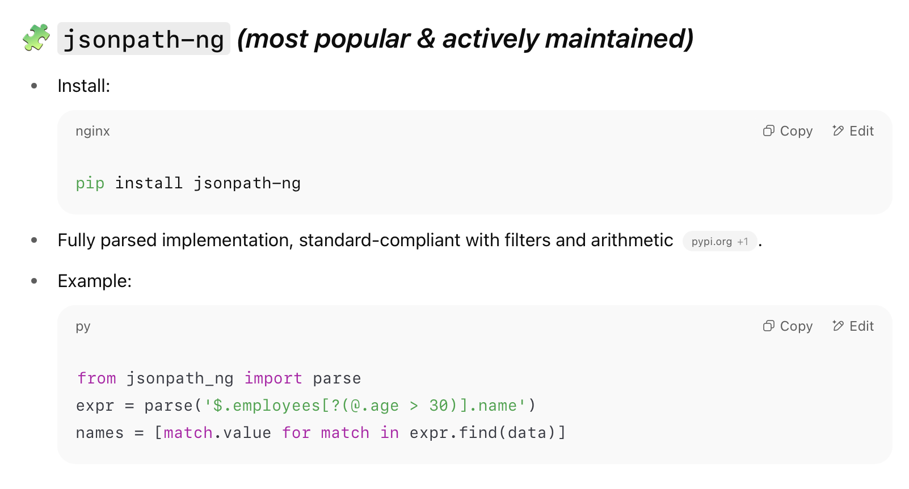
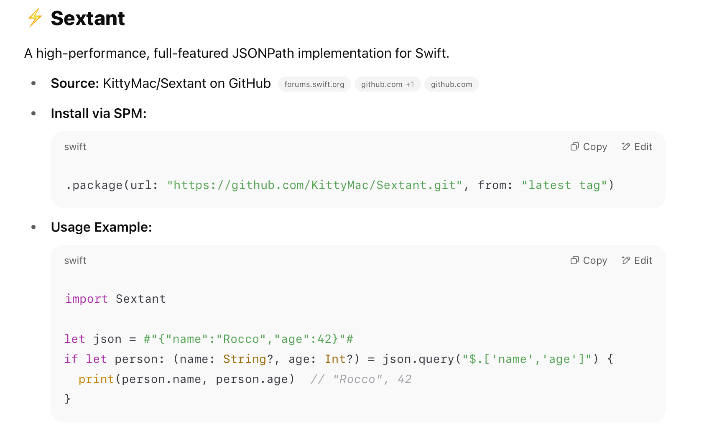

##### JSON Path

Core syntax

Some examples

A JSON with an array at its root.

A JSON with a dictionary at its root.

##### Libraries in various languages 

###### JavaScript

What seems to be in use most is actually a JSONPath Plus package.

###### Python

Similarly there are Python packages too available using pip.

###### Swift

