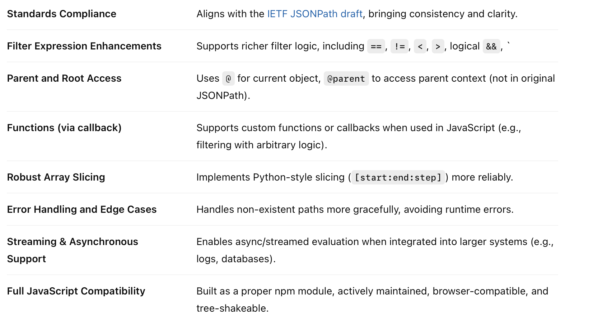
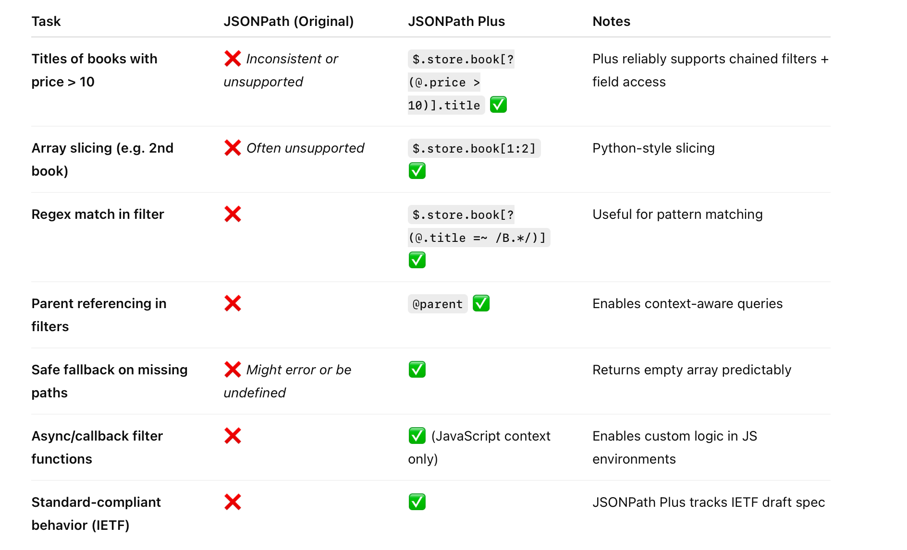

##### JSONPath Plus

It adds plenty more things, like parent access, conditionals, etc.



For example, consider this JSON

```swift
{
  "store": {
    "book": [
      { "title": "Book A", "price": 10 },
      { "title": "Book B", "price": 15 },
      { "title": "Book C", "price": 8 }
    ]
  }
}
```

Here are things that JSONPath Plus can achieve with above JSON but plaion JSONPath cannot.



##### Misc.

Get a list of all the keys in a dictionary (at root here) - `$.*~` <br>Get the length of an array when that is a key's value - `keyWithArrayValue.length`

