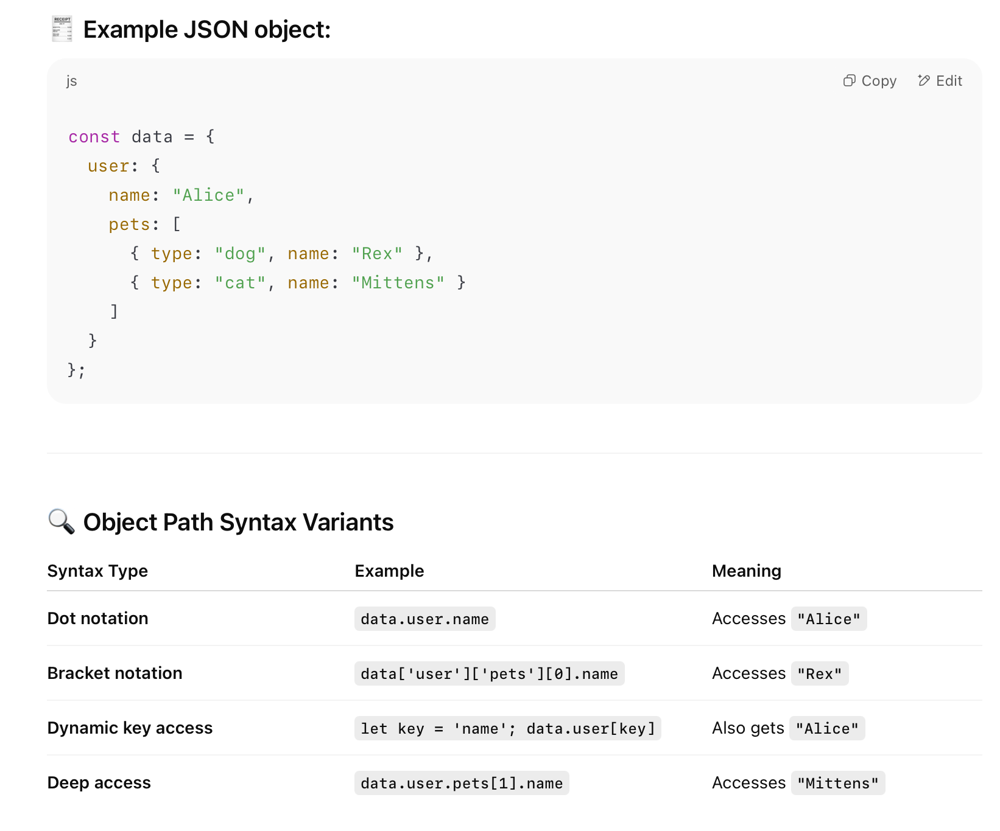
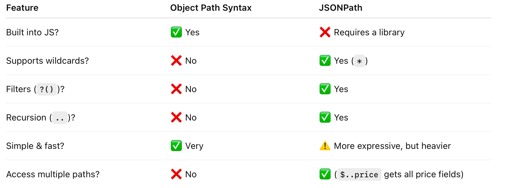
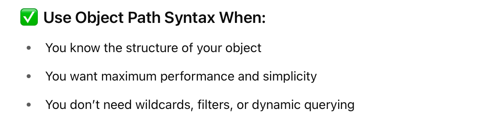
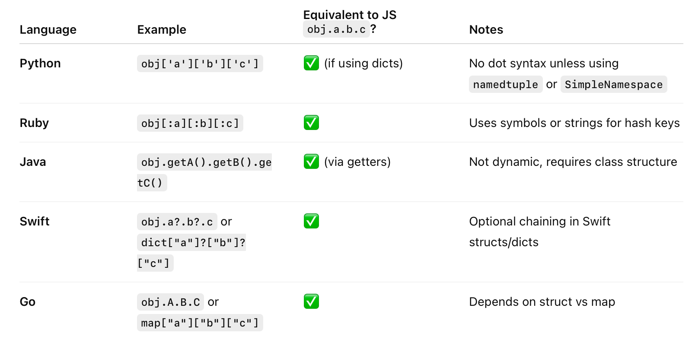

**Object path syntax** refers to the native JavaScript (and JSON-based) way of accessing nested values in an object using dot notation or bracket notation. It’s the simplest way to navigate through JSON objects when you already know the structure.

##### Syntax

##### How is it different from (say) JSONPath

##### When to use it

##### Do other non-JS languages have anything similar

Yes, about all. Just that they may not be calling it Object Path.

