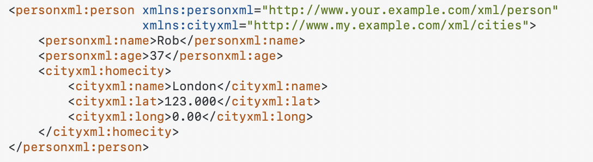

##### xmlns

`xmlns` attribute is used to specify namespaces. This helps in case different xmls are combined and there are chances of there being same tag names in both. ([Stack Overflow link](https://stackoverflow.com/a/1181936/1135417))

Here is a typical structure in Android's `activity_main.xml`.

