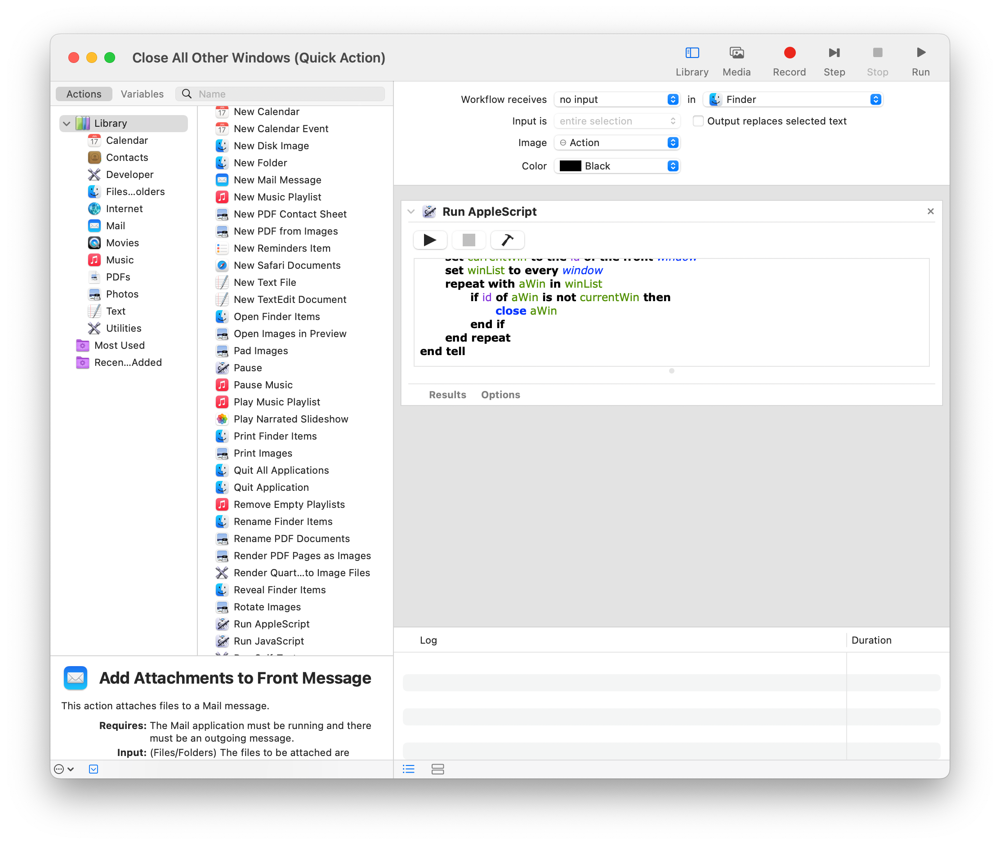
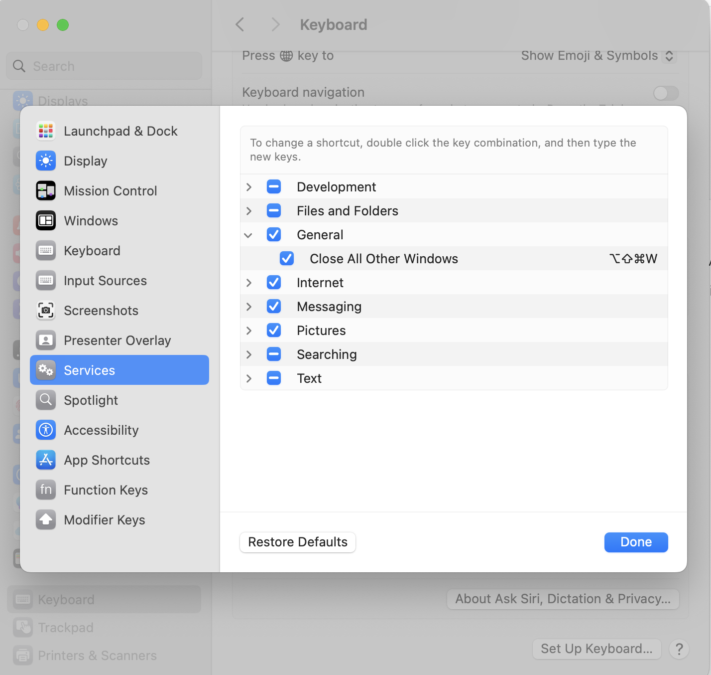
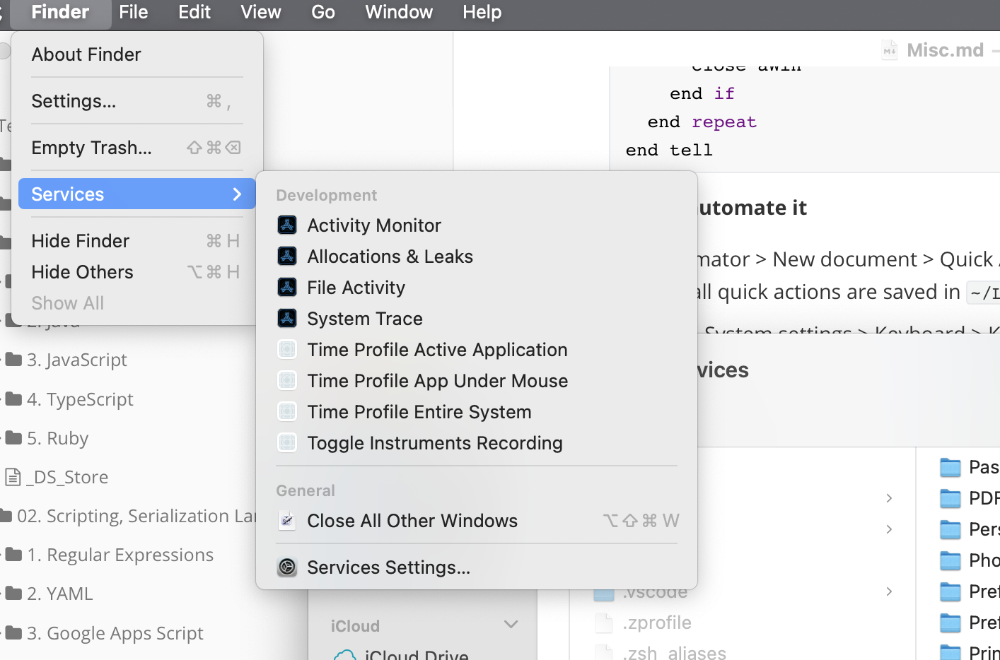

##### Script to close all Finder windows except the current one

> Note that as of mid 2025, this script closes the current window too if it has multiple tabs. It is just a limitation in AppleScripts' Finder API as Finder does provide the required API when there are multiple tabs.

```swift
tell application "Finder"
	set currentWin to the id of the front window
	set winList to every window
	repeat with aWin in winList
		if id of aWin is not currentWin then
			close aWin
		end if
	end repeat
end tell
```

##### How to automate it

1. **Automator** > New document > **Quick Action**:  Add the script (select 'workflow receives no input' in 'Finder') and save it. (Note that all quick actions are saved in `~/Library/Services/`)
2. Go to **System settings** > Keyboard > Keyboard Shortcuts > **Services** > General and assign that quick action a keyboard shortcut.

| Automator > Quick Action configuration                       | System settings > Keyboard Shortcut                          |
| ------------------------------------------------------------ | ------------------------------------------------------------ |
|  |  |

Quick Actions generally appear (where applicable for Finder) as a menu option in `Finder > Services`.

