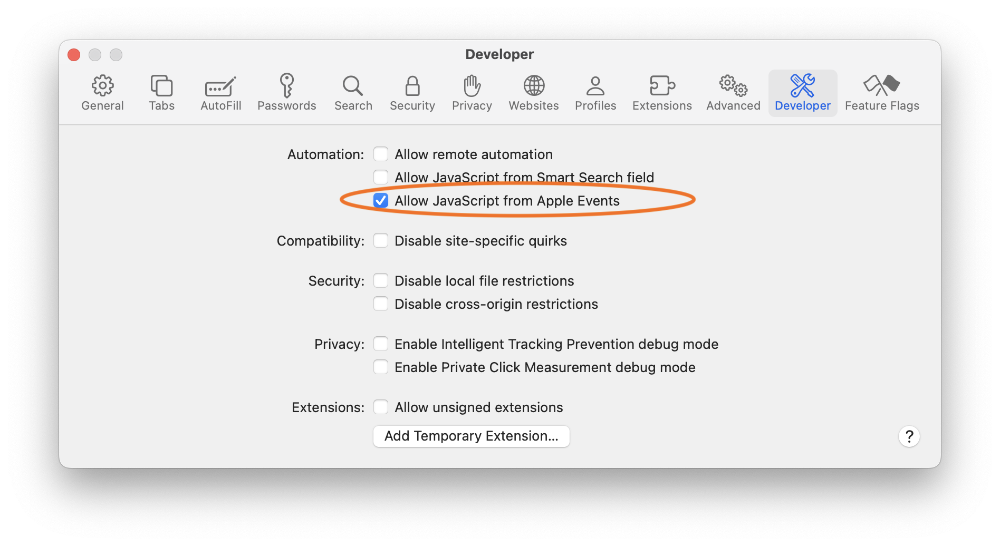

[toc]

##### Script to close all Finder windows except the current one

> Note that as of mid 2025, this script closes the current window too if it has multiple tabs. It is just a limitation in AppleScripts' Finder API as Finder does provide the required API when there are multiple tabs.

```swift
tell application "Finder"
	set currentWin to the id of the front window
	set winList to every window
	repeat with aWin in winList
		if id of aWin is not currentWin then
			close aWin
		end if
	end repeat
end tell
```

##### Script to get HTML from a webpage open in Safari window in front

Note that this uses JavaScript library to get the actual live DOM .

```swift
tell application "Safari"
	do JavaScript "document.documentElement.outerHTML" in front document
end tell
```

This does however require 'Safari > Developer Settings > Allow JS from Apple Events' to be on. Its a sensitive option and should usually be left off.

 

> Its also possible to use `pageSource`, but it only returns the initial DOM at the time of page load and not the latest DOM and is hence invariably not useful. <br>

```swift
tell application "Safari"
	set pageSource to source of front document
end tell
return pageSource
```

##### Running a Python script from AppleScript

This is basically the same as running a shell command from AppleScript

```swift
do shell script "python3 /Users/anandkumar/Desktop/ScrapeHTML.py"
```

##### Running an AppleScript from shell

This infact directs the output to a new file.

```swift
osascript ScrapeWebHTML.scpt > output.txt
```

