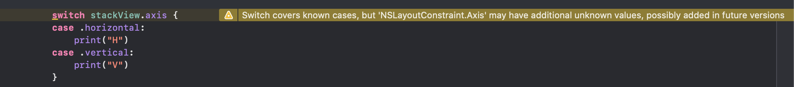

`Enumerations` can either have raw values or associated values. The same enum cannot have some cases with raw values and some others with associated values.

> The thumb rule is that associated values enum should be used when all enum cases are not of the same type or some values need to be associated with enum cases at runtime. <br> Otherwise raw value enum should be used.

##### Enums with associated values -

Every case of the enumeration can have associated values of different types and even have different no. of associated values. These values can also be named if needed.

```
enum HouseMember {
  case Lord(String)   // The value does not have a name
  case Queen(name: String, lineage: House)   // Values have names
}
```

The enum can be assigned to a variable this way.
```
keyMember = HouseMember.Queen(name: "Cersei", lineage: westerosManager.houses[2])
```

##### Enums with raw values -

In case of enums with raw (or default) values, all the values need to be of the same type and they can be strings, characters or numbers. Each raw value should be unique within the enum. By definition, these raw values of the enum cannot be changed later.

```
enum HouseSigil: String {
  case Lion = "A lion emoji"
  case Stag = "A stag emoji"
}
```

In case of enums with Int or String raw values, it is not mandatorily required to specify the actual raw values. In case of Int, they by default start with 0 and increment by 1 for successive cases. In case of strings, the default raw value is the case's name.

Int is the default type of a raw value enum.

The raw value of any case can be accessed using the rawValue method.
```
print("\($0.sigil!.rawValue)")
```

Keep in mind though that accessing the enum property and the enum property's raw value are different things.
```
$0.sigil!.rawValue - Gives 🦁 for Lion case and it is a String
$0.sigil! - Gives Lion alone and it is not a String.
```

Its also possible to initialize an enum variable directly with a raw value. However an initialization this way always returns an optional enum as there may or may not be a case matching that raw value.
```
westerosManager.houses[1].sigil = HouseSigil(rawValue: "🌴")
```

##### Recursive enumerations -

It is possible to define enums with associated values where some of its cases are of that same enum type. Such cases need to be prefixed with `indirect` keyword. Alternately, the enum itself can be prefixed with `indirect` keyword in case any of the cases can be recursive.

```
indirect enum ArithmeticExpression {
  case number(Int)
  indirect case addition(ArithmeticExpression, ArithmeticExpression)
  indirect case multiplication(ArithmeticExpression, ArithmeticExpression)
}
```

If any of the cases is just of another enum type (and not the same enum), then that is not a recursive enum and there is no need of indirect keyword.

Again keep in mind that recursive enums are possible only in case of enums with associated values (and not with enums with raw values). _Well the raw value enums can only be of type string, characters or number anyway._

##### Checking what case an enum variable is of -

While checking the variable for the kind of enum it has, a switch needs to be used and the names specified for its associated values.
```
switch keyMember {
  case .Lord(let name):
       print("- \(name)")
  case .Queen(let name, let lineageHouse):
       print("- \(name), \((lineageHouse.name)!))")
  }
```

##### CaseIterable

If a raw value enum is specified as being conformant to `CaseIterable` then all its cases can be fetched using `allCases` static property (gives an array).

```
enum Terrain: CaseIterable {
    case water
    case forest
    case desert
    case road
}

Terrain.allCases
```

This does not work for enums with associated values.

##### Switching with Unknown default case on non frozen enums

(This was proposed in [SE-0192 Handling Future Enum Cases](https://github.com/apple/swift-evolution/blob/master/proposals/0192-non-exhaustive-enums.md) and introduced in Swift 5.0.)

There are two kinds of enums - `frozen`, and `non frozen`. An enum declared as `@frozen` (i.e. `@frozen enum Enum1 {}`) is an indication to complier that this enum is not likely to have new cases going forward. Whereas `non frozen` enums say to compiler that it is indeed likely to get new cases later on, and any switch on it should have a `default` case handling too. Currently, all enums are frozen by default and only internal iOS APIs can be non frozen.

> Its kind of tricky though to tell which private enum is nonfrozen as the interface does not have any annotation/directive. And the only way to know it is if you have a switch on it and it does not have a default case,

`@unknown default` is needed when there is a switch on a non frozen enum. It stays silent if the switch is currently exhaustive, but throws a warning if there is a new case added to the enum later on.

Switches on non frozen enums should have a `default` or `@unknown default` handling. If it isn't there, a warning will be shown. (`stackView.axis`, i.e. `NSLayoutConstraint.Axis` is actually a non frozen enum).



It can then be handled using either a `default` or `unknown default`, both will not generate a warning for non frozen enum even if the switch is currently exhaustive. If new cases are later added, while `default` will stay silent an `unknown default` will instead thankfully give a warning saying there are unhandled cases.

> @frozen appears to be applicable for structs as well. For example, in SwiftUI `@frozen struct Text`.


##### Misc. -

enums are just like any other type can  have properties, functions, etc.

[Various](https://appventure.me/2015/10/17/advanced-practical-enum-examples/) ways in which enums can be used.
