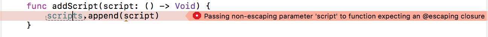

##### Closures take one of three forms
<br>
1. `Global functions` that have a name and do not capture any values. (Functions declared inside a class, enum, etc.?)
<br>

2. `Nested functions` that have a name and can capture values from their enclosing function. (Functions inside a function?)

3. `Closure expressions` that are unnamed closures written in a lightweight syntax and can capture values from their surrounding context.
Closures can capture and store references to any constants and variables from the context in which they are defined. This is known as _closing over those constants and variables_.

##### How the closure expression syntax keeps getting shorter

The general syntax for closure expressions. In its most elementary form its a simple syntax.  The arguments (if any) are specified before `in`.
```
{ (parameters) -> return type in
  statements
}
```

```
reversedNames = names.sorted(by: { (s1: String, s2: String) -> Bool in return s1 > s2 })
```

As the function declaration already specified the argument and return types, the types need not be specified during invocation.
```
reversedNames = names.sorted(by: { s1, s2 in return s1 > s2 } )
```

If the closure's body has just one expression, even the `return` keyword can be omitted.
```
reversedNames = names.sorted(by: { s1, s2 in s1 > s2 } )
```

The arguments can be referred to as $0, $1, etc. as a part of `shorthand notation`.
The `in` can be omitted when no argument names are not needed and there is some way to access the arguments inside the closure if needed (such as shorthand notation).
```
reversedNames = names.sorted(by: { $0 > $1 } )
```

In case operator methods are available, even the arguments need not be explicitly referred to. The operator method probably inherits the argument sequence.
```
reversedNames = names.sorted(by: { > } )
```
If the closure argument is the last argument to the function, the closure can be moved outside the parentheses. This is called a `trailing closure` and helps in readability when the closure goes into multiple lines.
```
reversedNames = names.sorted() { $0 > $1 }
```

And finally if the closure is the only argument to the function, even the parentheses can be omitted.
```
reversedNames = names.sorted { $0 > $1 }
```

> So anytime you are looking at a line, see where the braces `{}` are. Is it at the end of a line, its a trailing closure in that case. <br> Is there no parentheses `)` preceding it, then the closure is the only argument in the function.<br>
Then see if there is an `in` inside the closure body and if so what is specified before it. <br>
However, `in` may still be omitted if the arguments are being referred in shorthand notation inside the closure body.

##### Escaping closures


A closure is said to `escape a function` when the closure is passed as an argument to the function, but is called after the function returns.

By default, a closure passed as an argument to a function cannot even be stored in some context outside of that function's implementation (if its in a different file). In other words, by default closure parameters are `non-escaping`. <br>
The compiler gives an error right away in some way or the other. (For example, here its saying that due to the context the arguments to append function of scripts array should be an escaping closure.)



Hence to allow a closure to be executed even after the function to which it was passed has returned, the function must have that argument declared as an `escaping closure`.
```
func addScript(script: @escaping () -> Void) {
```

An `escaping closure` also requires to refer to self explicitly within the closure if needed.

> Escaping closures are usually needed in case of asynchronous operations.

Useful [link](https://swiftunboxed.com/lang/closures-escaping-noescape-swift3/) explaining escaping closures.

`withoutActuallyEscaping(_:do)` -
Swift 3.1 introduced [this](https://developer.apple.com/documentation/swift/2827967-withoutactuallyescaping) function which takes in two non-escaping closures and allows one of the closures to be escaping while the other one is still running. So it temporarily allows one non-escaping closure to be escaping.
> I think I get it, but need to try it

##### Autoclosures

The thing about an autoclosure argument is that the _passed argument (which needs to be an expression, i.e. I think something which can be written in one line) is wrapped into a closure_. In doing so that argument is treated by the compiler as a closure and not as an expression and is hence not executed when the actual function is called. Whether it is eventually executed or not depends upon the method, i.e. if it actually then executes it itself.

Here is an example. The argument is indeed marked an `autoclosure`. So the passed expression will actually not be evaluated unless the method implementation choses to do it (which it is choosing to, in this case).

```
func serve(customer customerProvider: @autoclosure () -> String) {
  print("Now serving \(customerProvider())")
}
```

Apart from the `@autoclosure` keyword preceding the closure argument in the function declaration, the important thing about the closure is that it has the right signature. Its argument and return types should match that of the expression to be passed.
```
func serve(customer customerProvider: @autoclosure () -> String) {
func func1_AutoClosure(withScript script: @autoclosure () -> Void) {
```

###### Passed expression gets wrapped in a usual non-escaping closure by default
Another thing about autoclosure is that by default wraps the passed expression in a usual non-escaping closure.

If for any reason it does need to be wrapped in an escaping closure then that must be specified in the function declaration with an `@escaping` attribute (like it should be).
```
func serve(customer customerProvider: @autoclosure @escaping () -> String) {
```

###### You can't just look at a function call and say whether it has an autoclosure or not

For example in the below method the customer argument might need a `Customer` object (which will be returned by the `remove` method) or it can even be an autoclosure where the expression actually gets wrapped in a closure in the method implementation and hence not necessarily evaluated. 
```
serve(customer: customersInLine.remove(at: 0))
```

No autoclosure below. The argument is not an expression, but a closure itself.
```
serve(customer: {customersInLine.remove(at: 0)})
```

There could be an autoclosure at work below. The argument is an expression.
```
serve(customer: customersInLine.remove(at: 0))
```


Hence, it is advised to not use autoclosures unless necessary as they aren't usually expected. If used though, it should be very clear from the function name itself.


> Practically though, when is autoclosure actually really needed.

Useful [link](https://krakendev.io/blog/hipster-swift#autoclosure) explaining autoclosure
