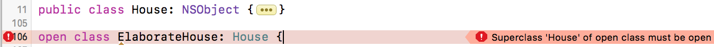

##### Various access levels

`open` `public` `internal` `fileprivate` `private` <br>
`fileprivate(set)` `private(set)` `internal(set)`

`open` - Accessible and subclassable from any source file within the module, as well as any source file in a different module that imports the containing module.

`public` - Accessible and subclassable from any source file within the module, accessible but not subclassable from any source file in a different module that imports the containing module.

`internal` - Accessible from any source file within the module

`fileprivate` - Accessible by anyone from the same source file (not just extensions)

`private` - Accessible only within the enclosing declaration and also by extensions in the same source file

Properties can also be given access level for their setter than their getter. This can be achieved with below modifiers.
`fileprivate(set)`
`private(set)`
`internal(set)`

`public fileprivate(set) var name: String` (This implies that the property is accessible in public scope but settable only in fileprivate scope.)

##### What to use when?
> The choice between `open` and `public` actually matters only while designing the API of frameworks.


The basic principle is that while any type cannot have an access level that is less restrictive than what it is consuming. Hence, something like this will result in a compile time error (as open is less restrictive than public).



> `open` and `public` applies only to classes and class members (so not to struct, etc. by themselves?).
public classes can be subclassed and overridden (classes can be overridden too?) only within the module they're defined in (not from outside). Really?

##### Access levels in specific types

The default access level of every entity is `internal`.
A `private` or `fileprivate` type defaults to having private or fileprivate internal members.
However, a `public` type defaults to having internal members, not public members.

###### Tuple
The access level for a tuple type is the most restrictive access level of all types used in that tuple.

###### Function
The access level for a function type is calculated as the most restrictive access level of the function’s parameter types and return type.

```
func someFunction() -> (SomeInternalClass, SomePrivateClass) {     // Here the function's access level will be private.
```

###### Enum
The types used for any raw values or associated values in an enumeration definition must have an access level at least as high as the enumeration’s access level.

###### Subclass
A subclass cannot have a higher access level than its superclass.

###### Subscript
A subscript cannot be more public than either its index type or return type.

If a constant, variable, property, or subscript makes use of a private type, the constant, variable, property, or subscript must also be marked as private:
```
private var privateInstance = SomePrivateClass()
```

##### Some 'not very obvious' rules to keep in mind

Custom initializers can be assigned an access level less than or equal to the type that they initialize. The only exception is for required initializers. A required initializer must have the same access level as the class it belongs to.

A default initializer (such as the one for structures) has the same access level as the type it initializes, unless that type is defined as public. For a type that is defined as public, the default initializer is considered internal.

The default memberwise initializer for a structure type is considered private (or fileprivate) if any of the structure’s stored properties are private (or fileprivate).

A type can conform to a protocol with a lower access level than the type itself. When a type is written or extended to conform to a protocol, it must be ensured that the type’s implementation of each protocol requirement has at least the same access level as the type’s conformance to that protocol.

An extension cannot be provided an explicit access-level modifier if it is being used to add protocol conformance. Instead, the protocol’s own access level is used
to provide the default access level for each protocol requirement implementation within the extension.

##### In unit tests
A unit test target can access any internal entity if the import declaration for that module has `@testable` attribute.
```
@testable import Module_name
```
