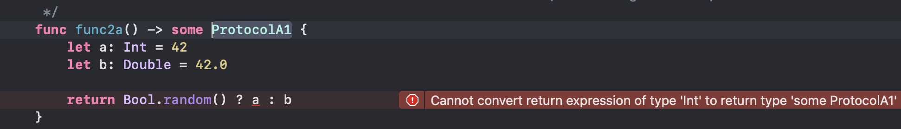

- [Syntax](https://github.cloud.capitalone.com/AnandKumar/TechnicalNotes/blob/master/02.%20iOS/1.%20Languages/1.%20Swift/18.%20Opaque%20Types.md#syntax)
- [What is it (Reverse Generic)](https://github.cloud.capitalone.com/AnandKumar/TechnicalNotes/blob/master/02.%20iOS/1.%20Languages/1.%20Swift/18.%20Opaque%20Types.md#what-is-it-reverse-generic)
- [What purpose does it solve](https://github.cloud.capitalone.com/AnandKumar/TechnicalNotes/blob/master/02.%20iOS/1.%20Languages/1.%20Swift/18.%20Opaque%20Types.md#what-purpose-does-it-solve)
- [Underlying concrete type should be fixed](https://github.cloud.capitalone.com/AnandKumar/TechnicalNotes/blob/master/02.%20iOS/1.%20Languages/1.%20Swift/18.%20Opaque%20Types.md#underlying-concrete-type-should-be-fixed)
- [Misc.](https://github.cloud.capitalone.com/AnandKumar/TechnicalNotes/blob/master/02.%20iOS/1.%20Languages/1.%20Swift/18.%20Opaque%20Types.md#misc)

---------

(This was proposed in [SE-0244 Opaque Result Types](https://github.com/apple/swift-evolution/blob/master/proposals/0244-opaque-result-types.md) and implemented in Swift 5.1.)

#### Syntax

Syntactically, an `Opaque Type` is a protocol type (aka `Existential Type`) that is qualified with `some` keyword. Its typically used as a return type in functions, though it can also be as a proper type by itself (in declarations).

```
func func2b() -> some ProtocolA1 {

let someProperty: some Equatable = {
	  return "1"
}()
```

#### What is it (Reverse Generic)

Conceptually, it is a `Reverse Generic`. In case of generics, the types in the callee function are determined by what arguments gets passed to it (or specified) by the caller. The callee function's implementation does not know the concrete types it works with. Opaque types are just the reverse in concept. The callee function alone knows the concrete type it returns, the caller function does not get to know them. The caller function can just work with the specified protocol return type.

#### What purpose does it solve

If I read the official guides, the impression I get is that if a function returns an opaque type then the caller site does not have to know the concrete type returned by the function (which is especially useful if the callee function is in a module of its own). The callee can just work with a protocol. But then I think this is alreay achievable if the return type was a protocol (aka existential type), so why this fuss?

Well, the return type of a function can be a protocol only if the protocol does not have any Self or associatedtype requirements. And that is what Opaque Type solves, if a protocol return type is qualified with `some` (i.e. if the return type is made opaque) then even protocols with Self or associatedtype requirements can be used as a return type in functions.

Hence for below ProtocolB, which has a 'Self or associatedtype requirement'.
```
protocol ProtocolB {
    associatedtype Type1
    func printType(_ :Type1)
}

struct StructB: ProtocolB {
    typealias Type1 = Int
    func printType(_ arg: Int) {
        print(arg)
    }
}
```

A simple existential type will give a compilation error if used as a return type.


But the same existential type will compile if wrapped as an Opaque type.


#### Underlying concrete type should be fixed

The underlying concrete type of the opaque type needs to be fixed for a given implementation.

Hence with the below protocol.
```
protocol ProtocolA1 { }
extension Int: ProtocolA1 { }
extension Double: ProtocolA1 { }
```

This will not compile as the concrete return type could be Int or Double.



But the below will compile as the concrete type can only be Int.


#### Misc.

<br>Useful links - <br>
[Swift evolution proposal  SE-0244](https://github.com/apple/swift-evolution/blob/master/proposals/0244-opaque-result-types.md) <br>
[Swift.org Opaque Type](https://docs.swift.org/swift-book/LanguageGuide/OpaqueTypes.html#ID613) <br>
[A nice explaination on Swift forum](https://forums.swift.org/t/reverse-generics-and-opaque-result-types/21608) <br>
[Swift forum - Improving the UI of generics](https://forums.swift.org/t/improving-the-ui-of-generics/22814#heading--missing-type-level-abstraction) <br>
