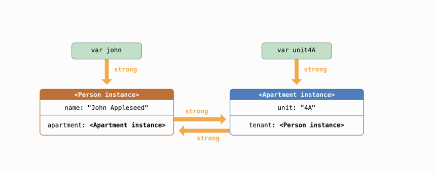
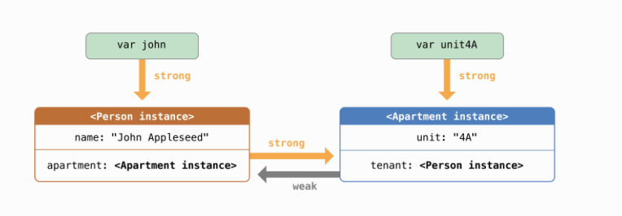
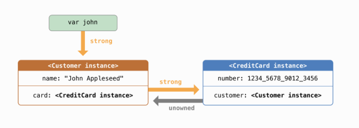

`ARC` applies only for reference types.

When a property/variable `a` is of type `B`, it is said that the property/variable `a` has a `strong reference` to instance `B` and `B` cannot be released as long as `a` exists.

> _A has a strong reference to B_, what it means is that B cannot be released as long as A exists


###### How strong reference cycles are caused


Happens if two class instances have references to each other.



Here there is memory chunk A (Person instance) and a memory chunk B (Apartment instance).
A is referred by variable john and the tenant property in memory chunk B.
B is referred by variable unit4a and the apartment property in memory chunk A.

Now even if variable john is set to nil, the chunk A is not released from memory as it is still referred by tenant property.
And then even if unit4A is set to nil, the chunk B is not released from memory as it is still referred by chunk A (as chunk A still exists).

And this way chunk A and chunk B continue to be in memory even though both variable john and variable unit4A have been set to nil.


###### Solving strong reference cycles using weak references



weak references allow the chunk they are pointing to be released even if the weak property pointing to it still exists. So effectively when that chunk does not have anything else referencing it, the weak property is automatically set to nil.

Also, for this reason a weak property must always be declared as an optional. Further, property observers are not set when ARC sets a weak property to nil.


Another important thing is that the instance that is likely to be needed for longer, should have a weak property pointing to the instance that is likely to be needed for a lesser time. In above example, chunk A is needed for a lesser time, hence chunk B should have a weak property pointing to chunk A.

If this is not done then as per my understanding the weak reference will not be optimal.

In above 'correct' situation (where chunk B has a weak property pointing to chunk A), what happens is -
variable john is set to nil, chunk A is immediately released as it only has a weak property pointing to it.
variable unit4A is set to nil, chunk B is relased as chunk A which used to point to it rhrough a strong property is not there anymore.
And hence both chunkA and chunkB do get released.

Now in an 'incorrect' situation (where chunk A instead had a weak property to chunk B and chunk B had a strong property to chunk A), this is what would have happened -
variable john is set to nil, chunk A is not immediately released as chunk B still points to it through a strong property.
variable unit4A is set to nil, chunk B is then released as only chunk A points to it through a weak reference. And then as chunk B is already released and there is nothing left pointing to chunk A, the chunk A is finally released.
So even though variable john was set to nil lot earlier, chunk A would get released only later on.

`weak var tenant: Person?`

###### Solving strong reference cycles using unowned references



It works a lot like weak reference and allows the chunk it is pointing to be released even if the unsafe reference itself still exists.

However the thing is that an unsafe reference should not be optional (or in other words cannot be nil). Hence the unowned reference should only point to an instance (or chunk) that is guaranteed to be released only after the chunk or instance of that property itself.

If chunk A is guaranteed to have a longer timespan than chunk B, then the unowned property should be in instance of chunk B and must point to instance of chunk A.

So clearly the forte of unowned reference is that it lates you work with non optionals. However, care must be taken to not have chunk A somehow released earlier (for example by setting variable john to nil) as then the unowned property in chunk B (as it is not an optional) will cause a crash.

`unowned let customer: Customer`

###### When none of the properties can be optionals (i.e none of them can be `nil`)

In this case one property should be declared as unowned and the other should be declared as an implicitly unwrapped optional. This is because implicitly unwrapped optional have a default value of nil, but by the time they are accessed they should not be nil.

Now there is also something called unowned(unsafe) where if the chunk that was pointed to by the unowned reference after the chunk was deallocated is accessed (using the unowned variable in chunk B), then the complier still actually tries to access that chunk. It hence is named unsafe.


Probably the choice between using weak, unowned, etc. depends upon what you want the properties to be (i.e. optional or non-optional).

###### Strong reference cycles for closures

A strong reference cycle can also happen if a closure if assigned to a property and the closure body itself refers to that instance in some way. (Such a strong reference cycle happens because closures are reference types by themselves.)

To resolve this, the things being captured from the closure body (such as self or some property, etc. in self) should be explicitly declared as weak or optional in something called a capture list.

The capture list is placed before the arguments and specifies everything being captured along with a weak/unowned prefix.

```
lazy var closure1: (Int, String) -> String = {
    [unowned self, weak delegate = self.delegate!] (index: Int, stringToProcess: String) -> String in
	.. closure body
}
```

If the captured reference will never become nil (i.e. will never be released before the closure itself), it must be captured as an unowned reference. If the captured reference may become nil, then it must be captured as a weak reference. Also, weak captured references are automatically exposed as optionals in the closure body.

Swift 4.2 onwards inside a closure, its possible to use `guard let self = self` (or `if let self = self`) when a capture list has been used.
