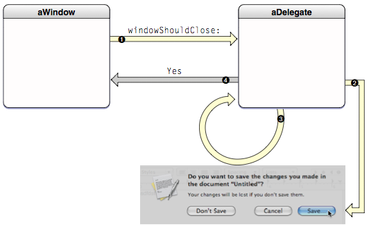

Delegation per se is a design principle, it is not some keyword or framework. To put it simply delegate is a name of a property in a class. It forms the connection between the delegating object and the delegate object and serves as a way for the delegating object to literally delegate some of its decisions and activities to the delegate object. It hence provides a way for object to alter the behavior of another object without having to inherit from it.

The delegating object is often a responder object, i.e. an object inheriting from `NSResponder` in `AppKit` or `UIResponder` in UIKit, that is responding to user events.

For example, UITableView has a property called delegate. Several things such as what and if something should happen when a user taps on a row are decided by this delegate property.

Delegate can be set either from the code or using outlets (in case of storyboards or xib files).

Delegates are implemented using either formal protocols or informal protocols. Since Objective-C has started allowing optional methods in protocols, informal protocols have become an obsolete way for implementing delegates. (The way informal protocols might have been used to implement delegates was that an object of the informal protocol's class would have been assigned as the delegate and it would have implemented only those methods that it wished to).

###### A sample illustration of the way delegates work

                   

###### What do delegates typically do

As is the case with methods, any method in a delegate too may either return something (typically but not always, a decision such as Yes or No) or else return anything. For example, the NSWindow delegate method `windowShouldClose:` returns a BOOL to indicate whether the window should be closed or not. The UITableView delegate method `tableView:willSelectRowAtIndexPath`: method returns a NSIndexPath to confirm the index path of the row that will be selected. The NSWindow delegate method windowWillClose: method has a return type of void and hence does not return anything.

Often delegate methods have a NSNotification parameter. For example the NSWindow delegate method `windowDidMove:` has a NSNotification parameter which is always a `NSWindowDidMoveNotification`. This method is invoked when the window has moved and the notification has been posted.

In AppKit, normally the delegating object automatically makes its delegate an observer of all notifications it posts.

Delegating objects usually have a weak reference to the delegate and the delegate in turn has a strong reference back to the delegating object. Strong reference cycles are avoided this way.

Data Sources are similar to delegates. It is just that they are typically used to populate data for view controllers instead of acting upon events.

###### MVC Pattern

In the MVC pattern, very often the controller is merged either with the view (in which case it is called a view controller) or/and with the model (in which case it is called a model controller).

In Cocoa, there are 2 kinds of controller objects - mediating controllers, coordinating controllers. Mediating controllers inherit from NSController and are used in Cocoa bindings. Coordinating controllers are typically subclass of NSWindowController or NSDocumentController.
