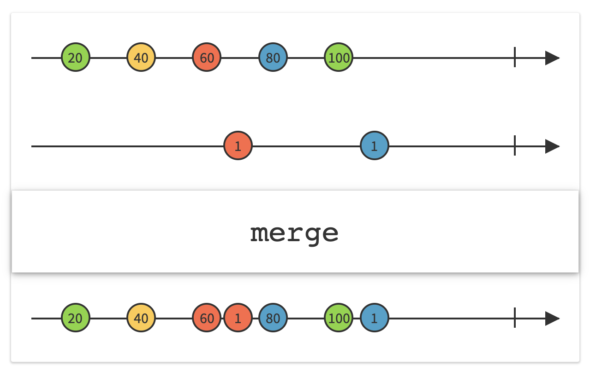
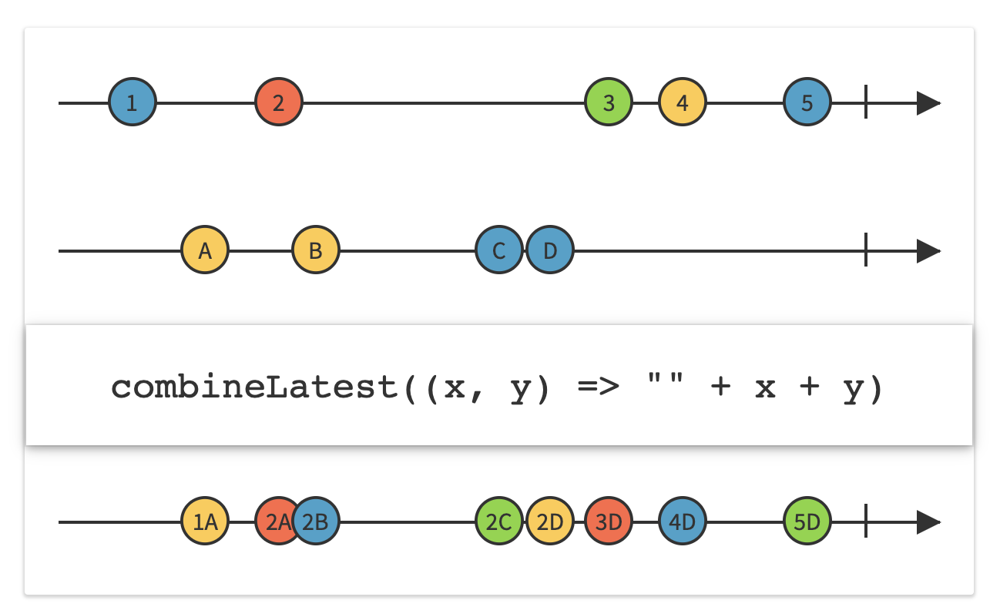
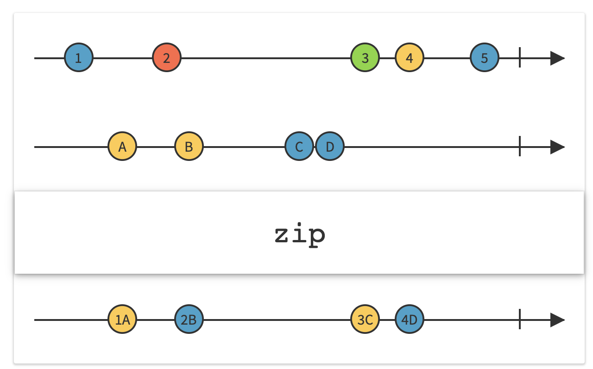

##### merge

Takes an array of observables and merges all its events together in a single observable.

```
static func merge(_ sources: Observable<A>...) -> Observable<A>
```

```
Observable<Int>.merge(sequence1, sequence2).subscribe(onNext: {
    print("\(Date().get(.second)) MERGE: \($0)")
}).disposed(by: disposeBag)
```



##### combineLatest

Takes two observables and creates one observable, which starts emitting only when every source sequence has emitted an event, and then emits whenever any sequence  emits anything. The emitted value is atuple having the latest values emitted by each sequence.

```
static func combineLatest<O1, O2>(_ source1: O1, _ source2: O2) -> Observable<(O1.Element, O2.Element)> where O1 : ObservableType, O2 : ObservableType
```

```
Observable.combineLatest(sequence1, sequence2).subscribe(onNext: { a1, a2 in
    print("\(Date().get(.second)) COMBINE-LATEST: \(a1) - \(a2)")
}).disposed(by: disposeBag)
```



##### zip

Starts emitting only when ever sequence has emitted an event, and then emits whenever there are values from both sequences that have not been accounted for yet. For any of the source observables, it takes the first event that is yet to be  taken.

```
static func zip<O1, O2>(_ source1: O1, _ source2: O2) -> Observable<(O1.Element, O2.Element)> where O1 : ObservableType, O2 : ObservableType
```

```
Observable.zip(sequence1, sequence2).subscribe(onNext: { a1, a2 in
    print("\(Date().get(.second)) ZIP: \(a1) - \(a2)")
}).disposed(by: disposeBag)
```

> Another rough way to think of `zip` is `combineOnlyUntilThereAreUnaccountedEventsFromAll.`



##### withLatestFrom

Is called on a source observable, with another observable passed to it as an argument. The created observable starts emitting events only when both sequences have emitted an event, and then emits the latest value from passed sequence whenever self emits an event.

```
func withLatestFrom<Source>(_ second: Source) -> Observable<Source.Element> where Source : ObservableConvertibleType
```

```
sequence1.withLatestFrom(sequence2).subscribe(onNext: {
    print("\(Date().get(.second)) WITH-LATEST-FROM: \($0)")
}).disposed(by: disposeBag)
```
