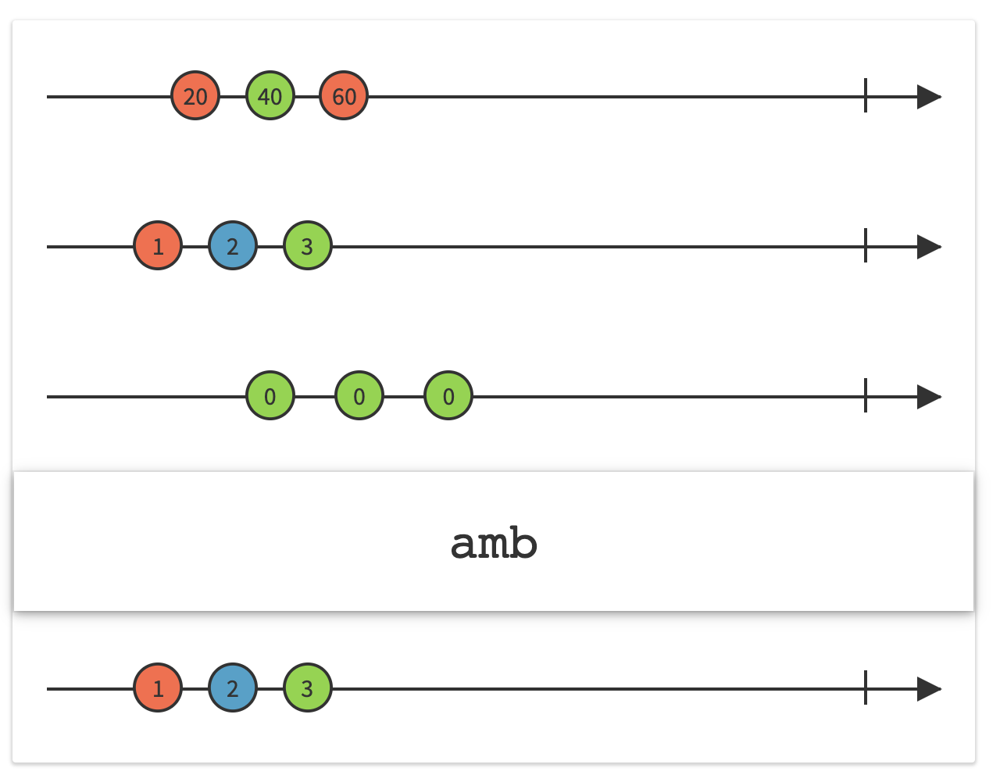

##### amb

Propagates events only from the first observable that starts to emit events, and completely ignores all events the other observables may later emit.

```
Observable<Int>.amb([sequence2, sequence1]).subscribe(onNext: {
    print("\(Date().get(.second)) AMB: \($0)")
}).disposed(by: disposeBag)
```


