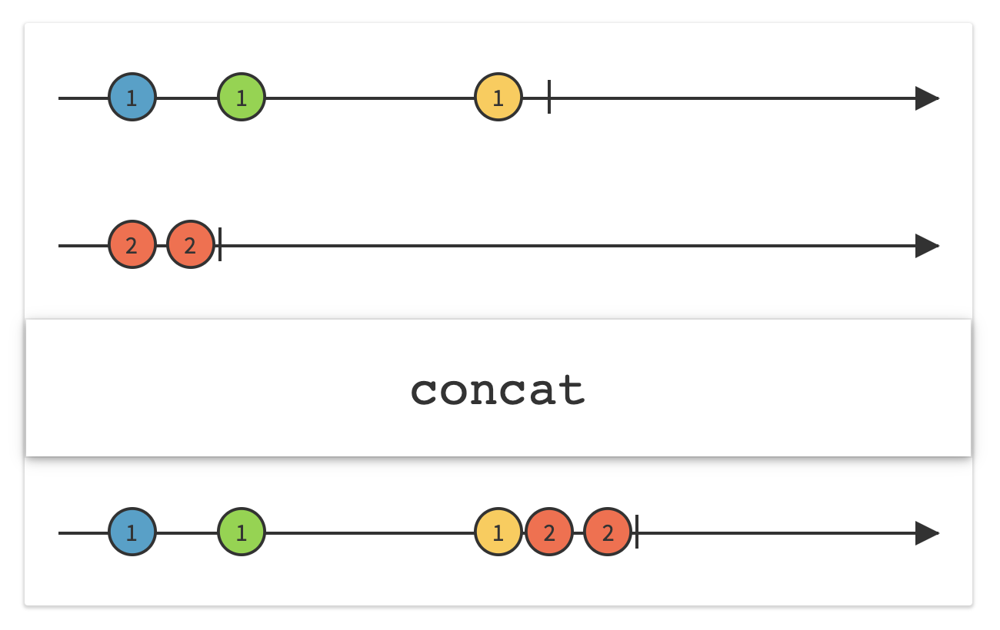

##### concat

Let the source observable finish emitting events, and only then start with the passed observable's events and emit beginning from its first event.

```
sequence1.concat(sequence2).subscribe(onNext: {
    print("\(Date().get(.second)) CONCAT: \($0)")
}).disposed(by: disposeBag)
```

> As per the Reactive documentation (not explicitly mentioned in RxSwift, but I have still seen this to be true) - <br>
Concat subscribes to passed Observable only when the source Oobservable completes. Consequently, if the source observable is a 'hot' observable, i.e one that begins emitting items immediately and before it is subscribed to, concat will not get and hence not emit, any items that the passed observable emits before all the source observables completes and concat subscribes to the 'hot' observable.


