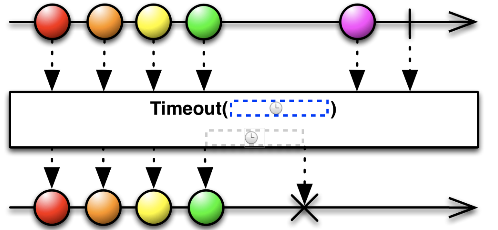
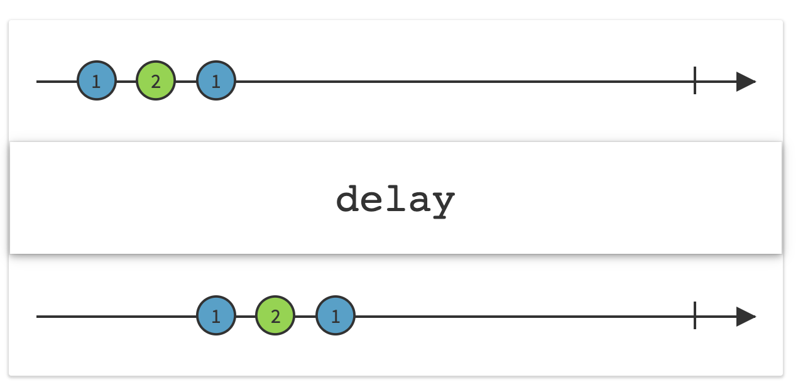

##### timeout

If no event is emitted by the source observable for specified time period, emits an error (and hence the observable stream gets stopped thereafter as well).

```
sequence1.timeout(DispatchTimeInterval.seconds(Int(2.0)), scheduler: MainScheduler.instance).subscribe(onNext: {
    print("\(Date().get(.second)) TIMEOUT: \($0)")
}).disposed(by: disposeBag)
```



##### delaySubscription

Proagates any event from the source observable only after adding a fixed delay to it.

```
let delayedData = data.delaySubscription(DispatchTimeInterval.seconds(Int(2.0)), scheduler: MainScheduler.instance)
```


