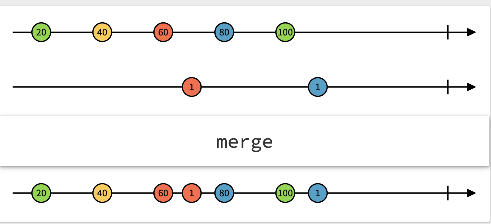
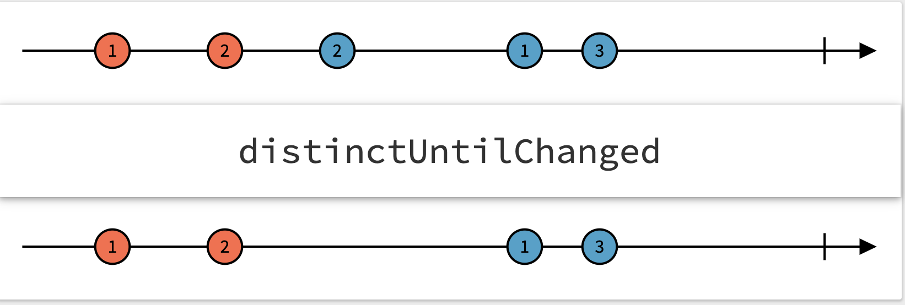

All the functions in this cheat sheet - https://cheatography.com/donghua-li/cheat-sheets/rxswift-operators/ <br>
Understanding cold and hot observables well <br>
Creating observables operators <br>
`MainScheduler, CurrentThreadScheduler, SerialDispatchQueueScheduler, ConcurrentDispatchQueueScheduler, OperationQueueScheduler` <br>
RxSwift memory management - http://adamborek.com/memory-managment-rxswift/ <BR<
Reference is at http://reactivex.io/documentation/operators.html <br>


There are several different kind of operators that exist. Each of these essentially create and return a new obserbvable that can be then subscribed to.

I can get it to dispose like this.
```
citySubscription?.dispose()
```
-------

`take(:)` emits only first n events emitted by the observer and then emits a `completed` event.
```
citySubscription = cityObservable.take(2).subscribe(onNext..
```

Similarly `takeWhile()` emits events only until the passed closure returns true.

> Also check `flatMap`, `buffer`, `takeDuration`, `skip`

#### Combining events emitted by Observables

`start(with:)` causes the observable to first emit the passed argument as a `next` event, before any other event is emitted. In the below example the specified string automatically gets emitted as the first event (even before other events that may already be there in that subject are emitted).

```
subscription1 = replaySubject1.startWith("Hi").subscribe {
    print("A \($0)")
}
```

`do(onNext:)` is triggered whenever a `next` event happens, but does not morph the events. So its like a subscriber before a subscriber but then also ensures that the subsequent subscriber actually receives the events. Similarly there are `do(onError:)`, `do(onCompleted:)` functions too.

#### Emitting a fallback event if observable does not emit anything within a certain time.

This can be done using `timeout`, which then needs to be connverted to a `Driver` to have a fallback event (instead of `TimeoutError` that will otherwise get emitted).

```
let mappedObservable: Observable<PayPalAction> = repoObservable
    .map { repoState -> PayPalAction in
        .. some logic here ..
        return PayPalAction.fetchedL1Accounts(cardAccounts)
    }
    .timeout(DispatchTimeInterval.milliseconds(500), scheduler: MainScheduler.instance)
    .asDriver(onErrorJustReturn: PayPalAction.fetchedL1Accounts(nil))
    .asObservable()
```

-----

###### Marble Diagrams

It's a way to represent what an operator does to events emitted by an observable before it reaches the subscriber. Observables are depicted with straight line, events with small circles, and it chronologically progresses left to right.

In the below diagram, 1st line represents one observable, 2nd line represents another. Then there is the operator. And finally there are the events received by the subscriber.

`merge` | `distinctUntilChanged`
--- | ---
 | 

[Link](https://medium.com/@jshvarts/read-marble-diagrams-like-a-pro-3d72934d3ef5)

###### Links

RxSwift basics - https://medium.com/ios-os-x-development/learn-and-master-%EF%B8%8F-the-basics-of-rxswift-in-10-minutes-818ea6e0a05b <br>
Rx operators - http://reactivex.io/documentation/operators.html <br>

RxSwift operators - https://www.cheatography.com/donghua-li/cheat-sheets/rxswift-operators/ <br>
RxSwift Getting Started guide - https://github.com/ReactiveX/RxSwift/blob/master/Documentation/GettingStarted.md#observables-aka-sequences <br>
Adam Borek's Thinking in RxSwift - http://adamborek.com/thinking-rxswift/ <br>
RxSwift basic summary - https://medium.com/@aliakhtar_16369/rxswift-part-1-2e8e2b9586db  <br>
RxSwift subjects - https://medium.com/fantageek/rxswift-subjects-part1-publishsubjects-103ff6b06932 <br>
Top mistakes in RxSwift - http://adamborek.com/top-7-rxswift-mistakes/ <br>
Presenting asynchronous content - https://www.thomasvisser.me/2016/08/03/rxswift-loading/
