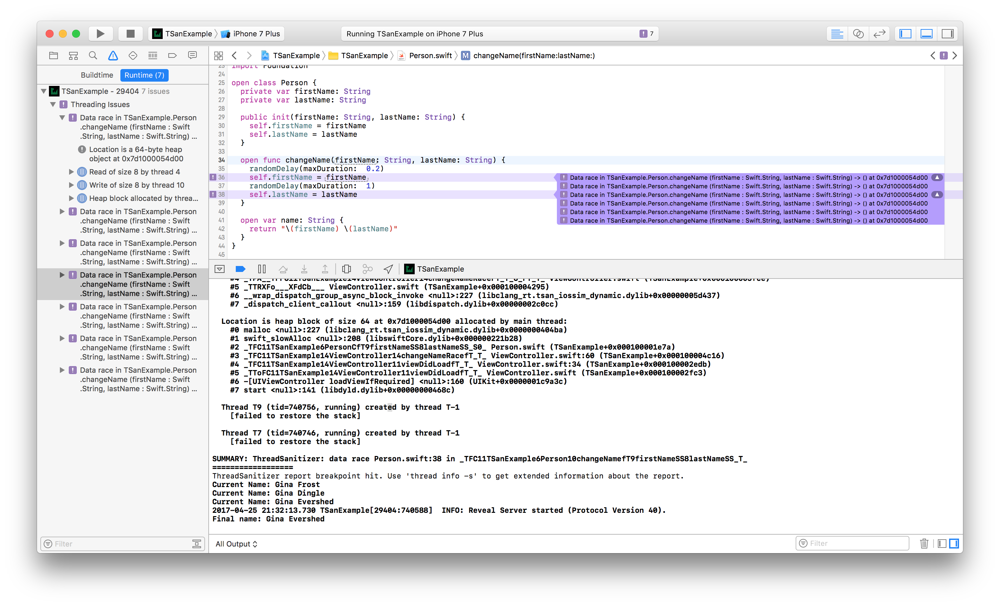

###### Thread Sanitizer

In edit scheme's Run - Diagnostics option, 'Thread Sanitizer' option can be checked to get a report on all race conditions that happened while running the app. In fact there is also a checkbox to pause execution when an issue (such as race conditon) occurs.

It shows the threads and the part of code where race conditions occurred.

