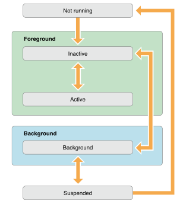

App states -

There are 5 different states an app can be in -

1. Not Running - The app has not been launched or was running but has now been terminated.

2. Inactive - The app is still in foreground but is not receiving any events, though it might be executing other code. An app enters this state briefly while it transitions to a different state.

3. Active - The app is running in the foreground and is receiving events. This is the normal mode.

4. Background - The app is in background and is executing code. An app enters this state briefly before moving to suspended state. Apps can request for extra time in this mode and apps can also be directly launched into this mode instead of going to inactive and active state.

5. Suspended - The app is in background and is not executing any code. The system moves apps to this state automatically and does not notify them before doing so. When a low memory condition occurs, the system may automatically purge suspended apps without notice.

State changes -

Methods called during state changes -

Most state changes are accompanied by UIApplicationDelegate methods being invoked.

application:willFinishLaunchingWithOptions: — App’s first chance to execute code at launch time.

application:didFinishLaunchingWithOptions: — Can be used to perform any final initialization before app is displayed.

applicationDidBecomeActive: — Is called when app is about to become the foreground app. Use this method for any last minute preparation.

applicationWillResignActive: — Is called when app is transitioning away from being the foreground app.

applicationDidEnterBackground: — Is called when app has moved to background and may be suspended at any time.

applicationWillEnterForeground: — Is called when the app is moving out of the background and back into the foreground, but is not yet active.

applicationWillTerminate: — Is called when the app is being terminated. It is not called if the app is already in a suspended state.

The exact sequence in which these methods are called changes in various cases.
