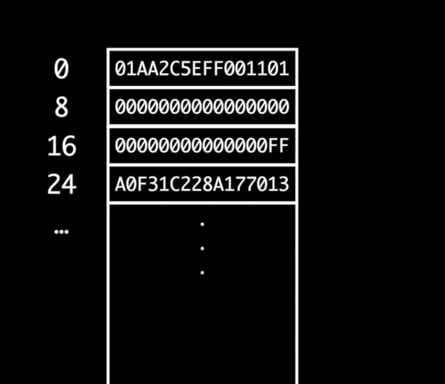
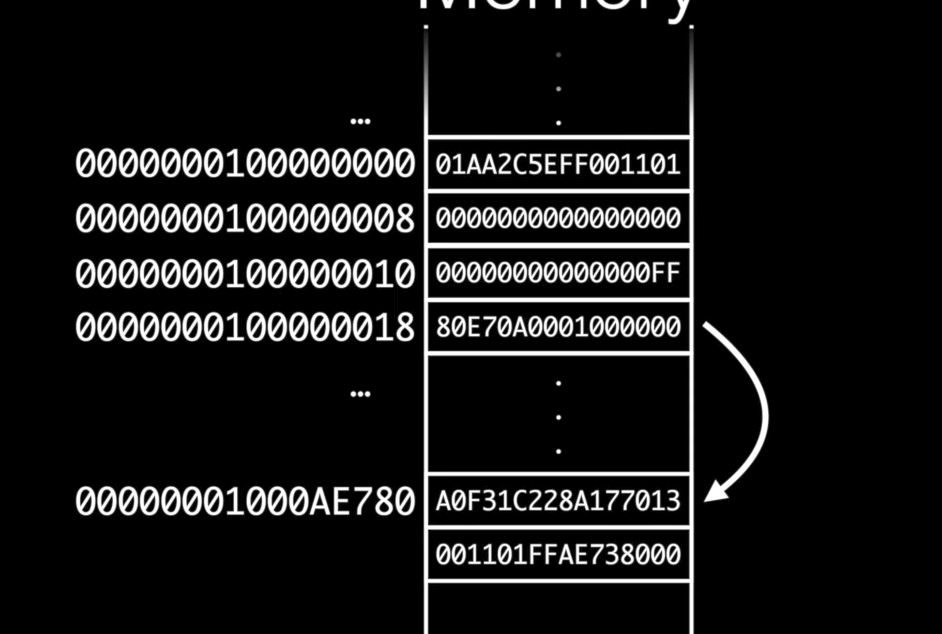

###### Bits, bytes and words

1 `byte` has 8 `bits`. Every bit may be having `0` or `1`. So the max value that can be held in a byte is `11111111` (i.e. `255` or `FF`)

`Word` is a unit that is of the size of a pointer. So in 64-bit systems it is 64 bits, i.e. 8 bytes. So it probably also means that addresses can be 64 bits long. Usually memory is shown as grouped together in words.

In the above example, byte0 has 01. byte1 has AA. and so the first 8 bytes are shown together, although just the first byte (i.e. byte 0) is mentioned on the left. And then byte 8 is 00 and so on.

Also, every byte has an address. (So bits do not have addresses that can be accessed? Probably yes, that's how it is.)

###### size, stride, alignment

For any given type, there are 3 terms. size, stride, alignment.

`size` - The no. of bytes the type requires for storage.

`stride` - The no. bytes skipped before next storage and it is usually same as size for that data type. That means that the next storage in memory (whatever it might be) can only be after 'stride' no. of bytes.

`alignment` - The memory address offset at which any storage for that type should begin.  An alignment of 4 means it should start only from addresses divisible by 4. (alignment usually needs to be on 4-byte boundaries, why though?.)

###### Little endian format

Most modern systems store things in `little endian` fashion, i.e. least significant part of the number comes first. So 234 is written as 432.

In the above example, the byte `00000001000000018` is a pointer and has an address (i.e. 80..00) as its value. This value is actually stored in little endian fashion here. And hence the true address is 00..80.

###### Max value that can be stored in a type (such as Int)

Int.max - Gives 9223372036854775807

And this can actually be matched.

8 bytes meaning there can be 8*8 = 64 bits for a signed integer. As the first bit is saved for sign, the remaining 63 bits are used. So at least 7 trailing bytes are used for the value only. The max no. a byte can hold is FF (i.e. 1111 1111 or 255). So 7 occurrences of  FF can be collated. Now for the most significant byte only 7 bits can be used. So the max number in that can be 0111 1111. This equates to 7F. So the no. is 7F FF FF FF FF FF FF FF. This does in fact equate to 9223372036854775807.
