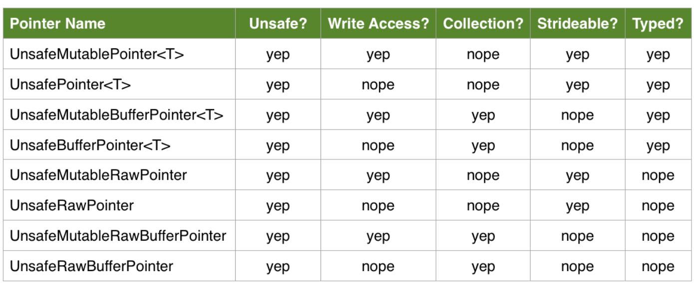

#### Unsafe pointers

As is well known, pointer stores an address. While all objects are actually pointer themselves we normally do not worry about accessing the individual bytes or reaching over to the address pointed by a pointer and then working with the values there as the language takes care of it automatically. (printing a pointer prints the address it stores, just like printing a value type such as int prints its contents.)

For example, here the system has automatically found some place in the memory and stored the value 3 there and then fetched and printed it in the print statement.
let a: Int = 4
print(a)

However using unsafe pointers it is possible to do all these things yourselves and even access the individual bytes ('a' above has taken 8 bytes as that is the standard size of an Int and it is not possible to check the value of each individual byte).

There are 8 different kinds of unsafe pointer types. They differ in these categories.
	1. Strongly typed using a generic or not (<T> or Raw).
	2. Mutable or not.
	3. Provides sequential access (non-buffer) or strideable access (buffer).

Here are all the types -

UnsafeMutablePointer <T>
UnsafePointer <T>
UnsafeMutableBufferPointer <T>
UnsafeBufferPointer <T>

UnsafeMutableRawPointer
UnsafeRawPointer
UnsafeMutableRawBufferPointer
UnsafeRawBufferPointer



From what I have understood, any region in memory is always actually mutable. If it is accessed using an immutable type (such as UnsafeRawBufferPointer) it can only be accessed, but if it is accessed using a mutable type such as UnsafeMutablePointer it can also be written to.

A typed pointer also automatically knows the size and alignment of that type.

#### What is unsafe about unsafe pointers

They are termed 'unsafe' to emphasize that while working with them the user has to be sure about the validity of memory himself and the system cannot assure it. Probably all these types provide no automated memory management, no type safety, and no alignment guarantees. The code should handle memory management itself and really ensure that its working with the right address (and not somethingw wrongly calculated).

#### Practical utility

The practical utility of this is the fact that sometimes some of the API (especially C ones) requires us to work with individual bytes and also that sometimes using unsafe pointers allows for a lot of performance optimization. For example, array itself allows it's contents to be accessed using unsafe pointers through various functions (such as withUnsafeBufferPointer<R>) and this can be used to optimize sorting algorithms. The performance just happens to be lot better. (An example shown in the Nate Cook's Realm [talk](https://news.realm.io/news/nate-cook-tryswift-tokyo-unsafe-swift-and-pointer-types/)).

#### What should be carefully avoided

A pointer obtained through methods such as withUnsafeBytes and withUnsafePointer should only be used within their closure arguments and never outside.

Also, the inout & should never be used to get an unsafe pointer and then use outside. That is, the below should not be done.

var countOfBooks = 256
let a = UnsafeMutablePointer(&countOfBooks)
a.pointee = 300

All the above leads to undefined behavior.

#### UnsafeMutableRawPointer

This allocates in memory no. of bytes specified in first argument with the alignment specified in second argument and returns the address of that region which then gets stored in the pointer.

let pointer = UnsafeMutableRawPointer.allocate(bytes: byteCount, alignedTo: alignment)

This deallocates the specified no. of bytes at the region pointed to by this pointer. It is something that is common to all unsafe pointer types and must be done once the task has been accomplished (typically in a defer block).
pointer.deallocate(bytes: byteCount, alignedTo: alignment)

This stores the specified value at the address pointed to by the unsafe mutable raw pointer.
pointer.storeBytes(of: 42, as: Int.self)

This fetches a pointer pointing to a location advanced by the specified no. of bytes from the pointer on which this method is called.
pointer.advanced(by: 4)

This returns a new instance of the specified type from the region pointed to by the pointer. This function actually also has a first argument called offset which has a default value of 0.
x = pointer.load(as: Int.self)

Why is it so that when I did not deallocate a pointer after I had used it, I still did not get a leak anywhere in memory debugger? (Tried in TestCaptureLists project.)

allocate(bytes:alignedTo:)
deallocate(bytes:alignedTo:)
storeBytes(of:as:)
advanced(by:)

******************

UnsafeMutableRawBufferPointer -

This allocates the specified no. of bytes in memory from the starting point and stores the address in pointer.

let bufferPointer = UnsafeRawBufferPointer(start: pointer, count: byteCount) // The pointer in argument should be obtained in some other way.

This enumerates over a buffer pointer and makes every byte available in a tuple of index and byte value. for (index, byte) in bufferPointer.enumerated() {
	print("byte \(index): \(byte)")
}

However I think what happens here is that the bytes are made available in little endian format (and that actually is fine). That is why if 42 is stored in the pointer, it is actually occupying 8 bytes and 42 is stored in rightmost byte and yet byte 0 above gives 42 (because of little endian format the address of rightmost byte in a word is stored first by the pointer).


UnsafeRawBufferPointer(start:, count:)
enumerated()

#### UnsafeMutablePointer<T>

This initializes an unsafe typed mutable pointer with specified capacity in bytes.
let pointer = UnsafeMutablePointer<Int>.allocate(capacity: 8)

This initializes the unsafe typed mutable pointer with the mentioned value (it has to be of the same type).
pointer.initialize(to: 0, count: 8)

This deinitializes the unsafe typed mutable pointer.
pointer.deinitialize(count: count)

And this deallocates the unsafe typed mutable pointer.
pointer.deallocate(capacity: count)

The region referred to by a pointer can also be directly accessed using pointee.
pointer.pointee = 42

This directly casts a raw pointer to a typed pointer.
let typedPointer = rawPointer.bindMemory(to: Int.self, capacity: count)
initialize(to:count:)
deinitialize(count:)
deallocate(capacity:)
pointee

raw pointers - bindMemory(to:capacity:)

#### Misc.

For any type, it is even possible to inspect its individual bytes using withUnsafeBytes(of:) method. The catch though is that the instance has to be
passed as an inout parameters and hence must be declared as a var. The bytes are made available within a closure as UnsafeRawBufferPointer. This raw buffer pointer should not be used outside the closure.

var countOfBooks = 256
withUnsafeBytes(of: &countOfBooks) { bytes in
    for byte in bytes {
        print(byte)     // Keep in mind that printing a byte, prints its contents
    }
}

Prints 0 1 0 0 0 0 0 0

In case of reference type (i.e. an object), its bytes contain an address and hence the address is broken into bytes and is printed (which is pretty useless actually).

withUnsafeBytes(of: &sampleClass) { bytes in
    for byte in bytes {
        print(byte)
    }
}

Prints random sequence of 8 nos. (and they obviously change every time you run).


withUnsafePointer(to:) function gives an UnsafePointer<T> (i.e. typed unsafe pointer) to the region pointed to by the passed variable.

```
withUnsafePointer(to: &i) { pointer in
    print(pointer)     // Prints the pointer, i.e. effectively the address of the variable
    print(pointer.pointee) // Prints the contents of i, i.e. say 5 if it is an integer
}
```

An important thing with both these methods (withUnsafeBytes and withUnsafePointer) is that the pointers that they give are temporary and should only be used in the passed closure (not outside).


withUnsafeBytes(of:)
withUnsafePointer(to:)

#### Summarizing all functions

UnsafeMutableRawPointer -
allocate(bytes:alignedTo:)
deallocate(bytes:alignedTo:)
storeBytes(of:as:)
advanced(by:)
load(as:)

UnsafeMutableRawBufferPointer -
UnsafeRawBufferPointer(start:, count:)
enumerated()

UnsafeMutablePointer<T> -
bindMemory(to:capacity:)

withUnsafeBytes(of:)
withUnsafePointer(to:)

******************

Test projects -

Memory Management/3. Unsafe Pointers
