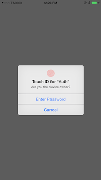

Passcode is the password you set on your phone. Touch ID is another category and shows up as the type fingerprint in Settings. Each device can be configured with a maximum of 5 fingerprints.
No data is transferred from the device.
If the device does not have a passcode set, probably the touchID cannot be used.

This is the kind of screen that the system brings up when a touchID is invoked (using evaluatePolicy:localizedReason:reply: method). The user should keep his finger on the fingerprint sensor.

If the user taps on 'Enter Password’ button in the prompt, it is the app’s responsibility to bring up a custom screen where he can enter a password.

The framework name is LocalAuthentication.

******

LAContext
LAPolicy
LAPolicyDeviceOwnerAuthenticationWithBiometrics
LAError

LAContext - Represents an authentication context. Used to evaluate authentication policies, allowing apps to request user to authenticate themselves using personal information such as fingerprint.

LAContext -> -canEvaluatePolicy:error (Checks if the authentication policy can be used.)
LAContext -> -evaluatePolicy:localizedReason:reply: (Brings up an authentication dialog and evaluates the fingerprint. The string passed in second argument is shown in the prompt. The completion block in third argument is run when evaluation is done.)

LAPolicy - Enum that represents an authentication policy. The only authentication policy currently available is LAPolicyDeviceOwnerAuthenticationWithBiometrics which represents Touch ID.

LAError - Enum that represents various errors when evaluating a policy.

LAErrorAuthenticationFailed - User did not provide valid credentials (i.e. a different fingerprint detected).
LAErrorUserCancel - User canceled the authentication (one way this can happen is when he taps cancel in the dialog).
LAErrorUserFallback - User tapped the fallback button (i.e. enter password button).
LAErrorSystemCancel - System cancels the authentication. Can happen if another app comes to foreground in the meantime. (Need to simulate this, did not happen when I brought another app from app switcher, maybe will come in case of an incoming phone call.)
LAErrorPasscodeNotSet - Passcode not set on device. (This error will be shown even if a touchID exists but a passcode is not present)
LAErrorTouchIDNotAvailable - TouchID not available on device.
LAErrorTouchIDNotEnrolled - TouchID not set up by user.

******
In the completion block, any UI related stuff should be done from the main queue (can be done using dispatch_async()) for it to be reflected immediately. As this code probably executes in a different queue.

Cannot double press the home button even with a different finger to move to a different app, it is detected as an authentication attempt.

******

Appcoda (Swift code snippet) - http://www.appcoda.com/touch-id-api-ios8/
Devfright (Objective-C code snippet)- http://www.devfright.com/touch-id-tutorial-objective-c/
NSHipster (Overview) - http://nshipster.com/ios8/
WWDC 2014 video - WWDC 2014 - Keychain and authentication with TouchID
Framework reference - Local Authentication Framework

******
Fingerprint strorage and access -

Touch ID doesn't store any images of your fingerprint. It stores only a mathematical representation of your fingerprint. It isn't possible for someone to reverse engineer your actual fingerprint image from this mathematical representation. The chip in your device also includes an advanced security architecture called the Secure Enclave which was developed to protect passcode and fingerprint data. Fingerprint data is encrypted and protected with a key available only to the Secure Enclave. Fingerprint data is used only by the Secure Enclave to verify that your fingerprint matches the enrolled fingerprint data. The Secure Enclave is walled off from the rest of the chip and the rest of iOS. Therefore, iOS and other apps never access your fingerprint data, it's never stored on Apple servers, and it's never backed up to iCloud or anywhere else. Only Touch ID uses it, and it can't be used to match against other fingerprint databases.

(Link)

******

TouchID not configured - LAErrorTouchIDNotAvailable / LAErrorTouchIDNotEnrolled / LAErrorPasscodeNotSet
Incorrect fingerprint detected - LAErrorAuthenticationFailed
User wishes to enter password - LAErrorUserFallback (3)
User cancels the process - LAErrorUserCancel (2)
System cancels the process - LAErrorSystemCancel

******

Why is the error code LAErrorAuthenticationFailed not returned when the user tries authenticating with a different finger. In fact neither the success nor the error block is called. Why?

The thing is that error codes such as LAErrorPasscodeNotSet, LAErrorTouchIDNotAvailable, LAErrorTouchIDNotEnrolled are not returned in the reply block as they fail canEvaluatePolicy:error: method itself in case that method is called first.
