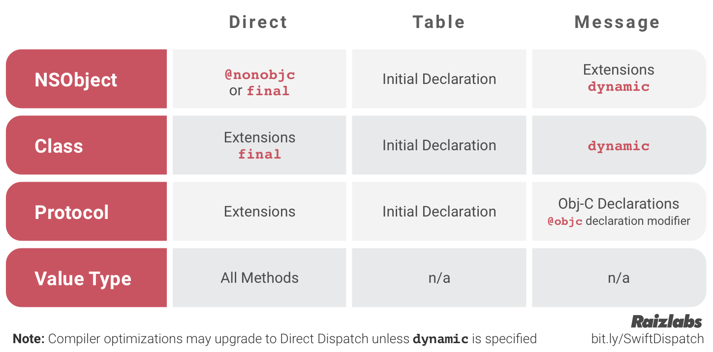

Method/property dispatch is how the method/property to be used gets selected during runtime.

Compiled programming languages have three primary methods of dispatch at their disposal -
1. Direct/static (default in C++)
2. Table/virtual (default in Java)
3. Message (default in Objective-C)

`Static dispatch` is the fastest dispatch and can even result in inline code. It however cannot be used for things like subclassing.

In `Table dispatch`, tables known as virtual or witness tables get generated for all the classes. And this table has entries for all the classes' methods, etc. (including inherited ones). However it is slightly slow. Swift extension methods are not supported by this dispatch method though.

`Message dispatch` is the most dynamic way of dispatch. This is what enables things like KVO and CoreData (accessors?). When a message is dispatched, the runtime crawls through the class hierarchy to determine which method to invoke.

###### Dispatch mechanism used in Swift -

Methods defined in the main body of the class are dispatched using table dispatch.
Methods defined in extension are dispatched using direct dispatch.

Value types get direct dispatch. <br>
Extensions of protocols and classes get direct dispatch. <br>
NSObject extensions use dynamic dispatch. <br>
Default implementations of methods in protocol use table dispatch. <br>

The type of the reference on which the method is invoked determines the dispatch rule.

So say a class's extension has a method1, and the class also conforms to a protocol. The protocol already provides default implementation of a method with same name, i.e. method1. In such a case, what matters is the reference on which the method is called.
```
let obj1: ClassA
let obj2: ExtensionA
```
Now even though `obj1` and `obj2` both point to same thing, the dispatch mechanism to be used will depend on the reference on which the  method is called.


`final` - Direct dispatch <br>
`dynamic` - Dynamic dispatch <br>



Links - [Raizlabs](https://www.raizlabs.com/dev/2016/12/swift-method-dispatch/) (Late 2016 article)
