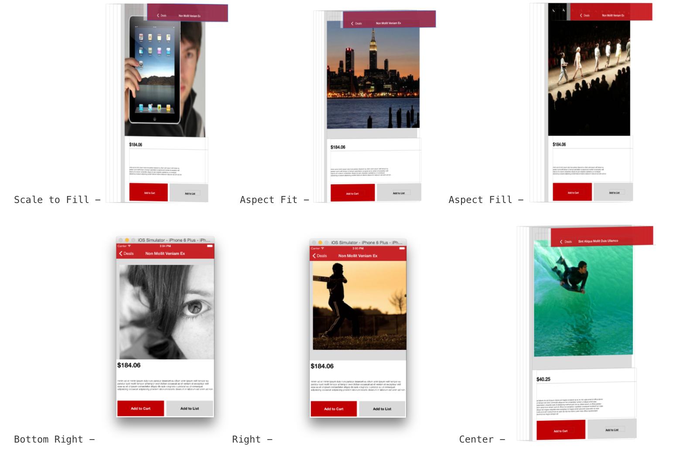
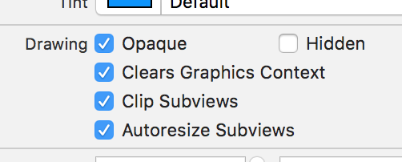
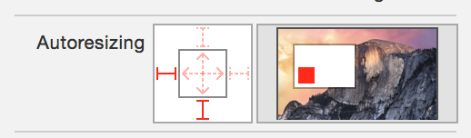

Content Modes (UIViewContentMode) -

Scale to Fill (Content is scaled to completely fit the size by changing the aspect ratio if necessary. When bounds change, drawRect: is not called again and instead already rendered content is used to draw the view.)

Aspect Fit (Content is scaled to fit the size by maintaining the aspect ratio without clipping any portion of itself. Any remaining portion is left transparent.)

Aspect Fill (Content is scaled to fill the size by maintaining aspect ratio and clipping the necessary portion of itself. However what I saw when using this content mode for a UIView is that the clipping happens only if the view's clipsToBounds is YES. Otherwise the clipping doesn't quite happen, the view can appear outside the bounds too if needed)

Redraw (setNeedsDisplay is called for redrawing every time the bounds change, which in turn calls drawRect:. As drawRect: gets called repeatedly, this can cause the rendering to be slower. Should be used only when needed. link.)

The below content modes specify the edge about which the view should be aligned keeping its aspect ratio same.

Center
Top
Bottom
Left
Right
Top Left
Top Right
Bottom Left
Bottom Right

Test Project to show drawRect and contentMode relationship - 20 Views/TestViews (git commit no. ec33ab3aa5be)
Test Project to show various contentMode visually - 21. Case Study (git commit no. 487cf2d72431)

clipsToBounds - 

By default a view is not confined to its superview's frame. If its frame is going to go outside its superview's frame, it will. Unless the superview's clipsToBounds property has been set as YES. This can be particularly seen when using the aspect fill content mode. In Interface Builder, it is represented by ‘Clip Subviews’ checkbox.

However even if a view goes beyond its superview's frame, any touch event that happens in the portion of the view that is outside its superview's frame is not delivered to the view. Also, it seems that even though the expanded bounds will actually be visible if the bounds are printed it will show up as the portion within the superview's frame.

Test Project - 20 Views/TestViews (git commit no. ec33ab3aa5be)

autoresizingMask and translatesAutoresizingMaskIntoConstraints - 

autoresizingMask determines how a view's size should change if its superview's bounds change. It is a bit mask property of the type UIViewAutoresizing and its possible values are none, flexible left margin, flexible right margin, flexible width, flexible top margin, flexible bottom margin, flexible height. The default value is none.

translatesAutoresizingMaskIntoConstraints determines if the resizing masks should automatically be converted into constraints when used in an auto layout enabled view. If auto layout is used, this value must be set to NO (this automatically happens if creating a view in interface builder, but in programmatically created views this must be done explicitly) or else there are conflicts. And if it is set to NO, then the auto resizing constraints do not even matter any more. 

So autoresizingMask seems to matter only when auto layout is not being used for the view or if auto layout is used but translatesAutoresizingMaskIntoConstraints is YES (which usually should not be the case).

autoresizesSubviews is a property that indicates if a view should automatically resize its subviews when its bounds change. The default value is YES. Also similar to autoresizingMask, this property probably does not matter if auto layouts are being used.

If needed though this property can be configured from interface builder as well (though it shows up only if auto layout is disabled for that file in interface builder). A solid line indicates that the concerned part is not flexible and will stay fixed.

Xcode 8/iOS 10 onwards this thing changed a bit. If no explicit constraints have been specified for a view in storyboard, its auto-resizing masks (i.e. struts and springs) are automatically converted into constraints at runtime. If however any explicit constraints are created in the storyboard, the auto-resizing masks do not matter.

Struts (i.e. the outer things) it seems specify the pinning behavior. Springs (i.e. the inner things) it seems specify the resizing behavior. So there are some constraints that can be achieved by auto-resizing masks themselves.

Misc. -

tag property can be used to tag views. viewWithTag: can be used to retrieve view having a specified tag no.
Every view has also got a window property to get the window of its root view.

hidden is not an animatable property (unless the view is contained in a stack view) but alpha is. Hence, if the view's hiding/showing needs to be animated it must be done using the view's alpha property.

Xcode 9 onwards, hidden property too can made sizeclassable in interface builder itself.
