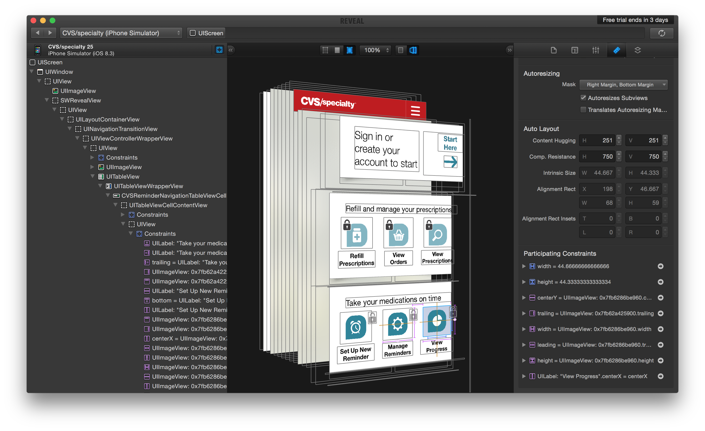
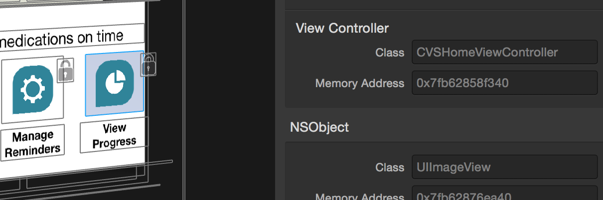
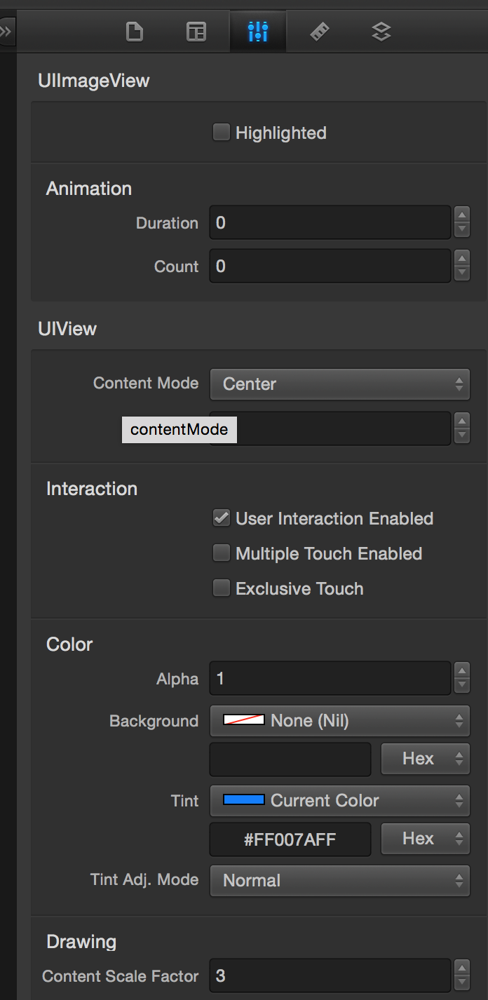
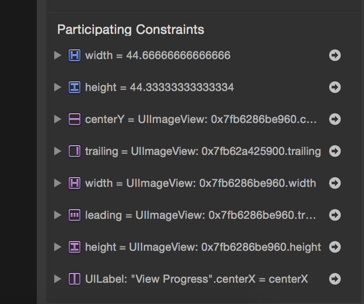
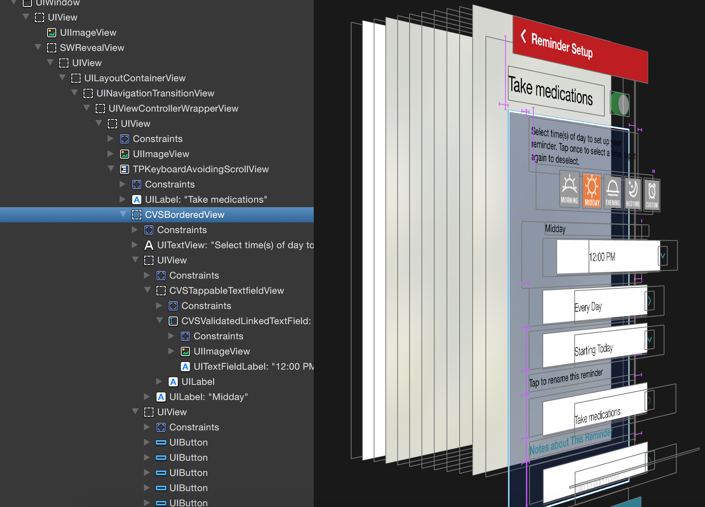
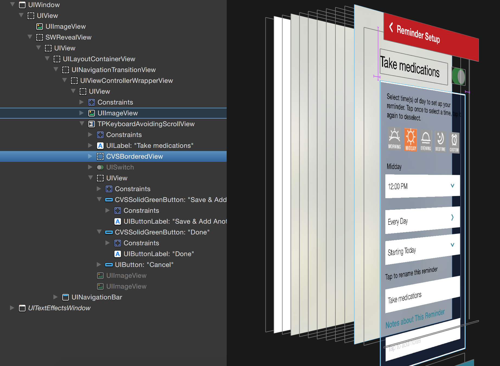
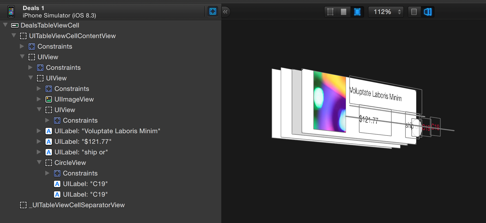
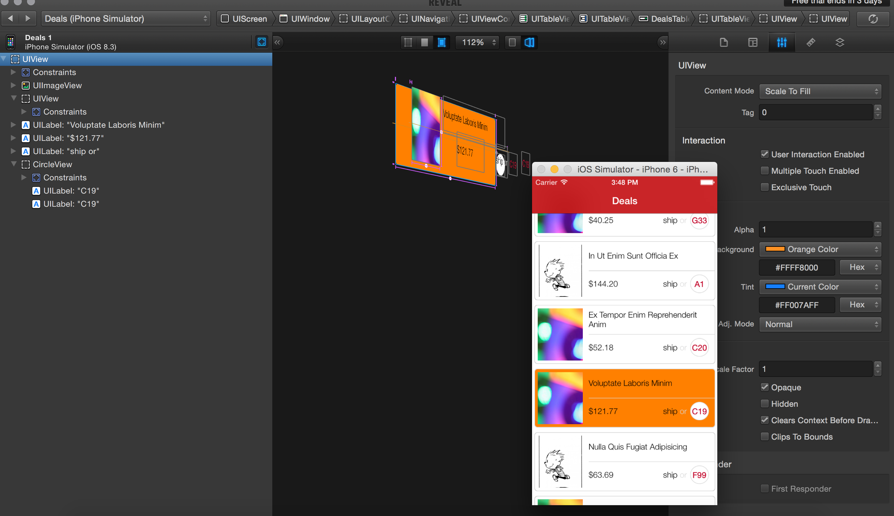

UIScreen > UIWindow > (UILayoutContainerView) > (UINavigationTransitionView) + UINavigationBar > (UIViewControllerWrapperView) > UITableView > (UITableViewWrapperView) > DealsTableViewCell > (UITableViewCellContentView) > 

To integrate Reveal in a project, either Reveal should be included in the podfile (pod 'Reveal-iOS-SDK') as a dependency or Reveal.framework should be statically linked or libReveal.dylib should be dynamically linked. (link)

To remove Reveal from a project, if Cocoapods was used for its installation then the reveal pod needs to be commented in podfile and a fresh install done. However if there are no more pods left enabled in podfile, there will be build errors in libworkspace. So the below needs to be done then.

Go to your target Build Phase, and delete Copy Pods Manifest.lock and Copy Pods Resources phases. And also remove libPods.a in Link Binary with Libraries. And, this after that.

Center pane - Shows the current view hierarchy visually. Available modes are view wireframes, view contents, view both. View both gives the best insight. There is also a 3D and a 2D mode of display.

Left pane - Shows the view hierarchy in a tree structure. It also shows the view related classes that are actually from Apple's private API.

Right pane - Shows details about the currently selected component. The identity inspector shows class, memory information and more importantly the view controller that owns the view. 

Attributes Inspector shows some of the public properties for every class in that object’s class hierarchy. Towards the end it even shows if the view is currently the first responder.

Layout Inspector shows the view's frame, bounds, auto-resizing mask and auto layout characteristics. Layer Inspector shows the view's layer properties, i.e. border, corner radius, etc. 

The constraints generated automatically are shown in blue and the constraints added manually by developer are shown in purple. Very often, the blue ones correspond t the intrinsic content size of the view.

When views are collapsed from the left pane, all the constituent views also flatten in the center pane making it clearer.

Double clicking on any view shows just that view in the center pane. You can go back to the entire screen using the hierarchy options at top.

It is even possible to change some of the properties on the fly and see how it looks, on the center pane as well as in the simulator at the same time. A similar live testing can also be done with constraints.

https://revealapp.com/features/

https://www.raywenderlich.com/1863-reveal-tutorial-live-view-debugging
