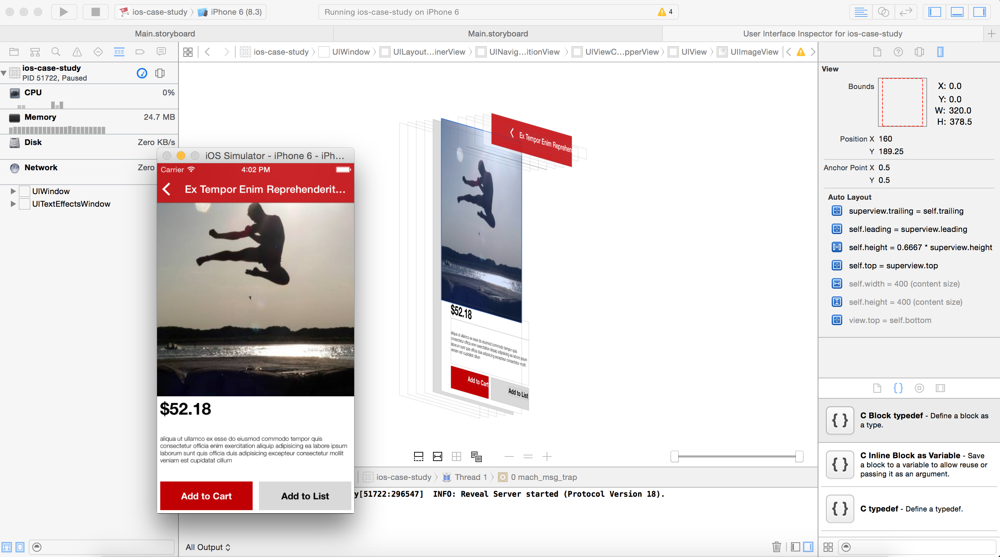
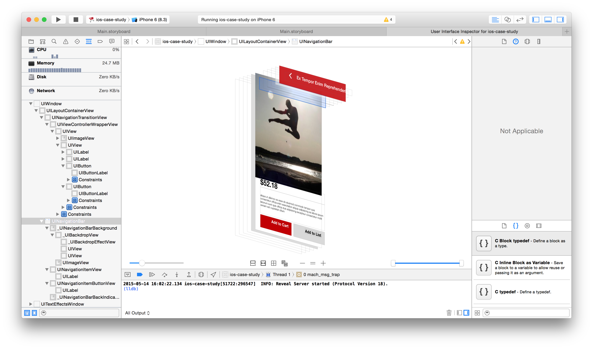

View debugging can be done through Xcode using the menu option Debug > View Debugging > Capture View Hierarchy, etc. It shows the details of simulator's current screen.

Using the slider at right bottom allows to remove the views one by one.

It is particularly useful to remove the built-in private views and have less clutter on the screen.
The bottom controls also allow to do things such as show clipped contents, show constraints, show wireframes, etc.
Once a view is selected, the object inspector on the right shows some of the properties including things scubas highlightedImage in case of an image view, the size inspector shows the dimensions and the auto layout constraints.

The view hierarchy tree structure is shown in the debug navigator (though it does not seem to be giving the view controller name).

It is also possible to get the current view controller by using the below debug command. Just pause run and enter this command.

po [[[[UIApplication sharedApplication] keyWindow] rootViewController] _printHierarchy]

The below command can also be used to get the view hierarchy.
po [[UIWindow keyWindow] recursiveDescription]

(Is there any difference between the two?)
